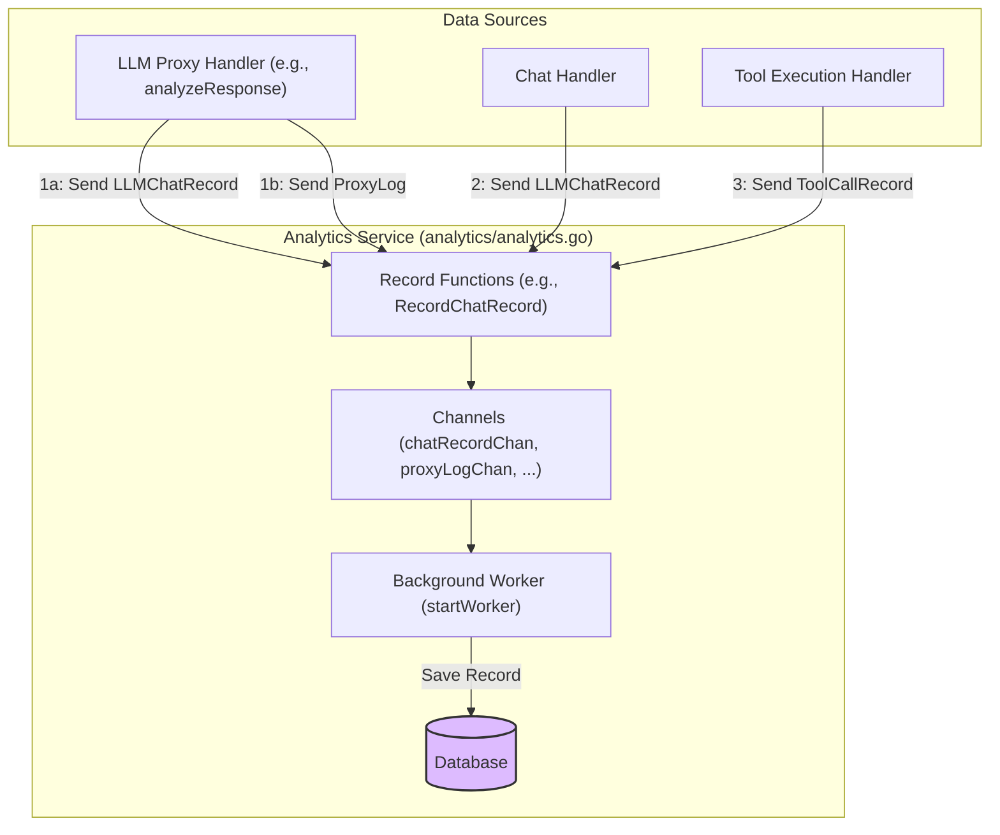
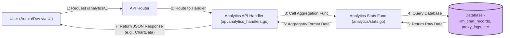
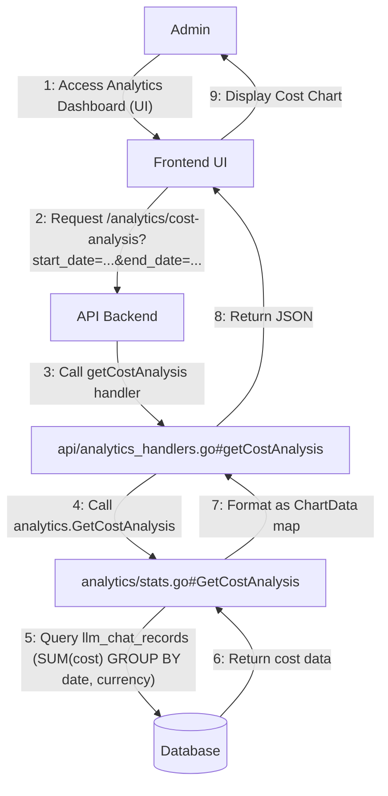
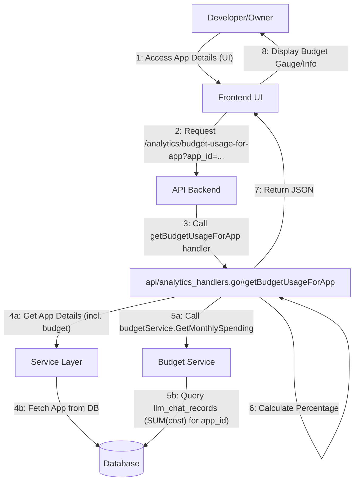

## Analytics System

**1. Overview & Purpose**

The Analytics System provides insights into the usage, cost, and performance of Large Language Models (LLMs) and associated tools accessed through the Midsommar platform. It collects data from various interactions (LLM Proxy, direct Chat), aggregates it, and exposes it via API endpoints for visualization in the Midsommar UI (Dashboard). This allows administrators and application owners to monitor resource consumption, track expenses, understand user behavior, and make informed decisions regarding LLM usage and budgeting.

**Key Objectives:**

*   **Usage Tracking:** Record every LLM interaction (via Proxy or Chat) and tool call, capturing details like tokens used, models accessed, vendors involved, and associated users/applications.
*   **Cost Calculation:** Calculate the cost of each LLM interaction based on token counts and pre-configured model pricing.
*   **Data Aggregation:** Provide aggregated statistics over time periods, grouped by various dimensions (user, app, model, vendor, day).
*   **Budget Monitoring:** Track spending against configured budgets for LLMs and Applications, providing visibility into budget consumption.
*   **Proxy Logging:** Store detailed logs of requests and responses flowing through the LLM Proxy for debugging and auditing.
*   **API Exposure:** Offer a comprehensive set of API endpoints for retrieving raw logs and aggregated analytics data.
*   **Asynchronous Processing:** Ingest data asynchronously to minimize impact on request processing performance.

**User Roles & Interactions:**

*   **Administrator (Admin):**
    *   **Monitoring:** Uses the Midsommar UI (**Analytics Dashboard**) to:
        *   View overall platform usage trends (chat records, tool calls, unique users per day).
        *   Analyze costs across different vendors, models, and interaction types (Proxy vs. Chat).
        *   Identify top users, applications, and LLM models based on usage or token consumption.
        *   Monitor budget usage for all configured LLMs and Applications.
        *   View detailed proxy logs for specific LLMs for troubleshooting.
    *   **Configuration:** (Indirectly) Configures model pricing (`model_prices`) and budgets (`llms`, `apps`) which are used by the Analytics system.
*   **AI Developer/App Owner (Dev):**
    *   **Monitoring:** Uses the Midsommar UI (**Analytics Dashboard**, potentially filtered to their scope) to:
        *   Monitor usage (tokens, cost) specifically for their Applications.
        *   Track their Application's budget consumption.
        *   View detailed proxy logs associated with their Applications.
*   **System (Internal Services):**
    *   **Data Ingestion:** Services like the LLM Proxy (`proxy/proxy.go`) and potentially Chat handlers send data records (`LLMChatRecord`, `ProxyLog`, `ToolCallRecord`) to the Analytics service for processing and storage.

**2. Architecture & Data Flow**

**Core Components & Interactions:**

*   **Analytics Service (`analytics/analytics.go`):**
    *   Manages asynchronous data ingestion via channels (`chatRecordChan`, `proxyLogChan`, `toolCallChan`, `logEntryChan`).
    *   Runs background workers (`startWorker`) to process incoming records and save them to the database.
*   **Analytics Stats (`analytics/stats.go`):**
    *   Contains functions for querying the database and aggregating data for API responses (e.g., `GetCostAnalysis`, `GetBudgetUsage`, `GetProxyLogsForAppID`).
*   **API Handlers (`api/analytics_handlers.go`):**
    *   Exposes GET endpoints under `/analytics/` that call functions in `analytics/stats.go` to retrieve data.
*   **Database Models (`models/analytics.go`, `models/llm.go`, `models/app.go`, etc.):**
    *   Defines the structure for stored data:
        *   `LLMChatRecord`: Detailed LLM usage (tokens, cost, model, vendor, user, app, interaction type).
        *   `ProxyLog`: Raw proxy request/response metadata.
        *   `ToolCallRecord`: Records of tool usage.
        *   `LLM`, `App`: Store budget configurations.
        *   `ModelPrice`: Stores pricing information used for cost calculation.
*   **Data Sources (e.g., `proxy/proxy.go`, Chat Handlers):**
    *   Generate and send data records to the Analytics Service channels after processing requests or interactions.

**Data Flow (Ingestion - Simplified):**

**Data Flow (API Retrieval - Simplified):**

**User Role Flows:**

**Admin Monitoring Flow (Example: View Cost Analysis):**

**Developer Monitoring Flow (Example: View App Budget):**

**3. Implementation Details**

*   **API Endpoints:** All endpoints are under the `/analytics/` path and use the GET method. They typically require `start_date` and `end_date` query parameters (format `YYYY-MM-DD`). Many endpoints return data formatted as `analytics.ChartData` (labels, data arrays) or `models.MultiAxisChartData`.
    *   `/chat-records-per-day`: Count of `LLMChatRecord` per day.
    *   `/tool-calls-per-day`: Count of `ToolCallRecord` per day.
    *   `/chat-records-per-user`: Count of `LLMChatRecord` per user.
    *   `/cost-analysis`: Sum of `cost` from `LLMChatRecord` per day, per currency. Optional `interaction_type` filter.
    *   `/most-used-llm-models`: Top 10 LLM `name` from `LLMChatRecord` by count. Optional `interaction_type` filter.
    *   `/tool-usage-statistics`: Top 10 tool `name` from `ToolCallRecord` by count.
    *   `/unique-users-per-day`: Count of distinct `user_id` from `LLMChatRecord` per day.
    *   `/token-usage-per-user`: Top 10 `user_id` by sum of `total_tokens` from `LLMChatRecord`. Optional `interaction_type` filter.
    *   `/token-usage-per-app`: Top 10 `app_id` by sum of `total_tokens` from `LLMChatRecord`. Optional `interaction_type` filter.
    *   `/token-usage-for-app`: Sum of `total_tokens` and `cost` per day for a specific `app_id`.
    *   `/chat-interactions-for-chat`: Count of `LLMChatRecord` per day for a specific `chat_id`.
    *   `/model-usage`: Sum of `total_tokens` and `cost` per day for a specific `model_name`.
    *   `/vendor-usage`: Sum of `total_tokens` and `cost` per day for a specific `vendor`. Optional `llm_id` filter.
    *   `/usage`: Flexible endpoint combining filters (`vendor`, `llm_id`, `app_id`, `interaction_type`) to show token usage and cost per day. Returns `MultiAxisChartData`.
    *   `/token-usage-and-cost-for-app`: Similar to `/token-usage-for-app` but returns `MultiAxisChartData`.
    *   `/total-cost-per-vendor-and-model`: Total cost grouped by `vendor` and `model`. Optional `interaction_type`, `llm_id` filters.
    *   `/proxy-logs-for-llm`: Paginated `ProxyLog` records filtered by `llm_id` (via vendor lookup).
    *   `/proxy-logs-for-app`: Paginated `ProxyLog` records filtered by `app_id`.
    *   `/budget-usage`: Aggregated budget status (`models.BudgetUsage`) for all LLMs and Apps. Optional date range for total cost calculation, optional `llm_id` filter.
    *   `/budget-usage-for-app`: Current monthly budget spending for a specific `app_id`.
*   **Data Models:**
    *   `models.LLMChatRecord`: Stores `Name`, `Vendor`, `Model`, `ChatID`, `UserID`, `AppID`, `PromptTokens`, `ResponseTokens`, `TotalTokens`, `Cost`, `Currency`, `InteractionType`, `TimeStamp`. Cost is stored as integer (actual * 10000).
    *   `models.ProxyLog`: Stores `AppID`, `UserID`, `TimeStamp`, `Vendor`, `RequestBody`, `ResponseBody`, `ResponseCode`. Bodies might be truncated.
    *   `models.ToolCallRecord`: Stores `Name`, `UserID`, `AppID`, `ChatID`, `TimeStamp`, `Input`, `Output`, `Error`.
    *   `analytics.ChartData`: `{ "labels": ["...", "..."], "data": [..., ...], "cost": [..., ...] }` (cost is optional).
    *   `models.MultiAxisChartData`: `{ "labels": ["...", "..."], "datasets": [{"label": "...", "data": [...], "yaxis": "y/y1"}, ...] }`.
    *   `models.BudgetUsage`: Aggregated view with `EntityID`, `Name`, `EntityType` (LLM/App), `Budget`, `Spent`, `Usage` (%), `TotalCost`, `TotalTokens`, `BudgetStartDate`, `UserID`, `UserEmail`.
*   **Core Logic:**
    *   Ingestion: `analytics.go` (`Record...` functions, `startWorker`).
    *   Aggregation/Querying: `stats.go` (`Get...` functions). Uses GORM for database interaction.
    *   Cost Calculation: Happens *before* ingestion, likely within the proxy (`AnalyzeCompletionResponse`) or chat handlers, using `service.GetModelPriceByModelNameAndVendor`.
*   **Dependencies:** Relies on database (`gorm.DB`), service layer (`service.Service`) for fetching related data (user names, app names, prices, budgets).

**4. Use Cases & Behavior**

*   **Admin Checks Overall Cost Trend:**
    1.  Admin navigates to the Analytics Dashboard in the UI.
    2.  UI fetches data from `/analytics/cost-analysis` for the last 30 days.
    3.  API returns daily cost totals.
    4.  UI displays a line chart showing cost over time.
*   **Admin Investigates High Spending:**
    1.  Admin notices high cost on the dashboard.
    2.  Admin checks `/analytics/total-cost-per-vendor-and-model` to see which models/vendors contribute most.
    3.  Admin checks `/analytics/token-usage-per-app` to see which apps are spending the most.
    4.  Admin checks `/analytics/budget-usage` to see if any LLM/App budgets are exceeded.
*   **Dev Checks App Usage:**
    1.  Dev navigates to their Application's detail page in the UI.
    2.  UI fetches data from `/analytics/token-usage-and-cost-for-app` using the App's ID.
    3.  UI displays charts showing daily token usage and cost for that specific app.
    4.  UI fetches data from `/analytics/budget-usage-for-app` to show the current budget status.
*   **Dev Debugs Proxy Issue:**
    1.  Dev's application receives errors from the proxy endpoint.
    2.  Dev navigates to their Application's detail page -> Proxy Logs tab.
    3.  UI fetches data from `/analytics/proxy-logs-for-app` using the App's ID.
    4.  UI displays recent proxy logs (request/response bodies, status codes) allowing the Dev to identify the issue.

**5. Potential Considerations & Future Enhancements**

*   **Data Granularity:** Currently aggregates primarily by day. More granular analysis (hourly) might be needed.
*   **Scalability:** High volume of interactions could strain the database during ingestion or complex queries. Consider optimizations like indexing, materialized views, or dedicated analytics databases/data warehouses for larger scale.
*   **Error/Latency Tracking:** While proxy logs exist, dedicated tracking and aggregation of error rates and response latencies could be valuable.
*   **Real-time Dashboards:** Current system relies on polling API endpoints. WebSockets or Server-Sent Events could enable more real-time updates.
*   **Custom Reporting:** Allow users to build and save custom reports/dashboards beyond the predefined views.
*   **Alerting:** Integrate with the Notification service to trigger alerts based on analytics data (e.g., budget thresholds reached, spike in errors).
*   **Data Retention Policies:** Implement policies for archiving or deleting old analytics data.
*   **Cost Precision:** Cost is stored as integer * 10000. Ensure this precision is sufficient and handled correctly during calculations and display.