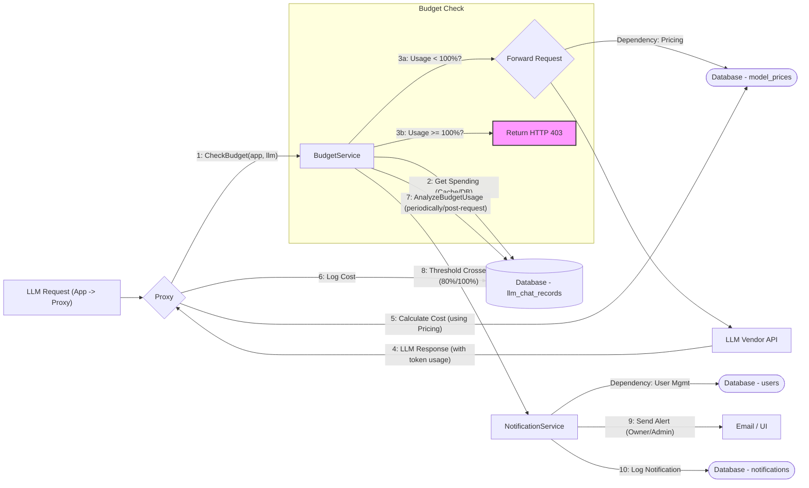

## Budget Control System

**1. Overview & Purpose**

The core goal of the Budget Control System is to enable organizations to set and enforce monthly spending limits on AI usage, specifically for:

*   **Applications (Apps):** Individual applications utilizing LLMs via the Midsommar proxy, linked to specific owners (`app.UserID`).
*   **Large Language Models (LLMs):** Specific models (e.g., GPT-4) across all consuming applications.

**Key Objectives:**

*   **Cost Control:** Prevent budget overruns by enforcing defined monthly caps (`apps.monthly_budget`, `llms.monthly_budget`). Usage is blocked (HTTP 403) when the limit is reached.
*   **Governance & Audit:** Track all LLM usage costs in the `llm_chat_records` table for transparency and compliance. This data serves as input for broader **Analytics**.
*   **Proactive Alerts:** Notify relevant stakeholders (App owners, Admins identified via **User Management**) when usage reaches predefined thresholds (80% - Warning, 100% - Critical) using the **Notification Service**.
*   **Reporting:** Provide API endpoints and UI components to monitor current usage against budgets, leveraging data aggregated potentially by the **Analytics** module.

**User Roles & Interactions:**

*   **Administrator (via User Management):** Sets/manages budgets (via **App/LLM Management** APIs/UI), monitors usage (via **Analytics** APIs/UI), receives LLM/Admin notifications (via **Notification Service**), defines **Pricing** for models.
*   **AI Developer/App Owner (via User Management):** Integrates apps, monitors app-specific budget usage (via **Analytics** APIs/UI), receives App notifications (via **Notification Service**).
*   **End User (Chat):** Interacts indirectly; may encounter a "Budget Exceeded" block enforced by the **Proxy** based on `BudgetService` checks.

**2. Architecture & Data Flow**

**Core Components & Interactions:**

*   **Proxy (`proxy/proxy.go`):** The gatekeeper for LLM requests.
    *   *Dependency:* Calls `BudgetService.CheckBudget` before forwarding requests.
    *   *Dependency:* Uses **Pricing** data (`model_prices`) to calculate request cost after receiving the LLM response.
    *   Logs usage (`LLMChatRecord`) to the Database, providing raw data for budget checks and **Analytics**.
*   **BudgetService (`services/budget_service.go`):** Central hub for budget logic.
    *   `CheckBudget`: Verifies App/LLM budget status (uses cache/DB).
    *   `GetMonthlySpending`/`GetLLMMonthlySpending`: Calculates spending from `llm_chat_records`.
    *   `AnalyzeBudgetUsage`: Checks notification thresholds.
    *   `NotifyBudgetUsage`: Dispatches notifications.
    *   *Dependency:* Calls the **Notification Service** (`notificationSvc`) to send alerts.
    *   Manages an in-memory `usageCache`.
*   **Database (`models/`):** Stores configuration and operational data.
    *   `apps`, `llms`: Store budget settings, linked via **App/LLM Management**.
    *   `users`: Stores user information, including Admins status, used by **User Management** and for notifications.
    *   `llm_chat_records`: Stores usage details (cost, timestamp, app/llm IDs). Primary data source for budget calculations and **Analytics**.
    *   `model_prices`: Stores cost data, managed via **Pricing** features, used by the **Proxy**.
    *   `notifications`: Stores sent alert records for deduplication by the **Notification Service**.
*   **NotificationService (`services/notification_service.go`):**
    *   *Dependency:* Called by `BudgetService`.
    *   Handles formatting (using templates like `budget_alert.tmpl`) and delivery of alerts.
    *   Uses **User Management** data to identify recipients (owner email, admin list).
    *   Ensures notifications are sent only once per threshold/period by checking/writing to the `notifications` table.
*   **Analytics (`analytics` package, `api/analytics_handlers.go`):**
    *   Consumes data from `llm_chat_records`.
    *   Provides aggregated views of budget usage via API endpoints (e.g., `/analytics/budget-usage` calls `analytics.GetBudgetUsage`).
*   **App/LLM Management (`api/app_handlers.go`, `api/llm_handlers.go`):**
    *   Provides APIs/UI for creating/updating Apps and LLMs, including their budget settings.
*   **User Management (`auth` package, `api/user_handlers.go`):**
    *   Manages users and their roles (Admin status). Provides user details needed for notifications.
*   **Pricing (`api/prices_handlers.go`, `models/model_price.go`):**
    *   Manages `model_prices` used by the **Proxy** for cost calculation. Includes fallback for missing prices.

**Data Flow (Simplified & Revised):**

**Flow Explanation:**

1.  Request hits the Proxy.
2.  Proxy calls `BudgetService.CheckBudget`.
3.  `CheckBudget` gets spending data (cache/DB).
4.  If budget is okay, Proxy prepares to forward. If exceeded, Proxy returns 403.
5.  Proxy fetches **Pricing** data (`model_prices`).
6.  Proxy forwards request to LLM Vendor.
7.  Vendor responds with token usage.
8.  Proxy calculates cost using token usage and **Pricing** data.
9.  Proxy logs the `LLMChatRecord` (including cost) to the Database.
10. `BudgetService.AnalyzeBudgetUsage` runs, recalculating usage.
11. If thresholds (80%/100%) are newly crossed, `BudgetService` calls the **Notification Service**.
12. **Notification Service** fetches recipient details (Owner/Admins) from **User Management** data.
13. **Notification Service** sends the alert (Email/UI) using templates.
14. **Notification Service** logs the sent notification to the `notifications` table for deduplication.

**3. Implementation Details**

*   **Budget Period:** Defined by `budget_start_date` on App/LLM (managed via **App/LLM Management**). Defaults to 1st of the month if null. If `monthly_budget` is NULL/0, budget checks are skipped.
*   **Cost Calculation:** Performed by the **Proxy**. Relies on `model_prices` (managed by **Pricing** feature). Cost stored as integer (actual_cost * 10000) in `llm_chat_records`. `BudgetService` reads this value and divides by 10000.0 for checks. Fallback creates 0-cost `model_price` if missing.
*   **Caching:** `BudgetService` uses an in-memory `usageCache` (map, mutex-protected, ~5 min expiry) keyed by {EntityType, EntityID, PeriodStartDate}. Used by `CheckBudget`, `GetMonthlySpending`, `GetLLMMonthlySpending`.
*   **Notification Deduplication:** Handled by the **Notification Service**. It checks the `notifications` table using a `baseNotificationID` (incorporating entity, period, budget, threshold) before sending and logs the notification upon successful sending.
*   **Notification Recipients:** App alerts go to Owner (`app.UserID` lookup via **User Management**) + Admins (`models.NotifyAdmins` flag, checked against **User Management** data). LLM alerts go only to Admins.
*   **Concurrency:** Slight budget overrun possible under high load before blocks activate consistently. Checking for existing 100% notifications mitigates prolonged overruns.
*   **API Endpoints:**
    *   `GET /analytics/budget-usage`: Aggregated view, uses `analytics.GetBudgetUsage` (part of **Analytics**).
    *   `GET /analytics/budget-usage-for-app?app_id=X`: Specific app view, uses `BudgetService.GetMonthlySpending`.
    *   `PATCH /v1/apps/:id`, `PATCH /v1/llms/:id`: Set budget config (part of **App/LLM Management**).

**4. Use Cases & Behavior** (Remains largely the same as previous version, implicitly involving the dependent features)

*   **Setting a Budget:** Admin uses **App/LLM Management** UI/API.
*   **Normal Usage:** **Proxy** intercepts, calls `BudgetService`, calculates cost using **Pricing**, logs record.
*   **Reaching 80%:** `BudgetService` detects, calls **Notification Service**, which uses **User Management** data to alert Owner/Admins.
*   **Reaching 100%:** `BudgetService` detects, calls **Notification Service**. `CheckBudget` starts failing.
*   **Exceeding Budget:** **Proxy** calls `CheckBudget`, gets failure, returns HTTP 403.
*   **New Budget Period:** `BudgetService` calculations reset based on `budget_start_date`.

**5. Potential Considerations & Future Enhancements**

*   **Cache Staleness:** Manual DB changes may have delayed reflection.
*   **Concurrency Overrun:** Minor overspending possible.
*   **Database Scalability:** `llm_chat_records` growth needs monitoring. Consider archiving strategies (potentially part of **Analytics** or platform operations).
*   **Pricing Complexity:** Assumes single currency from `model_prices`. Multi-currency budgets would require changes in **Pricing**, **BudgetService**, and **App/LLM Management**.
*   **Future Ideas:** Soft limits, more thresholds, daily digests, sub-budgeting (would require changes to models and potentially **Analytics**).

This revised document incorporates the dependencies and interactions with other Midsommar features, providing a more holistic understanding of the Budget Control system within the larger application context.
