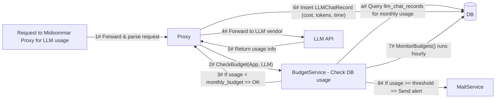

# Midsommar Budget Control System

Below is an **iceberg-style** document describing the Midsommar Budget Control System in both high-level (top of iceberg) and in-depth (under the surface) detail. It preserves the original content, including the **Mermaid diagram** showcasing data flow, expands on governance/audit aspects, and enumerates the UI details and possible usage scenarios. This document is intended to help readers—from administrators to AI developers—to fully understand how Midsommar's budgeting functionality is implemented and used.

---

## Part 1: The Tip of the Iceberg — High-Level Summary

### Purpose & Objectives

The Midsommar Budget Control System allows organizations to **define and enforce monthly spending caps** on:

1. **Applications (Apps)** that use LLMs under the Midsommar platform.  
2. **Language Models (LLMs)** themselves (e.g., OpenAI GPT-4).

Key reasons for this functionality:
- **Governance** and **Audit**: Keep complete visibility on AI usage, ensuring compliance and cost transparency.  
- **Cost Control**: Prevent "runaway" usage bills by imposing hard budget caps.  
- **Real-Time Blocking**: Immediately deny further requests once a budget is exceeded.  
- **Proactive Alerts**: Notify administrators and relevant stakeholders at key usage thresholds (80% and 100%).

### Who Uses It (Target Personas)

1. **Administrator (IT / Ops)**: Sets budgets, monitors monthly usage, receives notifications at thresholds, and ensures that AI usage complies with internal governance.  
2. **AI Developer**: Integrates or builds apps that call LLMs. They rely on the system to confirm usage is within budget. They may also read analytics logs for debugging or cost estimation.  
3. **Chat User (End User)**: Primarily interacts with the system indirectly (through an App), but may encounter "over budget" blocks if usage is exhausted.  

### Jobs to Be Done (JTBD)

- **Enforce Governance**: Ensure no app can exceed a set monthly limit, abiding by departmental or organizational policy.  
- **Audit & Oversight**: Have a reliable record of all LLM usage in `llm_chat_records`, enabling cost transparency and usage review for compliance or post-incident analysis.  
- **Cost Budgeting**: Set a monthly budget for an LLM (like GPT-4) to avoid surpassing a threshold. The system automatically blocks further usage to prevent unexpected bills.  
- **Threshold Notifications**: Automatically warn at 80% usage for an App or LLM to allow proactive intervention. Also send critical alerts at 100%.  
- **Detailed Reporting**: Through the Analytics pipeline or specialized endpoints, produce usage breakdowns for both technical and financial stakeholders.

---

## Part 2: Mid-Level Details — Use Cases & Architecture

### Key Features Overview

- **Monthly Budget Enforcement**:  
  Each `apps.monthly_budget` or `llms.monthly_budget` sets a limit. If `NULL`, no budget enforcement applies for that entity.
  
- **Usage Tracking**:  
  Every LLM request and its associated costs are stored in `llm_chat_records`. The Proxy intercepts requests to the LLM vendor and calculates cost based on the model's cost parameters (`model_prices` table).

- **Blocking Logic**:  
  If usage surpasses a set budget, further requests are **blocked** with HTTP `403 Forbidden`. The response includes JSON indicating that the budget limit was exceeded.

- **Notifications**:  
  - **80%** usage → Warn relevant parties.  
  - **100%** usage → Critical alert.  
  This ensures administrators know when usage is nearing or has reached the cap.

### Data Flow & Integration

Below is the **Mermaid diagram** showing how requests, budget checks, and analytics interplay:



**High-Level Steps**:

1. A request arrives at the **Proxy** specifying which LLM (via slug or ID) and which App is calling it.  
2. The Proxy calls `BudgetService.CheckBudget(...)` to see if the user is still under budget.  
3. If usage is **above** the monthly budget, the request is blocked (`403 Forbidden`).  
4. Otherwise, the request is **forwarded** to the external LLM vendor (e.g., OpenAI).  
5. The LLM vendor responds with usage metrics or token counts.  
6. The Proxy calculates the cost and stores it in the `llm_chat_records` table.  
7. The `BudgetService` periodically queries usage to see if it crosses 80% or 100%.  
8. If so, it triggers an email (or other) alert via the `MailService`.

### System Components

1. **Proxy** (`proxy/` folder):  
   - Intercepts requests for LLM usage.  
   - Calls `BudgetService.CheckBudget(app, llm)`.  
   - On success, forwards to the LLM vendor. On failure, returns `403 Forbidden`.  
   - Collects final usage data (prompt tokens, response tokens), calculates cost, and inserts into `llm_chat_records`.

2. **BudgetService** (`services/budget_service.go`):  
   - **`CheckBudget(app, llm)`**: Summarizes spending for App/LLM in the current month and compares with `monthly_budget`.  
   - **Caching**: Keeps a local in-memory cache of usage to avoid heavy DB queries on every request.  
     - A method `ClearCache()` is available to force re-check from DB if needed.  
   - **`GetMonthlySpending(appID, start, end)`**: Aggregates cost from `llm_chat_records`. Similar for `LLM` usage.
   - **`MonitorBudgets()`**: Periodically checks all Apps/LLMs to see if they've crossed 80% or 100% thresholds.
   - **`NotifyBudgetUsage()`**: Sends out email alerts to relevant people when thresholds are reached.

3. **Database** (`models/` and migrations):  
   - **`apps`** table: has `monthly_budget` and `budget_start_date`.  
   - **`llms`** table: likewise.  
   - **`llm_chat_records`**: usage logs (cost, tokens, vendor, timestamps, etc.).  
   - **`model_prices`**: references how cost per token is calculated for each model and vendor.

4. **Analytics Pipeline**:  
   - Additional background tasks or processes read from `llm_chat_records` to produce cost graphs, usage patterns, or compliance audits.

---

## Part 3: Core Features & Governance Functions

### 3.1 Budget Tracking

- **Per-App**:
  - If `apps.monthly_budget` is set, Midsommar enforces a monthly limit on that app's usage.
  - The time window is from the 1st of the month (or from `budget_start_date` if configured) until the end of that month.
- **Per-LLM**:
  - Similarly, if `llms.monthly_budget` is non-null, the total usage across all Apps that call that LLM is summed.

### 3.2 Governance & Audit

- **Full Usage History**:  
  Each request's cost is tracked in `llm_chat_records`. This yields a consistent trail for auditing.  
- **Notifications**:  
  Timely alerts to administrators enable immediate oversight and swift decision-making (such as adjusting budgets or investigating unexpected usage).  
- **Blocking**:  
  Hard limits ensure no violation of organizational or departmental policies.

### 3.3 Notifications & Alerts

- **80% Threshold**:  
  - Send a "Warning" email to the App's owner (and possibly system admins).  
  - Encourages proactive steps to either reduce usage or increase budget if needed.
- **100% Threshold**:  
  - "Critical" alert.  
  - Denotes that usage is fully blocked.  
  - Typically triggers an immediate review or budget adjustment.

### 3.4 Analytics Integration

- **`llm_chat_records`** as the single source of truth.  
- Summaries can be retrieved via `GetBudgetUsage()` or custom endpoints (e.g. `/analytics/budget-usage`) for dashboards, monthly reports, or compliance reviews.

### 3.5 Admin Controls

- **Setting Budgets**:
  - Admin UI or API (e.g., `PATCH /v1/apps/:id`) can update `monthly_budget`.  
  - `budget_start_date` optionally modifies the monthly cycle start day.
- **Soft vs. Hard Limit**:
  - Currently, the system enforces **hard** blocking at 100%.  
  - If no `monthly_budget` is set, no limit is enforced.

### 3.6 Enforcement

- If usage is already over budget, the system returns:
  ```json
  {
    "status": 403,
    "message": "Budget limit exceeded",
    "error": "app monthly budget exceeded: spent 50.12 of 50.00"
  }
  ```
- This response is standard for both Apps and LLM budget overages.

---

## Part 4: In-Depth Implementation (Under the Surface)

### 4.1 Database Schema Changes

- **`apps`**:
  - `monthly_budget FLOAT NULL`  
  - `budget_start_date DATETIME NULL`  
- **`llms`**:
  - `monthly_budget FLOAT NULL`  
  - `budget_start_date DATETIME NULL`
- **`llm_chat_records`**:
  - `id, app_id, llm_id, cost, time_stamp, prompt_tokens, response_tokens, vendor, etc.`
- **`model_prices`**:
  - `model_name, vendor, cpt (cost per response token), cpit (cost per prompt token), currency`

### 4.2 Primary Methods

1. **`CheckBudget(app, llm)`**  
   - Summarizes the current usage for both `app` and `llm` by calling `GetMonthlySpending()`.  
   - Compares usage against each budget, returns usage as a percentage.  
   - If usage >= 100% for either, it signals the calling code to block.

2. **`GetMonthlySpending(appID, start, end)`** / **`GetLLMMonthlySpending(llmID, start, end)`**  
   - Queries `llm_chat_records`, summing up `cost` in the `[start, end]` time window.  
   - Respects caching to reduce DB overhead.

3. **`MonitorBudgets()`**  
   - Loops over all apps and LLMs, checks usage.  
   - Sends 80% or 100% threshold emails if needed, using `MailService`.

4. **Caching Logic**  
   - Budgets are checked frequently, so the system caches usage results for a short period.  
   - `ClearCache()` can be used to discard the cached usage and recalculate from the DB (useful when data is updated outside normal flows).

### 4.3 Security & Concurrency

- **Enforcement in Proxy**:
  - All LLM requests funnel through `proxy/proxy.go`, so it's not possible to bypass budget checks.  
- **Thread-Safe Caching**:
  - A mutex guards reads/writes to the budget usage cache.  
- **Concurrency**:
  - Multiple requests can arrive at once. Summation queries are minimized by caching, which helps maintain performance under heavy loads.

### 4.4 Performance

- **Indexing**:
  - Indexes on `(app_id, time_stamp)` and `(llm_id, time_stamp)` are recommended to accelerate the queries summing cost.  
- **Data Growth**:
  - If `llm_chat_records` becomes very large, partitioning or archiving older records might be needed.

---

## Part 5: User Interface & Admin Experience

### 5.1 Admin Dashboard

- **Budget Usage Overview**:
  - A dedicated section that lists each App and LLM with:
    - Name
    - Monthly Budget (if any)
    - Spent This Month
    - Usage % (color-coded: green < 80%, orange at 80%, red at 100%)
- **Filtering & Search**:
  - Admins can quickly locate a specific App or LLM to see its usage details or edit its budget settings.

### 5.2 App & LLM Forms

- **Edit / Create**:
  - Allows specifying `monthly_budget` and `budget_start_date`.  
  - If left blank, that entity is not budget-constrained.  

### 5.3 Notifications & Emails

- **Templates**:
  - Typically in `templates/budget_alert.tmpl` or similarly named files.  
- **Recipients**:
  - For **Apps**: the App's owner plus system admins.  
  - For **LLMs**: only system admins.
- **Sample Alert**:
  ```
  Subject: Budget Alert: App "MyApp" at 80% Usage
  Your application "MyApp" has reached 80% of its monthly budget.

  Current usage: $400
  Budget limit: $500
  ```

---

## Part 6: Extended Use Cases & Pitfalls

1. **Governance**:
   - Enforces strict usage alignment with organizational policy.  
   - Clear logs let auditors review historical usage, ensuring no unapproved overspending.

2. **Auditing**:
   - `llm_chat_records` preserves each request, including cost and tokens used.  
   - Administrators or compliance teams can query or export these records for monthly or quarterly audits.

3. **Pitfalls**:
   - **Caching**: If budgets or usage records are updated outside normal flows, the cache might temporarily serve stale data. Use `ClearCache()` or rely on periodic cache refresh.  
   - **Concurrent Surges**: Multiple requests can push usage from below 100% to above 100% nearly simultaneously. Some overlap might occur before the system blocks new requests.  
   - **Large Data**: Very large `llm_chat_records` can slow queries. Index maintenance or table partitioning might be needed.

---

## Part 7: Future Considerations

1. **Soft vs. Hard Limit**:
   - Possibly allow a grace period past 100%, or partial usage. Currently, it is a strict cutoff at 100%.

2. **Multi-Currency**:
   - For complex global organizations, exchanging budgets in different currencies might be an improvement.

3. **Additional Alert Thresholds**:
   - Could add 50%, 90%, or daily usage updates.

4. **Detailed Sub-App or Department Splits**:
   - If multiple teams share an App, budget enforcement at sub-level could be considered.

5. **Scalability**:
   - Larger volumes require more sophisticated caching, partitioning, or sharding for the `llm_chat_records` table.

---

## Conclusion

**Midsommar Budget Control System** brings robust governance and audit capabilities to AI usage. By coupling:

- **Budget Enforcement** at both App and LLM levels,  
- **Comprehensive Logging** in `llm_chat_records`,  
- **In-Flight Checks** within the Proxy,  
- **Cache-Aided Summation** for performance,  
- **Automated Alerts** at critical usage thresholds,  
- **UI Components** for straightforward management,

it allows administrators, developers, and end-user stakeholders (chat users) to maintain predictable, accountable AI usage. The system's details, from database schemas to concurrency control, ensure it can scale to large environments while keeping each entity's usage within safe, budgeted limits.

*Last Updated: February 16, 2025*
