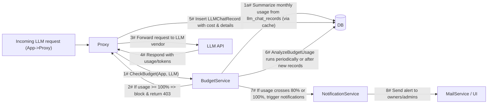

# Midsommar Budget Control System

Comprehensive overview of Midsommar’s budget control functionality. It covers high-level objectives, system architecture, data flows, and detailed technical aspects such as caching and notifications. The goal is to guide both administrators and developers in understanding how monthly usage caps for apps and LLMs are enforced, reported, and surfaced in the UI.

---

## Section 1: Overview

### Purpose & Objectives

The **Midsommar Budget Control System** enables organizations to define and enforce monthly spending caps on:
- **Applications (Apps)** that use Large Language Models (LLMs)
- **LLMs** themselves (e.g., OpenAI GPT-4)

**Key outcomes include:**
- **Governance & Audit:** Maintain transparency and compliance for all AI usage.
- **Cost Control:** Enforce predictable spending limits, avoiding budget overruns.
- **Real-Time Blocking:** Deny further usage once the budget is exceeded (HTTP 403).
- **Proactive Alerts:** Automatically send notifications to owners or admins at 80% (warning) and 100% (critical) usage.

### Who Uses It

1. **Administrator (IT/Ops)**
   - Sets and manages budgets, monitors usage, receives notifications, and ensures policy compliance.
2. **AI Developer**
   - Integrates Midsommar’s LLM proxy into applications and leverages budget analytics for cost insights.
3. **Chat User (End User)**
   - Only interacts indirectly; may see a “Budget Exceeded” message if usage is blocked.

### Core Objectives (Jobs to Be Done)

- **Enforce Governance:** Prevent usage beyond set monthly budgets.
- **Audit & Oversight:** Trace costs via `llm_chat_records` for compliance or analysis.
- **Cost Budgeting:** Define monthly budget for apps and LLMs, block usage at 100%.
- **Threshold Alerts:** Notify at 80% usage (warning) and 100% (critical).
- **Reporting:** Provide endpoints and UIs for monthly usage data and trends.

---

## Section 2: Architecture & Data Flow

### Key Features

1. **Monthly Budget Enforcement**
   - `apps.monthly_budget` and/or `llms.monthly_budget` define monthly caps.
   - `budget_start_date` sets the cycle (e.g., from the 14th to next month’s 13th).
   - If no budget is set, usage is unrestricted.

2. **Usage Tracking**
   - Each request logs cost in `llm_chat_records`.
   - The Proxy calculates cost from `model_prices` and writes DB records.
   - If a model price doesn't exist for a given model, it's automatically created with default values (0.0 CPT/CPIT in USD) to ensure tracking can continue.

3. **Blocking Logic**
   - If usage meets or exceeds 100% of the assigned budget, respond with HTTP 403:

   ```json
   {
     "status": 403,
     "message": "Budget limit exceeded",
     "error": "app monthly budget exceeded: spent 52.34 of 50.00"
   }
   ```

   - A similar message is used for LLM overages.

4. **Notifications**
   - 80% usage triggers a “warning.”
   - 100% usage triggers a “critical” alert.
   - App budgets notify the owner + admins; LLM budgets notify only admins.

5. **Caching Mechanism**
   - An in-memory cache (expires ~5 minutes) speeds up repeated usage checks.
   - Can be cleared explicitly if usage records are changed manually.

### Data Flow & Integration



**Sequence Explanation:**
- **1:** The Proxy calls `CheckBudget` in the `BudgetService`.
- **1a:** Usage is calculated from the DB (with caching).
- **2:** If already at or beyond budget, respond with 403.
- **3:** Otherwise, forward to the LLM vendor.
- **4:** LLM returns token usage.
- **5:** The Proxy inserts a usage record into `llm_chat_records`.
- **6:** A routine (`AnalyzeBudgetUsage`) checks threshold crossing (80% or 100%).
- **7:** If triggered, notifications are sent.
- **8:** End users (owners/admins) receive alerts via email or in-app UI.

### Components & Source Files

- **Proxy**
  - **File:** `/Users/leonidbugaev/go/src/midsommar/proxy/proxy.go`
  - Intercepts and forwards requests, logs usage.
- **BudgetService**
  - **File:** `/Users/leonidbugaev/go/src/midsommar/services/budget_service.go`
  - Performs budget checks, caching, threshold analysis.
- **Database**
  - Schema definitions in the models folder, e.g.:
    - `/Users/leonidbugaev/go/src/midsommar/models/app.go`
    - `/Users/leonidbugaev/go/src/midsommar/models/llm.go`
- **NotificationService**
  - **File:** `/Users/leonidbugaev/go/src/midsommar/services/notification_service.go`
  - Manages alerts, including emailing or in-app notifications.
- **Analytics**
  - **File:** `/Users/leonidbugaev/go/src/midsommar/api/analytics_handlers.go`
  - Provides endpoints under `/analytics/` for usage graphs and cost statistics.

*Adjust file paths/links to match your repository structure.*

---

## Section 3: Implementation Details

### Budget Tracking & Enforcement

- **App Budget:**
  - If `apps.monthly_budget` is set, usage from the budget start date to the current date is enforced.
- **LLM Budget:**
  - If `llms.monthly_budget` is set, usage across all apps for that LLM is tracked.
- **Start Date:**
  - `budget_start_date` can offset from the 1st. The system calculates monthly intervals accordingly.
- **No Budget:**
  - If `monthly_budget` is `NULL`, usage is unlimited.

**Where It’s Implemented:**
- The `CheckBudget(app, llm)` method in `budget_service.go` enforces these rules.
- DB migrations in `/Users/leonidbugaev/go/src/midsommar/models` define the schema.

### Notifications & Alerts

- **80% threshold:** Triggers a “Warning” to the relevant user group.
- **100% threshold:** Triggers a “Critical” block.
- All notifications are recorded in the `notifications` table.
- **UI or Email:** If SMTP is configured, an email is sent; otherwise, only UI notifications appear.

**Where It’s Implemented:**
- `AnalyzeBudgetUsage` in `budget_service.go` calls the `NotificationService`.
- Notification creation is handled in `notification_service.go`.

### Caching & Concurrency

- **In-Memory Cache:**
  - Keyed by entity type (App or LLM) + ID + budget period start.
  - Refreshes if older than ~5 minutes.
- **Thread-Safe:**
  - Synchronized with a mutex.
- **Potential Overruns:**
  - Concurrent requests may slightly overshoot the budget before blocking.

**Where It’s Implemented:**
- `usageCache` and related logic in `budget_service.go`.

### Database Schema Highlights

- **apps**
  - Fields: `monthly_budget` (FLOAT), `budget_start_date` (DATETIME)
- **llms**
  - Fields: `monthly_budget` (FLOAT), `budget_start_date` (DATETIME)
- **llm_chat_records**
  - Fields: `app_id`, `llm_id`, `cost`, `timestamps`, etc.
- **model_prices**
  - Fields: `model_name`, `vendor`, `cpt`, `cpit`, `currency`

*(See `/Users/leonidbugaev/go/src/midsommar/models` for specific struct definitions.)*

---

## Section 4: API Endpoints

Below are the endpoints specifically related to budget control:

| **Endpoint**                         | **Description**                                                      | **Source File**                                         |
| ------------------------------------ | -------------------------------------------------------------------- | ------------------------------------------------------- |
| **GET /analytics/budget-usage**      | Returns a list of current usage and budgets for each App/LLM         | `analytics_handlers.go` (`getBudgetUsage`)              |
| **GET /analytics/budget-usage-for-app**| Retrieves detailed budget usage for a specific app                   | `analytics_handlers.go` (`getBudgetUsageForApp`)          |
| **PATCH /v1/apps/:id**               | Update an app’s `monthly_budget` and `budget_start_date`              | `app_handlers.go` (`updateApp`)                         |
| **PATCH /v1/llms/:id**               | Update an LLM’s `monthly_budget` and `budget_start_date`              | `llm_handlers.go` (similar pattern)                     |

**Common Query Parameters for Budget Endpoints:**
- `app_id` (optional): Filter results for a specific app.
- `llm_id` (optional): Filter results for a specific LLM.

These endpoints enable both UI dashboards and automated scripts to manage or monitor budgets.

---

## Section 5: User Interface & Admin Experience

### Admin Dashboard

- **Budget Usage Overview:**
  - Displays each App/LLM with total spent vs. budget.
  - Color-coded usage bar:
    - **Green:** Usage less than 80%
    - **Yellow:** Usage between 80% and 99%
    - **Red:** Usage at or above 100%
  - Logic is implemented in React components located at:
    - `/Users/leonidbugaev/go/src/midsommar/ui/admin-frontend/src/admin/components/apps/AppDetails.js`
    - `/Users/leonidbugaev/go/src/midsommar/ui/admin-frontend/src/admin/components/Dashboard.js`

### App & LLM Forms

- **Create / Update:**
  - Specify `monthly_budget` and `budget_start_date`.
  - If left blank, no enforcement is applied.
  - Implemented in `AppForm.js` and `LLMForm.js`.

### Deletion & Edge Cases

- Removing an App or LLM stops enforcing its budget.
- If usage changes occur externally, call `BudgetService.ClearCache()` to refresh.
- A zero budget means requests are blocked immediately upon exceeding `$0`.

---

## Section 6: Pitfalls & Best Practices

1. **Stale Cache:**
   - Manual corrections in the DB may not be reflected immediately in the in-memory cache until it refreshes or is cleared.
2. **Concurrent Surges:**
   - Multiple simultaneous requests can push usage slightly over the budget before blocking.
3. **Large Datasets:**
   - Consider partitioning or archiving `llm_chat_records` if usage volumes are high.

---

## Section 7: Future Considerations

1. **Soft Limit:**
   - Allow a small buffer over 100% or implement an auto pause.
2. **Multi-Currency:**
   - Possibly store or convert budgets across different currencies.
3. **More Thresholds:**
   - Add notifications for 50%, 90% usage, or provide daily usage digests.
4. **Advanced Sub-Budgeting:**
   - Department-level usage breakdown or sub-app splits.
5. **High-Scale:**
   - Implement sharding or advanced caching for thousands of requests per second.

---

## Conclusion

Midsommar’s Budget Control System enforces predictable monthly spending on Apps and LLMs by providing:
- **Real-Time Blocks** at 100% usage.
- **Notifications** at 80% and 100%.
- **Complete Audit Trails** in `llm_chat_records`.
- **User-Friendly UI** with color-coded usage bars and analytics.
- **Efficient Caching** that reduces overhead on frequent checks.

By combining these features, Midsommar ensures strong governance of AI usage while offering flexibility for different budget cycles and advanced usage scenarios.

---

## Further Reading & References

- **BudgetService Implementation:**  
  `services/budget_service.go` – Primary logic for budget checks, analysis, caching, and notifications.
- **Proxy & Request Flow:**  
  `proxy/proxy.go` – Intercepts LLM requests, calls `CheckBudget(...)`, and records usage.
- **Notifications:**  
  `services/notification_service.go` – Deduplicates and sends notifications at specified thresholds.
- **Frontend:**  
  - `ui/admin-frontend/src/admin/components/apps/AppDetails.js` – Displays budget usage details and charts.
  - `ui/admin-frontend/src/admin/components/apps/AppForm.js` – Allows editing of monthly budgets.
  - `ui/admin-frontend/src/admin/components/llms/LLMForm.js` – Similar functionality for LLM budgets.
