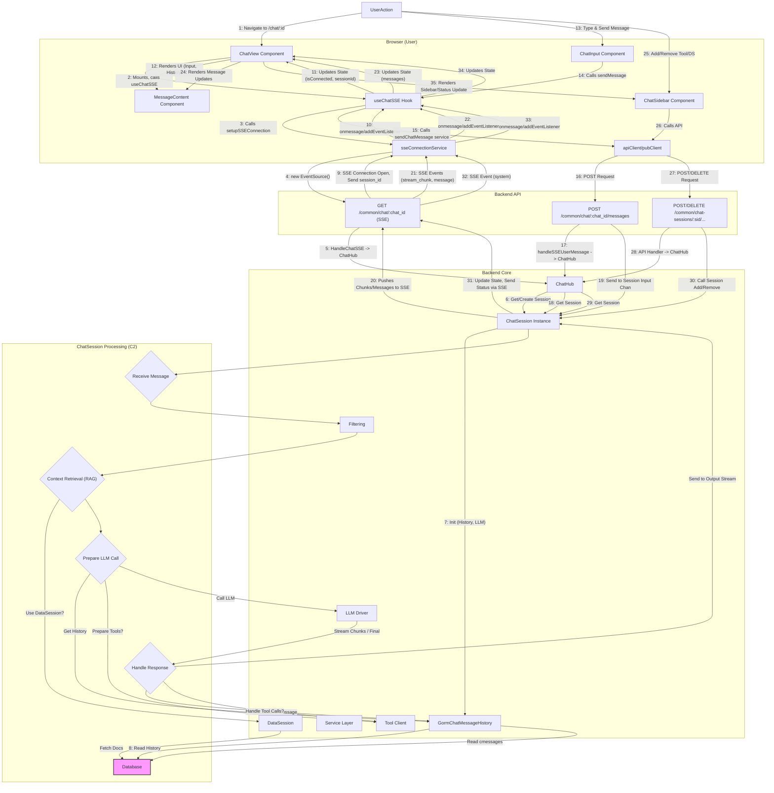

## Chat Session System

**1. Overview & Purpose**

The Chat Session System provides the core functionality for managing interactive, stateful conversations between users and Large Language Models (LLMs), potentially augmented with external tools, datasources, and files. It handles message history, context management, real-time streaming responses via Server-Sent Events (SSE), and integration with other Midsommar features, accessible through a dedicated UI.

**Key Objectives:**

*   **Stateful Interaction:** Maintain conversation context and history within a defined session (`session_id`).
*   **Real-time Communication:** Support Server-Sent Events (SSE) for streaming LLM responses back to the user interface (`ChatView`, `useChatSSE`).
*   **Extensibility:** Allow dynamic addition/removal of **Tools** and **Datasources** via the UI (`ChatSidebar`) to enrich the conversation context and capabilities during an active session.
*   **Persistence:** Store chat history (`cmessages`) and session metadata (`chat_history_records`) in the **Database** for later retrieval, continuation, and administrative review.
*   **Integration:** Work seamlessly with **User Management** (authentication, entitlements), **LLM Configuration**, **Tool/Datasource Catalogues**, **Filtering**, **File Storage**, and **Analytics/Logging**.
*   **Configuration:** Allow chat behavior customization through associated `Chat` configurations (LLM selection, system prompts, default tools/datasources, filters), managed via **App/LLM Management**.
*   **User Interface:** Provide a responsive and interactive chat UI (`ChatView`, `ChatInput`, `ChatSidebar`, `MessageContent`) for users to engage with the system.

**User Roles & Interactions:**

*   **End User (via Chat UI - `ChatView`):**
    *   Navigates to a specific chat (`/chat/:chatId`).
    *   Initiates or continues chat sessions (SSE connection established via `useChatSSE`).
    *   Sends messages using `ChatInput`.
    *   Views conversation history and streamed LLM responses in `MessageContent` (rendered using `MarkdownMessage`).
    *   Uploads files using the drag-and-drop feature in `ChatInput`.
    *   Adds/Removes available **Tools** and **Datasources** during the session using `ChatSidebar`.
    *   Receives system messages and error notifications within the chat interface.
    *   Can potentially edit their previous messages (`MessageContent` edit feature).
*   **Administrator (via Admin UI):**
    *   Configures `Chat` entities (defining available LLMs, settings, default tools/datasources, filters, system prompts) using **App/LLM Management** features (separate UI/API).
    *   Monitors user chat activity by viewing specific session logs (`/admin/users/:id/chat-log/:sessionId` route, `UserMessageLog` component).
    *   Manages **Users**, **Tools**, **Datasources**, **LLMs**, etc., through dedicated admin sections.

**2. Architecture & Data Flow**

**Core Components & Interactions:**

*   **Frontend UI (`ui/admin-frontend/src/portal/components/`):** React-based user interface.
    *   `ChatView`: Main component orchestrating the chat interface. Uses `useChatSSE` hook.
    *   `useChatSSE`: Custom hook managing the SSE connection lifecycle (`sseConnectionService`), state (connection status, session ID, errors), and message sending (`chatHistoryService`).
    *   `sseConnectionService`: Handles raw `EventSource` setup, event listeners (`session_id`, `stream_chunk`, `message`, `system`, `error`), and reconnection logic.
    *   `chatHistoryService`: Provides functions to fetch history and send messages to the backend API.
    *   `ChatInput`: Component for user text input, message sending, and file uploads.
    *   `ChatSidebar`: Displays available/selected **Tools** & **Datasources**, allowing users to add/remove them during a session.
    *   `MessageContent`: Renders individual messages (user, AI, system), supports Markdown (`MarkdownMessage`), and potentially editing.
    *   `UserMessageLog` (Admin): Displays paginated chat history for a specific session.
    *   Uses `apiClient`/`pubClient` for HTTP requests to the backend.
*   **API Handlers (`api/chat_session_handler.go`, `api/chat_handlers.go`, `api/history.go`):** Expose chat functionality via HTTP endpoints.
    *   `/common/chat/:chat_id` (GET): Endpoint for establishing the SSE connection (`HandleChatSSE`). Authenticates via token parameter.
    *   `/common/chat/:chat_id/messages` (POST): Receives user messages (`handleSSEUserMessage`) and forwards them to the appropriate `ChatSession`.
    *   `/common/chat-sessions/:session_id/...` (POST/DELETE): Endpoints for adding/removing tools, datasources, uploading files, editing messages within a session context.
    *   `/admin/chat-history-records/messages/:sessionId` (GET): Endpoint for admins to fetch paginated message logs (`GetChatHistoryRecordMessages`).
    *   *Dependency:* Interacts with `ChatHub` to manage session lifecycle.
    *   *Dependency:* Uses **Service** layer for DB access, user info, and entity retrieval.
*   **ChatHub (`api/chat_session_handler.go`):** In-memory manager for active `ChatSession` instances. (See previous description).
*   **ChatSession (`chat_session/chat_session.go`):** Represents a single, stateful conversation instance. (See previous description).
    *   *Dependency:* Uses **Service** layer.
    *   *Dependency:* Uses `GormChatMessageHistory`.
    *   *Dependency:* Uses **LLM Drivers**.
    *   *Dependency:* Uses **DataSession** for RAG.
    *   *Dependency:* Uses `universalclient` for **REST Tool** execution.
    *   *Dependency:* Interacts with **Filtering** service.
*   **GormChatMessageHistory (`chat_session/gorm_history.go`):** Handles persistence of chat messages and session metadata in the **Database**. (See previous description).
*   **Database (`models/`):** Stores configuration and operational data (`chats`, `cmessages`, `chat_history_records`, `llms`, `llm_settings`, `tools`, `datasources`, `filters`, `users`).
*   **Service (`services/service.go`, `services/history_service.go`):** Central service layer providing access to DB operations and business logic (e.g., `GetUserEntitlements`, `GetToolByID`, `GetChatHistoryRecordBySessionID`).
*   **DataSession (`data_session/data_session.go`):** Handles retrieval and processing of information from **Datasources** for RAG.
*   **LLM Drivers (`switches/`):** Adapters for communicating with different **LLM Vendor** APIs.
*   **Tool Client (`universalclient`):** Library used to interact with **REST-based Tools**.
*   **Filtering (`scripting/`):** Executes user-defined scripts (e.g., Lua) to filter content (e.g., uploaded files).

**Data Flow (UI Interaction Focus):**

**3. Implementation Details**

*   **Frontend State Management:** Primarily uses React hooks (`useState`, `useEffect`, `useCallback`, `useRef`) within components like `ChatView`. The `useChatSSE` hook encapsulates SSE connection state and logic.
*   **SSE Handling (Frontend):** `sseConnectionService.js` uses the browser's `EventSource` API. It listens for specific event types (`session_id`, `stream_chunk`, `message`, `system`, `error`) sent from the backend. Reconnection logic with exponential backoff is implemented. Errors are parsed (`detectErrorType`) to potentially halt reconnection (e.g., `llm_config` errors).
*   **SSE Handling (Backend):** `HandleChatSSE` manages the connection. The `ChatSession` pushes messages/chunks/status updates to different channels (`outputStream`, `outputMessages`) which are then formatted and sent over the SSE connection by the handler. Specific event types are used for different kinds of data.
*   **Session Management:** `ChatHub` (backend) manages active sessions in memory. The frontend receives the `session_id` via an SSE event and uses it for subsequent API calls (sending messages, managing tools/datasources). Session continuation is supported via the `continue_id` query parameter (`/chat/:chatId?continue_id=...`).
*   **Message Rendering:** `MessageContent` receives message objects, determines the type (user, AI, system), and renders accordingly. AI responses are often streamed (`stream_chunk`) and progressively built in the UI state before being finalized (`message` or `ai_message`). `MarkdownMessage` handles Markdown rendering. System messages (`:::system ... :::`) are styled distinctly.
*   **Tool/Datasource Management (UI):** `ChatSidebar` lists available items. Clicking triggers API calls (`POST/DELETE /common/chat-sessions/:session_id/...`) via `apiClient`. The backend `ChatSession` updates its state, performs validation (**Entitlements**, privacy scores), and sends a confirmation back via a `system` SSE message.
*   **File Uploads (UI):** `ChatInput` uses a library (likely react-dropzone) for drag-and-drop. On drop, files are uploaded via `apiClient` (`POST /common/chat-sessions/:session_id/upload`). The backend `ChatSession` stores a reference (`AddFileReference`). Files can be referenced in subsequent messages (`FileRefs`) and potentially processed by **Filters**.
*   **Admin Message Log:** The `UserMessageLog` component fetches paginated history from `/admin/chat-history-records/messages/:sessionId` and displays it, including message content and timestamps.
*   **Error Handling (UI):** `useChatSSE` catches connection errors and errors sent via SSE. Errors are displayed in the UI (`Alert` component in `ChatView`) or as system messages. Specific error types (`llm_config`, `connection`) influence UI behavior (e.g., stopping reconnection attempts).

**4. Use Cases & Behavior**

*   **End User: Starting a New Chat:**
    1.  User navigates to `/chat/:chatId` (e.g., from `ChatDashboard`).
    2.  `ChatView` mounts, `useChatSSE` initiates SSE connection to `/common/chat/:chat_id`.
    3.  Backend creates a new `ChatSession`, assigns a `session_id`.
    4.  Backend sends `session_id` event via SSE.
    5.  Frontend (`useChatSSE`) receives `session_id`, updates state, updates URL (`window.history.replaceState`) to include `continue_id`.
    6.  Backend loads default **Tools/Datasources** based on `Chat` config. Sends initial state via `session_id` event payload.
    7.  Frontend updates `ChatSidebar` based on received tools/datasources.
    8.  UI (`ChatInput`, empty history) is ready.
*   **End User: Continuing a Chat:**
    1.  User navigates to `/chat/:chatId?continue_id=EXISTING_SESSION_ID`.
    2.  `ChatView` mounts, `useChatSSE` initiates SSE connection including `session_id=EXISTING_SESSION_ID`.
    3.  Backend (`ChatHub`) finds/loads the existing `ChatSession`.
    4.  Backend sends `session_id` event via SSE (confirming the session).
    5.  Frontend (`useChatSSE`) calls `fetchChatHistory` service -> `GET /common/chat-history/:session_id`.
    6.  Backend (`GetChatHistory`) retrieves messages from **Database**.
    7.  Frontend receives history, populates `messages` state, renders in `MessageContent`. UI is ready.
*   **End User: Sending a Message:**
    1.  User types in `ChatInput`, optionally attaches files, clicks send.
    2.  `ChatInput` calls `handleSendMessage`.
    3.  `useChatSSE.sendMessage` is called -> `POST /common/chat/:chat_id/messages` with payload and `session_id`.
    4.  Frontend may optimistically display the user message in `MessageContent`.
    5.  Backend `ChatSession` receives message, processes it (RAG, **Filtering**, **Tool** calls, **LLM** call).
    6.  Backend streams response chunks (`stream_chunk` events) via SSE.
    7.  Frontend (`useChatSSE` -> `ChatView`) appends chunks to the last AI message in state. `MessageContent` re-renders.
    8.  Backend sends final message (`message` or `ai_message` event) or error (`error` event).
    9.  Backend saves user message, AI response, tool interactions to **Database** (`GormChatMessageHistory`).
*   **End User: Adding a Tool:**
    1.  User clicks "Add" on a tool in `ChatSidebar`.
    2.  Sidebar handler calls `addToCurrentlyUsing`.
    3.  `apiClient` sends `POST /common/chat-sessions/:session_id/tools` with tool ID.
    4.  Backend `ChatSession.AddTool` validates (**Entitlements**, privacy), updates internal state.
    5.  Backend sends `system` message via SSE ("Tool 'X' added...").
    6.  Frontend receives system message, displays it. Sidebar state might update based on API success/failure or the system message.
*   **Admin: Reviewing a Chat Log:**
    1.  Admin navigates to User Management section, selects a user.
    2.  Admin views user's chat history list (potentially fetched from `chat_history_records`).
    3.  Admin clicks on a specific session link.
    4.  Navigates to `/admin/users/:id/chat-log/:sessionId`.
    5.  `UserMessageLog` component mounts, fetches paginated messages from `/admin/chat-history-records/messages/:sessionId`.
    6.  Component displays the conversation messages. Admin can navigate pages.

**5. Potential Considerations & Future Enhancements**

*   **UI State Synchronization:** Ensuring UI state (selected tools/datasources in `ChatSidebar`) perfectly mirrors the backend `ChatSession` state, especially after reconnections or errors, requires careful handling.
*   **Error Display:** Providing user-friendly error messages based on backend error types (`llm_config`, tool execution failure, datasource access denied, filter rejection).
*   **Scalability:** High number of concurrent SSE connections can strain backend resources. Consider load balancing and potentially stateless API design with external session state stores (e.g., Redis) if `ChatHub` becomes a bottleneck.
*   **Offline Support/Resilience:** Currently relies heavily on active SSE connection. Implementing mechanisms to queue messages or gracefully handle temporary disconnections could improve UX.
*   **Message Editing Complexity:** Editing a message requires backend logic to potentially invalidate/delete subsequent messages and re-run parts of the conversation, which can be complex and computationally expensive. Ensure UI clearly reflects the impact.
*   **Accessibility:** Ensure UI components (`ChatInput`, `MessageContent`, `ChatSidebar`) adhere to accessibility standards.
*   **Testing:** Implement robust end-to-end tests covering UI interactions, SSE communication, and backend processing flows.