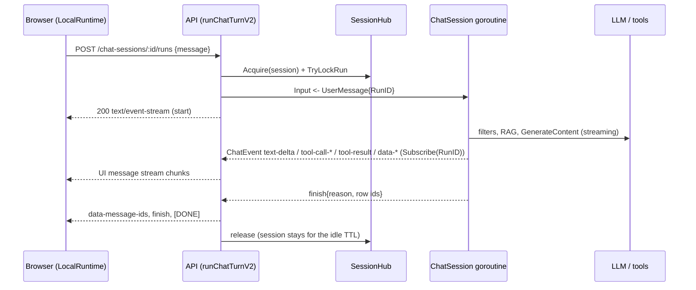

## Chat Session System

**1. Overview & Purpose**

The Chat Session System provides the core functionality for managing interactive, stateful conversations between users and Large Language Models (LLMs), potentially augmented with external tools, datasources, and files. It handles message history, context management, real-time streaming responses and integration with other Midsommar features, accessible through a dedicated UI.

Two front ends and two wire protocols exist side by side (September 2026):

*   **v2 (default, `CHAT_UI_V2_ENABLED=true`)**: an [assistant-ui](https://www.assistant-ui.com/) based thread (`ui/admin-frontend/src/portal/components/chat-v2/`) driven by a per-turn streamed request (`POST .../runs`) in the AI SDK "UI message stream" format. Tool calls, retrieved context, status and errors are structured parts, not text markers.
*   **v1 (fallback)**: the original hand-rolled React chat (`ChatView.js`, `MessageContent.js`) on a long-lived SSE connection plus a message POST, where tool activity and context are encoded as `:::system ...:::` and `[CONTEXT]...[/CONTEXT]` text.

Both share the same `ChatSession` (`chat_session/chat_session.go`), persistence and governance; a session is fixed to one output mode when it starts (`OutputModeRaw` for v1, `OutputModeEvents` for v2).

**Key Objectives:**

*   **Stateful Interaction:** Maintain conversation context and history within a defined session (`session_id`).
*   **Real-time Communication:** Stream LLM responses to the browser (per-turn streams in v2, SSE in v1).
*   **Extensibility:** Allow dynamic addition/removal of **Tools** and **Datasources** via the UI (`ChatSidebar`) during an active session.
*   **Human-in-the-loop:** Let the model ask the person in the chat for an approval or a form answer through **client tools** (`models.ToolTypeClient`).
*   **Persistence:** Store chat history (`c_messages`) and session metadata (`chat_history_records`) for later retrieval, continuation, and administrative review.
*   **Integration:** Work with **User Management**, **LLM Configuration**, **Tool/Datasource Catalogues**, **Filtering**, **File Storage**, **Plugins** (tool renderers) and **Analytics/Logging**.

**User Roles & Interactions:**

*   **End User (v2 chat UI):**
    *   Navigates to a chat (`/chat/:chatId`, optionally `?continue_id=<session>`), or an agent (`/chat/agent/:agentId`).
    *   Sends messages (Enter), attaches files, picks prompt templates on an empty thread.
    *   Sees streamed Markdown replies, tool-call cards with arguments/results, collapsible retrieved context, status lines and categorised errors (hideable with the persisted "System and Context Messages" toggle).
    *   Edits an earlier message (the conversation rewinds), regenerates the last reply, stops a reply, starts a new chat, prints the conversation.
    *   Answers client tools (approve/reject or form) so the model can continue.
    *   Adds/removes tools and datasources from the sidebar.
*   **Administrator:**
    *   Configures `Chat` entities and tools (including client tools, on the Tools page with tool type "Client (human-in-the-loop)").
    *   Reviews session logs (`/admin/users/:id/chat-log/:sessionId`).

**2. Architecture & Data Flow (v2)**

*   **Frontend (`ui/admin-frontend/src/portal/components/chat-v2/`)**
    *   `runtime/useStudioRuntime.js`: builds assistant-ui's `LocalRuntime` with a `ChatModelAdapter` (POSTs one turn to `.../runs`, pipes the response through `assistant-stream`'s `UIMessageStreamDecoder` and `AssistantMessageAccumulator`), a history adapter (`GET .../messages/v2`), an attachments adapter (`POST .../upload`, file names become `file_refs`) and `unstable_humanToolNames` for client tools.
    *   `runtime/messageMapping.js`: converts v2 history messages to `ThreadMessageLike`; `buildRunBody` derives a plain turn, an edit (`after_message_id`), a regenerate, or a client-tool resume (`tool_results`) from the thread shape and the row ids returned in the `data-message-ids` chunk.
    *   `api/chatV2Client.js`: endpoints for chat rooms (`chatEndpoints`) and agents (`agentEndpoints`); the streamed run uses `fetch` with cookies + CSRF header (no token in the URL).
    *   `StudioChatShell.js` (toolbar, thread, optional sidebar), `StudioThread.js` (viewport, welcome + suggestions, messages, scroll-to-bottom, composer), `AssistantMessage.js` / `UserMessage.js` / `EditComposer.js` / `Composer.js`, `MarkdownText.js` (react-markdown 10 via `MarkdownTextPrimitive`, Prism code blocks).
    *   Parts: `ToolCallCard` (default tool renderer), `HumanToolCard` (approval/form for client tools, rjsf), `PluginToolRenderer` (plugin web components), `ContextBlock`, `StatusChip`, `ErrorCard`.
    *   `toolUiRegistry.js`: tool name → renderer (built-ins, plugin renderers from the `chat.tool_renderer` portal slot, client tools).
    *   Pages: `pages/ChatViewV2.js`, `pages/AgentChatV2.js`; `routes/ChatRoutes.js` picks v2 or v1 from `features.chat_ui_v2` (`GET /common/system`).
*   **API (`api/chat_v2_handlers.go`, `api/agent_v2_handlers.go`, `api/chat_v2_history.go`)**
    *   `POST /common/chat/:chat_id/sessions` create/resume; `POST /common/chat-sessions/:session_id/runs` stream one turn; `.../cancel`; `GET .../messages/v2` materialised history (assistant rows folded per turn, tool results attached to their call, `[CONTEXT]` split into `data` parts, system prompt omitted). Agents: `/common/agents/:id/sessions`, `/common/agent-sessions/:session_id/...`.
    *   `uiStreamWriter` maps session events to UI-message-stream chunks; the finish carries the turn's row ids as a transient `data-message-ids` chunk.
    *   `api/session_hub.go` `SessionHub`: reference-counted, idle-TTL (`CHAT_SESSION_IDLE_TTL`, default 10m) registry of live chat and agent sessions. A v1 SSE connection or a v2 run holds a reference; a session is never stopped while in use and never duplicated for the same id.
*   **ChatSession (`chat_session/`)**
    *   `events.go`: `OutputMode`, `ChatEvent` envelope (`{v:"aui/v1", run_id, seq, kind, data}`) published on the queue's stream channel in events mode, per-run `Subscribe` fan-out, run lifecycle (`beginRun`/`finishRun`, `CancelRun`, run context), `ClassifyError`.
    *   Turn boundary: every user message is a run; `HandleLLMResponse` reports whether it re-entered the model; `finish` is emitted for every way a turn ends (`stop`, `tool-calls`, `error`, `cancelled`).
    *   `client_tools.go`: client tools are offered to the model as functions (`prepareTools`), parked when called (`handleToolCalls`), persisted as the tool-call row; `resumeWithToolResults` persists the answers and re-calls the model (`callModelAfterTools`, shared with the REST tool loop); unanswered calls are closed with an error result when the user moves on.
    *   `regenerateTurn` re-runs the model on the stored history; `services.TruncateAfterMessage` rewinds history for edits/regenerates without touching the system prompt.
    *   `muteStreaming` keeps side calls to the model (title generation) out of the user's reply.
*   **Agents (`agent_session/runs.go`)**: `StartRun` streams one turn from the plugin and signals its end; an in-memory transcript (text, reasoning, tool calls/results) is served as history and handed to the plugin; TOOL_CALL/TOOL_RESULT chunks are tagged with `tool_call_id`. The plugin SDK proto is unchanged.
*   **Persistence** unchanged: `CMessage.Content` = `llms.MessageContent` JSON; `models.SplitContext` is the single place that knows the stored `[CONTEXT]` format.

**Data Flow (v2 turn):**

```mermaid
sequenceDiagram
    participant B as Browser (LocalRuntime)
    participant A as API (runChatTurnV2)
    participant H as SessionHub
    participant S as ChatSession goroutine
    participant M as LLM / tools

    B->>A: POST /chat-sessions/:id/runs {message}
    A->>H: Acquire(session) + TryLockRun
    A->>S: Input <- UserMessage{RunID}
    A-->>B: 200 text/event-stream (start)
    S->>M: filters, RAG, GenerateContent (streaming)
    S-->>A: ChatEvent text-delta / tool-call-* / tool-result / data-* (Subscribe(RunID))
    A-->>B: UI message stream chunks
    S-->>A: finish{reason, row ids}
    A-->>B: data-message-ids, finish, [DONE]
    A->>H: release (session stays for the idle TTL)
```

**3. Implementation Notes**

*   **Edits and regenerate:** the browser maps runtime message ids to database row ids (history load + `data-message-ids`); an edit sends `after_message_id` of the message before the edited one (`root` for the first), regenerate sends `regenerate: true` (server rewinds to after the last user turn and re-runs).
*   **Client tools:** `tool_results` are sent when the runtime resumes a message that assistant-ui marked `requires-action`; the server verifies a call is pending and refuses otherwise (409).
*   **Output modes:** the hub refuses to attach a v1 reader to a v2 session and vice versa; the v1 reader silently drops envelope JSON.
*   **Distributed queues:** v2 subscribes through the session's own fan-out over the queue channels; cross-instance consumption of one session's output is not supported (use session affinity). See `features/ChatQueue.md`.
*   **Jest:** the assistant-ui packages are ESM-only; `package.json` maps their subpath exports and allows their transformation, and `setupTests.js` polyfills Web Streams.

**4. Use Cases & Behaviour (v2)**

*   **Start / continue:** `ChatViewV2` calls the sessions endpoint (with `continue_id` when present), rewrites the URL to `?continue_id=`, and the runtime loads `messages/v2`.
*   **Send:** the composer appends a user message; the adapter streams the turn; tool cards update as arguments and results arrive.
*   **Edit:** the edit composer replaces the message; the run rewinds server-side and streams a new reply; later messages disappear from the thread and the database.
*   **Client tool:** the reply pauses with `finish: tool-calls`; the card collects the answer; the same adapter resumes the turn.
*   **New Chat:** a fresh session is created; the previous one stays until its idle TTL.
*   **Agent:** identical flow against the agent endpoints, without sidebar or uploads.

**5. Follow-ups**

*   Branch switching in the thread (assistant-ui supports it; the backend truncates, so branches are not kept).
*   Persisted agent transcripts (agents keep their transcript in memory for the session's lifetime only).
*   Resuming a pending client tool after a page reload (the session payload lists `pending_tool_call_ids`; the UI does not yet re-offer the card).
*   Removing the v1 UI once v2 has soaked.
