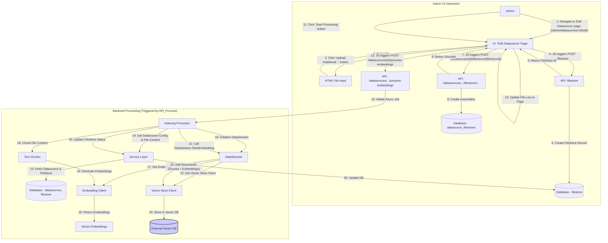
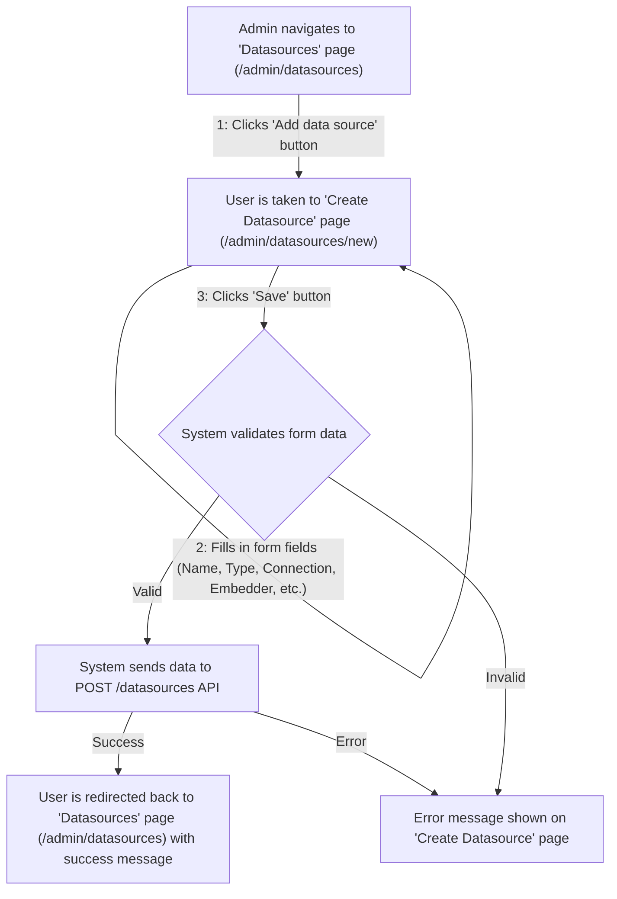
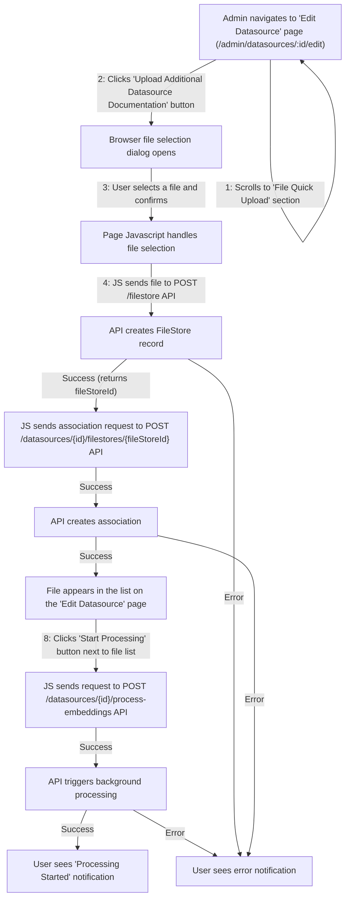

## Datasource & RAG System

**1. Overview & Purpose**

The Datasource system allows administrators to configure and manage connections to various external **Vector Stores** (e.g., Pinecone, PGVector, Chroma, Redis, Qdrant, Weaviate). These Datasources define how Midsommar connects to and interacts with these vector databases, which serve as knowledge bases for Retrieval Augmented Generation (RAG).

Users/Admins can upload files (like PDFs, text documents) into Midsommar's internal **FileStore**. A `FileStore` record holds the file's metadata and content. These `FileStore` entries can then be associated with specific `Datasource` configurations.

When files are associated and processed, the system (via `DataSession`) reads the content from the `FileStore`, chunks it, generates vector embeddings using the `Datasource`'s configured embedding model, and stores these embeddings (along with the text chunks) in the external **Vector Store** specified by the `Datasource`.

During chat interactions configured for RAG, the `DataSession` queries the relevant **Vector Store(s)** (as defined by the `Datasource`) using semantic similarity search to retrieve relevant context based on the user's input. This context is then injected into the LLM prompt to provide more informed and accurate responses.

**Key Objectives:**

*   **Vector Store Abstraction:** Provide a unified interface (`DataSession`) to interact with different vector database vendors.
*   **Configuration Management:** Allow Admins to easily configure connections (`Datasource` model) to external Vector Stores and Embedding Providers via the Admin UI (primarily the 'Create/Edit Datasource' pages) or API.
*   **Source File Management:** Enable users/admins to upload source documents into the internal `FileStore` (`filestore` table) and associate them with `Datasources` for indexing via the Admin UI ('Edit Datasource' page) or API.
*   **Embedding Generation:** Automatically handle the process of generating embeddings for ingested document chunks using configured embedding models (e.g., OpenAI, Cohere, local).
*   **Data Ingestion:** Provide a mechanism (`DataSession.StoreEmbedding`) to chunk documents from `FileStore` and store their embeddings in the appropriate external Vector Store namespace/index associated with a `Datasource`.
*   **Retrieval (RAG):** Offer a search capability (`DataSession.Search`) that queries configured external Vector Stores (via `Datasource` definitions) using semantic similarity search to find relevant context for user prompts.
*   **Integration with Chat:** Allow Chat configurations (`Chat` model) to specify a default `Datasource` (`DefaultDataSourceID`) to be used for RAG.

**Clarification: FileStore vs. Vector Store**

*   **FileStore (`filestore` table, managed by Midsommar):**
    *   An **internal record** within the Midsommar database.
    *   Represents a **source file** uploaded by a user (e.g., PDF, TXT).
    *   Stores file **metadata** (filename, description) and the **raw content**.
    *   Acts as the **source material** before processing and embedding.
    *   Managed via the `/filestore` API endpoint and UI components (e.g., upload section on the 'Edit Datasource' page).
*   **Vector Store (External Database, e.g., Pinecone, Chroma):**
    *   An **external database service** (like Pinecone, Weaviate, etc.). Midsommar connects to it based on the `Datasource` configuration.
    *   Stores **vector embeddings** (numerical representations) derived from the processed content of associated `FileStore` files.
    *   Also stores the corresponding **text chunks** and potentially metadata needed for retrieval.
    *   Does **not** store the original raw file.
    *   Optimized for efficient **similarity searches**.
    *   Interaction is managed by `DataSession` using connection details from the `Datasource` model.

**Relationship:** `FileStore` (Raw Content) -> (Processing/Chunking/Embedding via `DataSession` & Embedder defined in `Datasource`) -> Data stored in external **Vector Store** (Embeddings & Chunks) configured in `Datasource`.

**User Roles & Interactions:**

*   **Administrator (Admin):**
    *   **Configuration (UI):** Uses the Midsommar Admin UI:
        *   Navigates to the **'Datasources' page** (`/admin/datasources`).
        *   Clicks the "Add data source" button, navigating to the **'Create Datasource' page** (`/admin/datasources/new`).
        *   Fills in the Datasource configuration form (name, vector store type, connection info, embedder info) and saves.
        *   From the 'Datasources' page, clicks on a Datasource name to view its details on the **'Datasource Details' page** (`/admin/datasources/:id`).
        *   From the 'Datasource Details' page, clicks "Edit" to navigate to the **'Edit Datasource' page** (`/admin/datasources/:id/edit`).
        *   On the 'Edit Datasource' page, manages associated files within the "File Quick Upload" section: uploads new files, views associated files, removes associations, triggers processing ("Start Processing" button).
        *   Configures Chat instances (on relevant Chat configuration pages) to use specific Datasources.
    *   **Monitoring (UI):** Uses the 'Datasources' page and 'Datasource Details' page to view Datasource status, configuration, and associated files/processing status.
*   **AI Developer/App Owner (Dev) / End User:**
    *   **Interaction:** Interacts with Chat instances configured for RAG. Queries trigger `DataSession.Search` transparently.
    *   **(Potentially):** May upload files directly to a Chat's "Extra Context" on the Chat configuration page, which creates a `FileStore` and associates it for RAG specific to that chat.

**2. Architecture & Data Flow**

**Core Components:** (API Handlers, Service Layer, Models, DataSession, Vector Store Clients, Embedding Clients, Database) - *Remain the same as previous spec.*

**UI Components (File Structure):**

*   `DatasourceList.js`: Renders the 'Datasources' page (`/admin/datasources`).
*   `DatasourceForm.js`: Renders the 'Create Datasource' (`/admin/datasources/new`) and 'Edit Datasource' (`/admin/datasources/:id/edit`) pages.
*   `DatasourceDetails.js`: Renders the 'Datasource Details' page (`/admin/datasources/:id`).
*   **(File Upload Integration):** File upload logic exists within `DatasourceForm.js`, `ToolForm.js`, `ChatForm.js`.

**Data Flow (File Ingestion & Embedding - Updated UX):** (Diagram remains conceptually similar, emphasizing UI page interactions)



**Data Flow (RAG Query):** (Remains the same as the previous spec)

**Admin UI Flows (UX Perspective):**

**Creating a Datasource:**



**Associating and Processing a File:**



**3. Implementation Details**

(Model definitions, DataSession logic, API endpoints, File Processing API, File Content Storage, Vendor Utilities, State Management - *Remain the same as previous spec, referencing `.js` files where appropriate.*)

**4. Use Cases & Behavior**

(Use cases remain the same, but the UI steps follow the revised "Admin UI Flows (UX Perspective)" above).

*   **Admin Configures New Pinecone Datasource (UI Flow):** Follows the "Creating a Datasource" UX flow diagram.
*   **Admin Uploads File and Associates (UI Flow):** Follows the "Associating and Processing a File" UX flow diagram.
*   **System Indexes File:** Triggered by the "Start Processing" button via the API.
*   **User Query triggers RAG:** Unchanged from the user's perspective.

**5. Datasource API Endpoint**

The Datasource API provides programmatic access to create, read, update, and delete datasource configurations, as well as manage associated files and trigger embedding processes.

**Endpoint Structure:**

Base URL: `/api/v1/datasources`

| Method | Endpoint | Description |
|--------|----------|-------------|
| GET | `/api/v1/datasources` | List all datasources |
| GET | `/api/v1/datasources/{id}` | Get a specific datasource by ID |
| POST | `/api/v1/datasources` | Create a new datasource |
| PUT | `/api/v1/datasources/{id}` | Update an existing datasource |
| DELETE | `/api/v1/datasources/{id}` | Delete a datasource |
| POST | `/api/v1/datasources/{id}/filestores/{fileStoreId}` | Associate a FileStore with a datasource |
| DELETE | `/api/v1/datasources/{id}/filestores/{fileStoreId}` | Remove a FileStore association |
| POST | `/api/v1/datasources/{id}/process-embeddings` | Trigger embedding processing for associated files |

**Authentication Requirements:**

All API endpoints require authentication using one of the following methods:
- API Key: Include in the `X-API-Key` header
- Bearer Token: Include in the `Authorization` header as `Bearer {token}`
- Session Cookie: For browser-based access

**Request and Response Formats:**

Requests and responses use JSON format following the JSON:API specification.

**Example Request (Create Datasource):**
```json
POST /api/v1/datasources
Content-Type: application/json
X-API-Key: your-api-key

{
  "data": {
    "type": "datasource",
    "attributes": {
      "name": "My Pinecone Datasource",
      "short_description": "Knowledge base for product documentation",
      "long_description": "Contains all product manuals and guides",
      "icon": "database",
      "url": "https://my-index.pinecone.io",
      "privacy_score": 3,
      "vector_store_type": "pinecone",
      "vector_store_config": {
        "api_key": "your-pinecone-api-key",
        "environment": "us-west1-gcp",
        "index_name": "my-index"
      },
      "embedder_type": "openai",
      "embedder_config": {
        "api_key": "your-openai-api-key",
        "model": "text-embedding-ada-002"
      }
    }
  }
}
```

**Example Response:**
```json
{
  "data": {
    "type": "datasource",
    "id": "42",
    "attributes": {
      "name": "My Pinecone Datasource",
      "short_description": "Knowledge base for product documentation",
      "long_description": "Contains all product manuals and guides",
      "icon": "database",
      "url": "https://my-index.pinecone.io",
      "privacy_score": 3,
      "vector_store_type": "pinecone",
      "embedder_type": "openai",
      "created_at": "2025-04-18T10:30:00Z",
      "updated_at": "2025-04-18T10:30:00Z"
    }
  }
}
```

**Example Usage:**

**cURL:**
```bash
# List all datasources
curl -X GET "https://your-instance.example.com/api/v1/datasources" \
  -H "X-API-Key: your-api-key"

# Create a new datasource
curl -X POST "https://your-instance.example.com/api/v1/datasources" \
  -H "Content-Type: application/json" \
  -H "X-API-Key: your-api-key" \
  -d '{
    "data": {
      "type": "datasource",
      "attributes": {
        "name": "My Datasource",
        "vector_store_type": "pinecone",
        "vector_store_config": {
          "api_key": "your-pinecone-api-key",
          "environment": "us-west1-gcp",
          "index_name": "my-index"
        },
        "embedder_type": "openai",
        "embedder_config": {
          "api_key": "your-openai-api-key",
          "model": "text-embedding-ada-002"
        }
      }
    }
  }'
```

**Python:**
```python
import requests
import json

API_URL = "https://your-instance.example.com/api/v1"
API_KEY = "your-api-key"

headers = {
    "Content-Type": "application/json",
    "X-API-Key": API_KEY
}

# List all datasources
response = requests.get(f"{API_URL}/datasources", headers=headers)
datasources = response.json()
print(json.dumps(datasources, indent=2))

# Create a new datasource
payload = {
    "data": {
        "type": "datasource",
        "attributes": {
            "name": "Python-created Datasource",
            "vector_store_type": "pinecone",
            "vector_store_config": {
                "api_key": "your-pinecone-api-key",
                "environment": "us-west1-gcp",
                "index_name": "my-index"
            },
            "embedder_type": "openai",
            "embedder_config": {
                "api_key": "your-openai-api-key",
                "model": "text-embedding-ada-002"
            }
        }
    }
}

response = requests.post(f"{API_URL}/datasources", headers=headers, json=payload)
new_datasource = response.json()
print(json.dumps(new_datasource, indent=2))
```

**JavaScript:**
```javascript
const API_URL = 'https://your-instance.example.com/api/v1';
const API_KEY = 'your-api-key';

// List all datasources
async function listDatasources() {
  const response = await fetch(`${API_URL}/datasources`, {
    method: 'GET',
    headers: {
      'Content-Type': 'application/json',
      'X-API-Key': API_KEY
    }
  });
  
  const data = await response.json();
  console.log(data);
  return data;
}

// Create a new datasource
async function createDatasource() {
  const payload = {
    data: {
      type: 'datasource',
      attributes: {
        name: 'JS-created Datasource',
        vector_store_type: 'pinecone',
        vector_store_config: {
          api_key: 'your-pinecone-api-key',
          environment: 'us-west1-gcp',
          index_name: 'my-index'
        },
        embedder_type: 'openai',
        embedder_config: {
          api_key: 'your-openai-api-key',
          model: 'text-embedding-ada-002'
        }
      }
    }
  };
  
  const response = await fetch(`${API_URL}/datasources`, {
    method: 'POST',
    headers: {
      'Content-Type': 'application/json',
      'X-API-Key': API_KEY
    },
    body: JSON.stringify(payload)
  });
  
  const data = await response.json();
  console.log(data);
  return data;
}
```

**Important Note About Trailing Slashes:**

The API is sensitive to trailing slashes in URLs. Ensure consistency in how you format your API requests:

- Correct: `/api/v1/datasources`
- Incorrect: `/api/v1/datasources/`

Using inconsistent trailing slashes may result in 404 errors or unexpected behavior.

**Common Error Cases and Troubleshooting:**

| Error | Possible Cause | Solution |
|-------|----------------|----------|
| 401 Unauthorized | Missing or invalid API key | Check your authentication credentials |
| 403 Forbidden | Insufficient permissions | Ensure your account has the necessary permissions |
| 404 Not Found | Incorrect endpoint URL or resource doesn't exist | Verify the URL and resource ID |
| 422 Unprocessable Entity | Invalid request payload | Check your request format against the API schema |
| 500 Internal Server Error | Server-side issue | Contact support with the request details and timestamp |

**Troubleshooting Tips:**
1. Verify all required fields are included in your request
2. Check that your authentication credentials are valid and not expired
3. Ensure your JSON payload is properly formatted
4. For file processing issues, verify the FileStore ID exists and is accessible
5. When updating a datasource, use PUT for full updates and PATCH for partial updates
6. Monitor the response headers for rate limiting information

**6. Datasource Query API Endpoint**

The Datasource Query API provides a simple way for developers to search datasources directly from their applications. This endpoint allows semantic search against the vector database associated with a specific datasource.

**Endpoint Structure:**

Base URL: `/datasource/{dsSlug}`

| Method | Endpoint | Description |
|--------|----------|-------------|
| POST | `/datasource/{dsSlug}` | Search a specific datasource by its slug |

Where `{dsSlug}` is the unique slug identifier for the datasource.

**Authentication Requirements:**

All query API endpoints require authentication using one of the following methods:
- API Key: Include in the `X-API-Key` header
- Bearer Token: Include in the `Authorization` header as `Bearer {token}`
- Session Cookie: For browser-based access

**Request and Response Formats:**

**Request Format:**
```json
{
  "query": "Your search query text here",
  "n": 5,
  "include_metadata": true
}
```

**Request Parameters:**
- `query` (required): The text to search for in the datasource
- `n` (optional): Maximum number of results to return (default: 5)
- `include_metadata` (optional): Whether to include metadata in results (default: true)

**Response Format:**
```json
{
  "results": [
    {
      "content": "The text content of the matching chunk",
      "metadata": {
        "source": "document1.pdf",
        "page": 5,
        "chunk_id": "abc123"
      },
      "score": 0.89
    },
    {
      "content": "Another matching text chunk",
      "metadata": {
        "source": "document2.txt",
        "page": 1,
        "chunk_id": "def456"
      },
      "score": 0.82
    }
  ]
}
```

**Example Usage:**

**cURL:**
```bash
# Query a datasource
curl -X POST "https://your-instance.example.com/datasource/product-docs" \
  -H "Content-Type: application/json" \
  -H "X-API-Key: your-api-key" \
  -d '{
    "query": "How do I reset my password?",
    "n": 3
  }'
```

**Python:**
```python
import requests
import json

API_URL = "https://your-instance.example.com"
API_KEY = "your-api-key"
DATASOURCE_SLUG = "product-docs"

headers = {
    "Content-Type": "application/json",
    "X-API-Key": API_KEY
}

# Query a datasource
payload = {
    "query": "How do I reset my password?",
    "n": 3
}

response = requests.post(
    f"{API_URL}/datasource/{DATASOURCE_SLUG}", 
    headers=headers, 
    json=payload
)

results = response.json()
print(json.dumps(results, indent=2))

# Access the first result
if results["results"]:
    first_result = results["results"][0]
    print(f"Best match (score: {first_result['score']}):")
    print(first_result["content"])
```

**JavaScript:**
```javascript
const API_URL = 'https://your-instance.example.com';
const API_KEY = 'your-api-key';
const DATASOURCE_SLUG = 'product-docs';

// Query a datasource
async function queryDatasource() {
  const payload = {
    query: 'How do I reset my password?',
    n: 3
  };
  
  const response = await fetch(`${API_URL}/datasource/${DATASOURCE_SLUG}`, {
    method: 'POST',
    headers: {
      'Content-Type': 'application/json',
      'X-API-Key': API_KEY
    },
    body: JSON.stringify(payload)
  });
  
  const data = await response.json();
  console.log(data);
  
  // Access the first result
  if (data.results && data.results.length > 0) {
    const firstResult = data.results[0];
    console.log(`Best match (score: ${firstResult.score}):`);
    console.log(firstResult.content);
  }
  
  return data;
}
```

**Important Note About Trailing Slashes:**

The Query API is also sensitive to trailing slashes in URLs. Ensure consistency in how you format your API requests:

- Correct: `/datasource/product-docs`
- Incorrect: `/datasource/product-docs/`

Using inconsistent trailing slashes may result in 404 errors or unexpected behavior.

**Common Error Cases and Troubleshooting:**

| Error | Possible Cause | Solution |
|-------|----------------|----------|
| 401 Unauthorized | Missing or invalid API key | Check your authentication credentials |
| 403 Forbidden | Insufficient permissions | Ensure your account has the necessary permissions |
| 404 Not Found | Datasource slug doesn't exist | Verify the datasource slug is correct |
| 422 Unprocessable Entity | Invalid query parameters | Check your request format and parameters |
| 429 Too Many Requests | Rate limit exceeded | Implement backoff strategy and respect rate limits |
| 500 Internal Server Error | Server-side issue | Contact support with the request details and timestamp |

**Troubleshooting Tips:**
1. Ensure your datasource slug is correct and the datasource exists
2. Verify your query is not empty and is properly formatted
3. Try adjusting the threshold value if you're getting too few or too many results
4. Check that the datasource has been properly indexed with content
5. For large result sets, use pagination by adjusting the limit parameter
6. Monitor your API usage to avoid hitting rate limits

**7. Potential Considerations & Future Enhancements**

(Considerations remain largely the same, with added UI points)

*   **Indexing Trigger:** Confirm if processing is only manual via the button or if automatic triggers exist.
*   **File Content Storage:** Evaluate DB storage scalability.
*   **Processing Feedback:** Enhance UI feedback on the 'Edit Datasource' page (progress indicators, clearer status per file).
*   **Dedicated FileStore Management:** Consider a dedicated 'FileStore Management' page/section in the Admin UI.
*   **Error Handling:** Improve UI display of processing errors on the 'Edit Datasource' page.
*   **Security:** Role-based access control for Datasource pages and actions.
*   **Scalability:** Ensure background processing queue is robust.
*   **UI Enhancements:** Add search/filter to the file list on the 'Edit Datasource' page. File previews.
