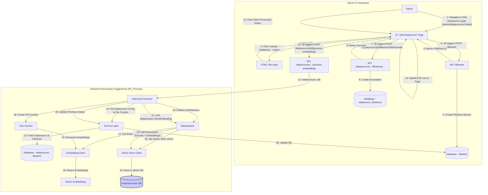
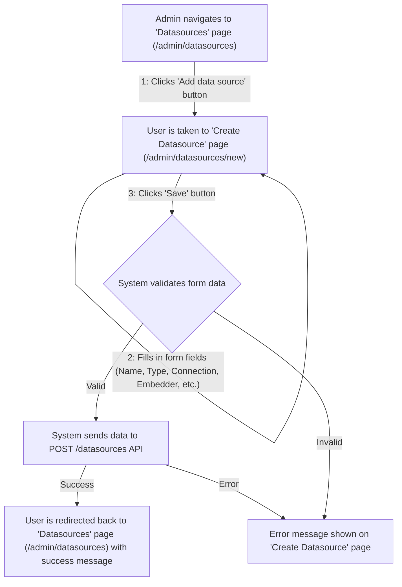
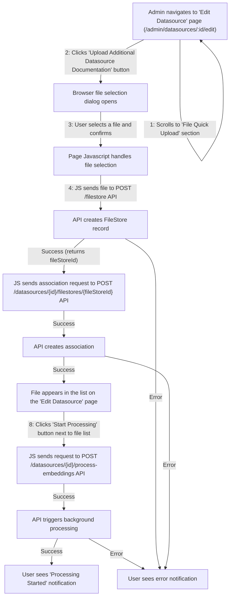

## Datasource & RAG System

**1. Overview & Purpose**

The Datasource system allows administrators to configure and manage connections to various external **Vector Stores** (e.g., Pinecone, PGVector, Chroma, Redis, Qdrant, Weaviate). These Datasources define how Midsommar connects to and interacts with these vector databases, which serve as knowledge bases for Retrieval Augmented Generation (RAG).

Users/Admins can upload files (like PDFs, text documents) into Midsommar's internal **FileStore**. A `FileStore` record holds the file's metadata and content. These `FileStore` entries can then be associated with specific `Datasource` configurations.

When files are associated and processed, the system (via `DataSession`) reads the content from the `FileStore`, chunks it, generates vector embeddings using the `Datasource`'s configured embedding model, and stores these embeddings (along with the text chunks) in the external **Vector Store** specified by the `Datasource`.

During chat interactions configured for RAG, the `DataSession` queries the relevant **Vector Store(s)** (as defined by the `Datasource`) using semantic similarity search to retrieve relevant context based on the user's input. This context is then injected into the LLM prompt to provide more informed and accurate responses.

**Key Objectives:**

*   **Vector Store Abstraction:** Provide a unified interface (`DataSession`) to interact with different vector database vendors.
*   **Configuration Management:** Allow Admins to easily configure connections (`Datasource` model) to external Vector Stores and Embedding Providers via the Admin UI (primarily the 'Create/Edit Datasource' pages) or API.
*   **Source File Management:** Enable users/admins to upload source documents into the internal `FileStore` (`filestore` table) and associate them with `Datasources` for indexing via the Admin UI ('Edit Datasource' page) or API.
*   **Embedding Generation:** Automatically handle the process of generating embeddings for ingested document chunks using configured embedding models (e.g., OpenAI, Cohere, local).
*   **Data Ingestion:** Provide a mechanism (`DataSession.StoreEmbedding`) to chunk documents from `FileStore` and store their embeddings in the appropriate external Vector Store namespace/index associated with a `Datasource`.
*   **Retrieval (RAG):** Offer a search capability (`DataSession.Search`) that queries configured external Vector Stores (via `Datasource` definitions) using semantic similarity search to find relevant context for user prompts.
*   **Integration with Chat:** Allow Chat configurations (`Chat` model) to specify a default `Datasource` (`DefaultDataSourceID`) to be used for RAG.

**Clarification: FileStore vs. Vector Store**

*   **FileStore (`filestore` table, managed by Midsommar):**
    *   An **internal record** within the Midsommar database.
    *   Represents a **source file** uploaded by a user (e.g., PDF, TXT).
    *   Stores file **metadata** (filename, description) and the **raw content**.
    *   Acts as the **source material** before processing and embedding.
    *   Managed via the `/filestore` API endpoint and UI components (e.g., upload section on the 'Edit Datasource' page).
*   **Vector Store (External Database, e.g., Pinecone, Chroma):**
    *   An **external database service** (like Pinecone, Weaviate, etc.). Midsommar connects to it based on the `Datasource` configuration.
    *   Stores **vector embeddings** (numerical representations) derived from the processed content of associated `FileStore` files.
    *   Also stores the corresponding **text chunks** and potentially metadata needed for retrieval.
    *   Does **not** store the original raw file.
    *   Optimized for efficient **similarity searches**.
    *   Interaction is managed by `DataSession` using connection details from the `Datasource` model.

**Relationship:** `FileStore` (Raw Content) -> (Processing/Chunking/Embedding via `DataSession` & Embedder defined in `Datasource`) -> Data stored in external **Vector Store** (Embeddings & Chunks) configured in `Datasource`.

**User Roles & Interactions:**

*   **Administrator (Admin):**
    *   **Configuration (UI):** Uses the Midsommar Admin UI:
        *   Navigates to the **'Datasources' page** (`/admin/datasources`).
        *   Clicks the "Add data source" button, navigating to the **'Create Datasource' page** (`/admin/datasources/new`).
        *   Fills in the Datasource configuration form (name, vector store type, connection info, embedder info) and saves.
        *   From the 'Datasources' page, clicks on a Datasource name to view its details on the **'Datasource Details' page** (`/admin/datasources/:id`).
        *   From the 'Datasource Details' page, clicks "Edit" to navigate to the **'Edit Datasource' page** (`/admin/datasources/:id/edit`).
        *   On the 'Edit Datasource' page, manages associated files within the "File Quick Upload" section: uploads new files, views associated files, removes associations, triggers processing ("Start Processing" button).
        *   Configures Chat instances (on relevant Chat configuration pages) to use specific Datasources.
    *   **Monitoring (UI):** Uses the 'Datasources' page and 'Datasource Details' page to view Datasource status, configuration, and associated files/processing status.
*   **AI Developer/App Owner (Dev) / End User:**
    *   **Interaction:** Interacts with Chat instances configured for RAG. Queries trigger `DataSession.Search` transparently.
    *   **(Potentially):** May upload files directly to a Chat's "Extra Context" on the Chat configuration page, which creates a `FileStore` and associates it for RAG specific to that chat.

**2. Architecture & Data Flow**

**Core Components:** (API Handlers, Service Layer, Models, DataSession, Vector Store Clients, Embedding Clients, Database) - *Remain the same as previous spec.*

**UI Components (File Structure):**

*   `DatasourceList.js`: Renders the 'Datasources' page (`/admin/datasources`).
*   `DatasourceForm.js`: Renders the 'Create Datasource' (`/admin/datasources/new`) and 'Edit Datasource' (`/admin/datasources/:id/edit`) pages.
*   `DatasourceDetails.js`: Renders the 'Datasource Details' page (`/admin/datasources/:id`).
*   **(File Upload Integration):** File upload logic exists within `DatasourceForm.js`, `ToolForm.js`, `ChatForm.js`.

**Data Flow (File Ingestion & Embedding - Updated UX):** (Diagram remains conceptually similar, emphasizing UI page interactions)

**Data Flow (RAG Query):** (Remains the same as the previous spec)

**Admin UI Flows (UX Perspective):**

**Creating a Datasource:**

**Associating and Processing a File:**

**3. Implementation Details**

(Model definitions, DataSession logic, API endpoints, File Processing API, File Content Storage, Vendor Utilities, State Management - *Remain the same as previous spec, referencing `.js` files where appropriate.*)

**4. Use Cases & Behavior**

(Use cases remain the same, but the UI steps follow the revised "Admin UI Flows (UX Perspective)" above).

*   **Admin Configures New Pinecone Datasource (UI Flow):** Follows the "Creating a Datasource" UX flow diagram.
*   **Admin Uploads File and Associates (UI Flow):** Follows the "Associating and Processing a File" UX flow diagram.
*   **System Indexes File:** Triggered by the "Start Processing" button via the API.
*   **User Query triggers RAG:** Unchanged from the user's perspective.

**5. Potential Considerations & Future Enhancements**

(Considerations remain largely the same, with added UI points)

*   **Indexing Trigger:** Confirm if processing is only manual via the button or if automatic triggers exist.
*   **File Content Storage:** Evaluate DB storage scalability.
*   **Processing Feedback:** Enhance UI feedback on the 'Edit Datasource' page (progress indicators, clearer status per file).
*   **Dedicated FileStore Management:** Consider a dedicated 'FileStore Management' page/section in the Admin UI.
*   **Error Handling:** Improve UI display of processing errors on the 'Edit Datasource' page.
*   **Security:** Role-based access control for Datasource pages and actions.
*   **Scalability:** Ensure background processing queue is robust.
*   **UI Enhancements:** Add search/filter to the file list on the 'Edit Datasource' page. File previews.