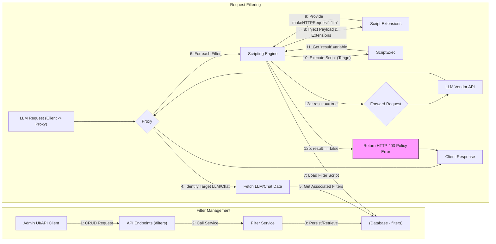

## Filters Functionality

**1. Overview & Purpose**

The Filters feature allows administrators to define and apply custom logic to intercept and potentially block or modify requests flowing through the Midsommar proxy before they reach the upstream Large Language Model (LLM) vendor. Filters act as policy enforcement points.

**Key Objectives:**

*   **Policy Enforcement:** Implement custom rules based on request content (payload). Examples include data loss prevention (DLP), content moderation, prompt injection detection, or enforcing specific formatting.
*   **Request Blocking:** Prevent non-compliant requests from reaching the LLM vendor, returning an error (HTTP 403 Forbidden) to the client.
*   **Flexibility:** Allow administrators to write custom logic using a scripting language (Tengo) to address diverse policy needs.
*   **Granular Application:** Apply filters globally (via proxy configuration, though less explicit in current findings) or specifically to individual LLMs or Chats.

**User Roles & Interactions:**

*   **Administrator:** Creates, manages, and assigns Filters via API/UI. Defines the script logic for policy enforcement.
*   **AI Developer/App Owner:** Associates existing Filters with their Chats or uses LLMs that have Filters applied.
*   **End User (Chat):** Interacts indirectly; may encounter a "Policy error" (HTTP 403) if their request violates a Filter's rules.

**2. Architecture & Data Flow**

**Core Components & Interactions:**

*   **API (`api/filter_handlers.go`):** Provides CRUD endpoints (`/filters`) for managing Filter resources (Name, Description, Script).
*   **Service (`services/filter_service.go`):** Implements the business logic for managing Filters (Create, Get, Update, Delete, List). Interacts with the Database.
*   **Database (`models/filter.go`):** Stores Filter definitions (`filters` table), including the `script` (byte array containing Tengo code). Also stores associations (e.g., `llm_filters` join table for LLM-Filter links, `chat_filters` for Chat-Filter links).
*   **Proxy (`proxy/proxy.go`):** The central component that intercepts LLM requests and applies Filters.
    *   Retrieves associated Filters (e.g., `llm.Filters` for the target LLM).
    *   *Dependency:* Uses the **Scripting Engine** (`scripting/scripting.go`) to execute each Filter's script.
*   **Scripting Engine (`scripting/scripting.go`):** Responsible for executing Filter scripts.
    *   Uses the `tengo` scripting language interpreter.
    *   Injects the request `payload` (as a string) into the script's context.
    *   *Dependency:* Uses **Script Extensions** (`scriptExtensions/script_extensions.go`) to provide custom functions (`makeHTTPRequest`, `llm`) callable from within the script.
    *   Expects the script to return a boolean `result` variable.
*   **Script Extensions (`scriptExtensions/script_extensions.go`):** Provides custom functions accessible within Filter scripts.
    *   `makeHTTPRequest`: Allows scripts to make external HTTP calls.
    *   `llm`: Allows scripts to call Midsommar's LLM service, potentially invoking other models.
*   **Models (`models/llm.go`, `models/chat.go`):** Define the relationships between LLMs/Chats and Filters (many-to-many).

**Data Flow (Simplified):**

**Flow Explanation:**

1.  **Management:** An Admin uses the API (likely via a UI) to Create/Read/Update/Delete Filters. The API calls the `Filter Service`.
2.  The `Filter Service` interacts with the `Database` to store/retrieve Filter definitions (Name, Description, Script). Filters can be associated with LLMs or Chats via separate API calls (e.g., `PATCH /llms/{id}`, `PATCH /chats/{id}`, `POST /tools/{id}/filters/{filter_id}`).
3.  **Filtering:** A client sends a request intended for an LLM via the `Proxy`.
4.  The `Proxy` identifies the target LLM (and potentially the Chat context).
5.  It fetches the LLM/Chat details from the `Database`, including any associated `Filter` IDs.
6.  For each associated `Filter`, the `Proxy` instructs the `Scripting Engine` to run it.
7.  The `Scripting Engine` loads the `Filter.Script` code from the database (or cache).
8.  It prepares the execution environment, injecting the request `payload` and making custom functions (`makeHTTPRequest`, `llm` from `Script Extensions`) available to the script.
9.  The Tengo script is executed.
10. The `Scripting Engine` retrieves the value of the `result` variable set by the script.
11. If `result` is `true`, the filter passes, and the `Proxy` proceeds (either to the next filter or to forwarding the request).
12. If `result` is `false` (or not set), the filter fails. The `Proxy` immediately stops processing and returns an HTTP 403 Forbidden error ("Policy error: {Filter Name}") to the client.
13. If all filters pass, the `Proxy` forwards the request to the upstream LLM Vendor.

**3. Implementation Details**

*   **Script Language:** Filters are written in Tengo (`github.com/d5/tengo`).
*   **Script Input:** The request body is passed to the script as a string variable named `payload`.
*   **Script Output:** The script *must* set a variable named `result`. A value of `true` allows the request; `false` blocks it.
*   **Execution Context:** Scripts run within the `Scripting Engine` (`scripting/scripting.go`). They have access to Tengo's standard library and custom Midsommar functions provided via `scriptExtensions`.
*   **Custom Functions:**
    *   `tyk.makeHTTPRequest(method, url, body, headers)`: Makes an HTTP call.
    *   `tyk.llm(llm_id, prompt)`: Calls another LLM managed by Midsommar.
*   **Error Handling:** Compilation or runtime errors in the script, or a `result` of `false`, lead to request rejection (HTTP 403).
*   **Association:** Filters are linked to LLMs and Chats via many-to-many relationships in the database, managed through the respective entity's update endpoints or specific association endpoints (like for Tools).
*   **API Endpoints:**
    *   `POST /filters`: Create a new Filter.
    *   `GET /filters`: List all Filters (paginated).
    *   `GET /filters/{id}`: Get a specific Filter.
    *   `PATCH /filters/{id}`: Update a Filter.
    *   `DELETE /filters/{id}`: Delete a Filter.
    *   `PATCH /llms/{id}`: (Likely includes `filter_ids` in payload to associate filters).
    *   `PATCH /chats/{id}`: (Likely includes `filter_ids` in payload to associate filters).
    *   `POST /tools/{id}/filters/{filter_id}`: Add a filter to a tool.
    *   `DELETE /tools/{id}/filters/{filter_id}`: Remove a filter from a tool.
    *   `PUT /tools/{id}/filters`: Set all filters for a tool.

**4. Use Cases & Behavior**

*   **Creating a DLP Filter:** Admin creates a Filter via `POST /filters` with a Tengo script that searches the `payload` for keywords or patterns (e.g., credit card numbers) and sets `result = false` if found.
*   **Applying Filter to LLM:** Admin updates an LLM via `PATCH /llms/{id}`, including the DLP Filter's ID in the list of associated filters.
*   **Blocking Request:** A user sends a request containing sensitive data through the `Proxy` targeting the filtered LLM. The `Proxy` executes the DLP Filter script. The script finds the pattern, sets `result = false`. The `Proxy` returns HTTP 403.
*   **Allowing Request:** A user sends a compliant request. The DLP Filter script runs, doesn't find patterns, sets `result = true`. The `Proxy` forwards the request to the LLM vendor.
*   **Using LLM Filter:** A script uses `tyk.llm()` to call a moderation model to check the `payload` content, setting `result` based on the moderation model's response.

**5. Potential Considerations & Future Enhancements**

*   **Script Performance:** Complex Tengo scripts could introduce latency. Performance testing is crucial.
*   **Security Risks:** The `makeHTTPRequest` function allows scripts to call arbitrary URLs, which could be a security risk if not carefully managed. Access control or sandboxing might be needed. Calling internal services could also be risky.
*   **Error Reporting:** Clearer error messages from failed scripts back to the client or admin logs would be helpful.
*   **Script Complexity:** Managing complex logic in Tengo scripts might become difficult. Versioning or testing frameworks for scripts could be beneficial.
*   **Filter Ordering:** If multiple filters are applied, their execution order might matter but isn't explicitly defined in the findings.
*   **Request/Response Filtering:** Currently, filtering seems focused on the *request* payload (`outboundRequestMiddleware`, `screenProxyRequestByVendor`). Filtering the *response* from the LLM might be a future enhancement.
*   **Middleware Scripting:** The `scripting` package also contains `RunMiddleware`, suggesting scripts might also be usable for modifying requests/responses, not just filtering/blocking. This wasn't the focus but is related.

This document outlines the Midsommar Filters functionality based on the analyzed code, detailing how custom scripts can be used to enforce policies on LLM requests.