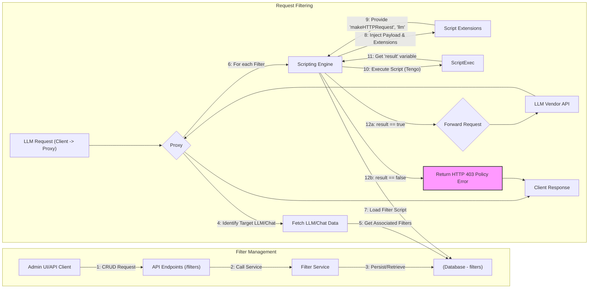

## Filters Functionality

**1. Overview & Purpose**

The Filters feature allows administrators to define and apply custom logic to intercept and potentially block or modify requests flowing through the Midsommar proxy before they reach the upstream Large Language Model (LLM) vendor. Filters act as policy enforcement points.

**Key Objectives:**

*   **Policy Enforcement:** Implement custom rules based on request content (payload). Examples include data loss prevention (DLP), content moderation, prompt injection detection, or enforcing specific formatting.
*   **Request Blocking:** Prevent non-compliant requests from reaching the LLM vendor, returning an error (HTTP 403 Forbidden) to the client.
*   **Flexibility:** Allow administrators to write custom logic using a scripting language (Tengo) to address diverse policy needs.
*   **Granular Application:** Apply filters globally (via proxy configuration, though less explicit in current findings) or specifically to individual LLMs or Chats.

**User Roles & Interactions:**

*   **Administrator:** Creates, manages, and assigns Filters via API/UI. Defines the script logic for policy enforcement.
*   **AI Developer/App Owner:** Associates existing Filters with their Chats or uses LLMs that have Filters applied.
*   **End User (Chat):** Interacts indirectly; may encounter a "Policy error" (HTTP 403) if their request violates a Filter's rules.

**2. Architecture & Data Flow**

**Core Components & Interactions:**

*   **API (`api/filter_handlers.go`):** Provides CRUD endpoints (`/filters`) for managing Filter resources (Name, Description, Script).
*   **Service (`services/filter_service.go`):** Implements the business logic for managing Filters (Create, Get, Update, Delete, List). Interacts with the Database.
*   **Database (`models/filter.go`):** Stores Filter definitions (`filters` table), including the `script` (byte array containing Tengo code). Also stores associations (e.g., `llm_filters` join table for LLM-Filter links, `chat_filters` for Chat-Filter links).
*   **Proxy (`proxy/proxy.go`):** The central component that intercepts LLM requests and applies Filters.
    *   Retrieves associated Filters (e.g., `llm.Filters` for the target LLM).
    *   *Dependency:* Uses the **Scripting Engine** (`scripting/scripting.go`) to execute each Filter's script.
*   **Scripting Engine (`scripting/scripting.go`):** Responsible for executing Filter scripts.
    *   Uses the `tengo` scripting language interpreter.
    *   Injects the request `payload` (as a string) into the script's context.
    *   *Dependency:* Uses **Script Extensions** (`scriptExtensions/script_extensions.go`) to provide custom functions (`makeHTTPRequest`, `llm`) callable from within the script.
    *   Expects the script to return a boolean `result` variable.
*   **Script Extensions (`scriptExtensions/script_extensions.go`):** Provides custom functions accessible within Filter scripts.
    *   `makeHTTPRequest`: Allows scripts to make external HTTP calls.
    *   `llm`: Allows scripts to call Midsommar's LLM service, potentially invoking other models.
*   **Models (`models/llm.go`, `models/chat.go`):** Define the relationships between LLMs/Chats and Filters (many-to-many).

**Data Flow (Simplified):**

```mermaid
flowchart LR
    subgraph Filter Management
        direction TB
        AdminUI["Admin UI/API Client"] -- "1: CRUD Request" --> API["API Endpoints (/filters)"];
        API -- "2: Call Service" --> SVC["Filter Service"];
        SVC -- "3: Persist/Retrieve" --> DB["(Database - filters)"];
    end

    subgraph Request Filtering
        direction LR
        A["LLM Request (Client -> Proxy)"] --> B{Proxy};
        B -- "4: Identify Target LLM/Chat" --> C["Fetch LLM/Chat Data"];
        C -- "5: Get Associated Filters" --> DB;
        B -- "6: For each Filter" --> D["Scripting Engine"];
        D -- "7: Load Filter Script" --> DB;
        D -- "8: Inject Payload & Extensions" --> SE["Script Extensions"];
        SE -- "9: Provide 'makeHTTPRequest', 'llm'" --> D;
        D -- "10: Execute Script (Tengo)" --> ScriptExec;
        ScriptExec -- "11: Get 'result' variable" --> D;
        D -- "12a: result == true" --> E{Forward Request};
        D -- "12b: result == false" --> F["Return HTTP 403 Policy Error"];
        E --> G["LLM Vendor API"];
        G --> B;
        B --> H["Client Response"];
        F --> H;
    end

    style F fill:#f9f,stroke:#333,stroke-width:2px
```

**Flow Explanation:**

1.  **Management:** An Admin uses the API (likely via a UI) to Create/Read/Update/Delete Filters. The API calls the `Filter Service`.
2.  The `Filter Service` interacts with the `Database` to store/retrieve Filter definitions (Name, Description, Script). Filters can be associated with LLMs or Chats via separate API calls (e.g., `PATCH /llms/{id}`, `PATCH /chats/{id}`, `POST /tools/{id}/filters/{filter_id}`).
3.  **Filtering:** A client sends a request intended for an LLM via the `Proxy`.
4.  The `Proxy` identifies the target LLM (and potentially the Chat context).
5.  It fetches the LLM/Chat details from the `Database`, including any associated `Filter` IDs.
6.  For each associated `Filter`, the `Proxy` instructs the `Scripting Engine` to run it.
7.  The `Scripting Engine` loads the `Filter.Script` code from the database (or cache).
8.  It prepares the execution environment, injecting the request `payload` and making custom functions (`makeHTTPRequest`, `llm` from `Script Extensions`) available to the script.
9.  The Tengo script is executed.
10. The `Scripting Engine` retrieves the value of the `result` variable set by the script.
11. If `result` is `true`, the filter passes, and the `Proxy` proceeds (either to the next filter or to forwarding the request).
12. If `result` is `false` (or not set), the filter fails. The `Proxy` immediately stops processing and returns an HTTP 403 Forbidden error ("Policy error: {Filter Name}") to the client.
13. If all filters pass, the `Proxy` forwards the request to the upstream LLM Vendor.

**3. Implementation Details**

*   **Script Language:** Filters are written in Tengo (`github.com/d5/tengo`).
*   **Script Input:** the script reads an `input` map: `raw_input` (the request body as a string), `messages` (normalised chat messages), `vendor_name`, `model_name`, `context` (`llm_id`, `app_id`, `request_id`) and, on the response side, `is_response`, `is_chunk`, `chunk_index`, `current_buffer` and `status_code`.
*   **Script Output:** the script assigns an `output` map: `block` (bool, stops the chain), `payload` (rewritten body; empty means unchanged), `messages` (rewritten messages, an alternative to `payload`, rebuilt into the vendor's wire format by the message reconstructor) and `message` (block reason). The legacy `payload`-in / `result`-out contract is no longer supported anywhere; the microgateway's last implementation of it (`FilterService.ExecuteFilter`) had no callers and was removed.
*   **Execution Context:** Scripts run within the `Scripting Engine` (`scripting/scripting.go`). They have access to Tengo's standard library and custom Midsommar functions provided via `scriptExtensions`.
*   **Custom Functions:**
    *   `tyk.makeHTTPRequest(method, url, body, headers)`: Makes an HTTP call.
    *   `tyk.llm(llm_id, prompt)`: Calls another LLM managed by Midsommar.
*   **Compliance Events:** Scripts can optionally include a `compliance_events` array in the output object. Each event requires an `event_type` (string), and can include `severity` ("info"/"warning"/"critical"), `description` (string), and `metadata` (map). Events are stored in the `compliance_events` table (`models/compliance_event.go`) for audit reporting via `GET /compliance/events`. Events are non-blocking and do not affect the filter's block/allow decision.
*   **Error Handling:** Compilation or runtime errors in the script, or `output.block = true`, lead to request rejection (HTTP 400 on the proxy, `Policy error` message). On the `/ai/` shim for non-Bedrock vendors the filters run on the inner `/llm/call/` loopback hop; that hop is marked with `X-Tyk-Internal-Hop` by the loopback transport and answers a block in the OpenAI error envelope (`respondPolicyBlock`, `proxy/proxy.go`), because the langchaingo drivers keep an upstream error's message only in that shape. Without it the caller saw "API returned unexpected status code: 400" and no reason. Direct `/llm/` callers keep the pass-through's own `ErrorResponse` shape.
*   **Script Panics:** Tengo panics rather than returning an error for faults it does not model (integer divide by zero being the common one), and filters run on the goroutine serving the request. `scripting.RunScript` therefore recovers and converts the panic into an ordinary script error, so a malformed script costs a single failed request instead of the whole process. The microgateway runs filters through the same shared `proxy` package, so it inherits this behaviour. The recovered error carries the underlying fault and is logged with the full stack. Each call site then applies its existing policy: request filters fail closed (request rejected), response filters fail open.
*   **Runtime Limits:** the enterprise runner (`enterprise/scripting/scripting.go`) bounds every execution. `FILTER_SCRIPT_TIMEOUT` (default 5s) aborts the Tengo VM via `RunContext`; the context is also the request or chat-session context (`ScriptInput.Ctx`), so a caller that goes away cancels its scripts. `FILTER_SCRIPT_MAX_ALLOCS` (default 10M) caps VM allocations. The `os` stdlib module is withheld unless `FILTER_SCRIPT_ALLOW_OS=true`; every other module (`text`, `json`, `math`, `times`, `rand`, `fmt`, `base64`, `hex`, `enum`) is pure computation. Compiled scripts are cached per (source, service, limits) and each run executes on a `Clone()`, so runs never share state and compilation is paid once per filter rather than once per request.
*   **Outbound Calls:** `tyk.makeHTTPRequest` (`enterprise/scriptExtensions/httpcaller`) uses `pkg/netguard`'s validating transport (scheme and `LLM_UPSTREAM_*` host policy on every request including redirects, dial-time internal-range blocking), a per-call timeout (`FILTER_HTTP_TIMEOUT`, default 10s) and a response cap (`FILTER_HTTP_MAX_RESPONSE_BYTES`, default 1 MiB; exceeding it is an error, not a truncation). `tyk.llm` (`enterprise/scriptExtensions/llmcaller`) resolves `$SECRET/` and `$ENV/` references on the LLM before building the driver (the service interface's `GetLLMByID` preserves references for API responses, which previously sent the literal reference as the bearer token) and bounds the call with `FILTER_LLM_TIMEOUT` (default 30s). Limits are read from the environment at the point of use (`enterprise/scriptExtensions/scriptenv`).
*   **Association:** Filters are linked to LLMs and Chats via many-to-many relationships in the database, managed through the respective entity's update endpoints or specific association endpoints (like for Tools).
*   **API Endpoints:**
    *   `POST /filters`: Create a new Filter.
    *   `GET /filters`: List all Filters (paginated).
    *   `GET /filters/{id}`: Get a specific Filter.
    *   `PATCH /filters/{id}`: Update a Filter.
    *   `DELETE /filters/{id}`: Delete a Filter.
    *   `PATCH /llms/{id}`: (Likely includes `filter_ids` in payload to associate filters).
    *   `PATCH /chats/{id}`: (Likely includes `filter_ids` in payload to associate filters).
    *   `POST /tools/{id}/filters/{filter_id}`: Add a filter to a tool.
    *   `DELETE /tools/{id}/filters/{filter_id}`: Remove a filter from a tool.
    *   `PUT /tools/{id}/filters`: Set all filters for a tool.

**3b. Guardrail Filters (provider kind)**

A filter has a `kind`: `script` (default, the Tengo contract above) or `guardrail`. A guardrail filter carries a `config` (`guardrails.Config`: provider, detectors with optional thresholds, exclude list, scope, on_detect, redaction, fail_mode, timeout_ms, stream cadence, block_message, connection) instead of a script, and runs a typed provider.

*   **One execution chain:** `scripting.NewFilterRunner(filter)` (`scripting/filter_runner.go`) returns the Tengo runner for a script and the guardrail runner for a guardrail; every call site (proxy request and response, chat request/response/file, tool input/output, the `/filters/test` endpoint) constructs its runner through it. The guardrail runner maps `ScriptInput` onto provider segments (scope selection on proxy requests; the raw text on chat, tool and response paths; the accumulated buffer when streaming), runs the provider under `timeout_ms`, and maps the verdict back onto a `ScriptOutput`: `Block` with the configured message, rewritten `Messages` (proxy requests, rebuilt by the reconstructor registry) or `Payload` (chat, tools), or nothing for `log`. Findings become one compliance event per detector (`guardrail.<detector>`), never carrying the matched text. Fail mode is applied inside the runner: `closed` blocks, `open` passes, both record `guardrail.error`; defaults are closed on the request/tool side and open on the response side, matching script semantics. `redact` on the LLM response path degrades to `log` (responses are block-only). Streaming uses a stateless cadence: the provider runs when the buffer crosses a multiple of `evaluate_every_chars`, and once more on the end-of-stream run (`ScriptInput.IsFinal`, added to `proxy.ExecuteFinalResponseFilters` and called after the pass-through streaming loop in `proxy/proxy.go`), so a response shorter than the cadence is still evaluated in full. Scripts see that run as one more chunk with `is_final: true` and an empty `raw_input`. A block on the final run appends the error chunk and logs a blocked response; the content already streamed has reached the client, which is inherent to streaming. A caller that hangs up mid-stream (`clientGone` in the pass-through streaming loop: a failed write, or an upstream read cancelled with the request context) no longer drops the exchange from the proxy log; only an upstream failure does. The `/ai/` bridge streams from `/llm/call/` internally, so response guardrails on it have streaming semantics even for non-streaming clients; the `/llm/rest/` pass-through buffers and blocks fully.
*   **Provider framework:** `guardrails/` (core) holds the `Provider` interface (`Classify(ctx, Input) (Verdict, error)`, `Capabilities`), the config parser/normaliser, a provider catalogue (`Specs()`, served by `GET /filters/guardrail-providers`) and a factory registry. Implementations live in the Enterprise submodule and register in `init()`; `scripting/guardrails_ent.go` imports them under the `enterprise` tag. With no factory registered (CE) the runner passes through with a warning, like the script stub.
*   **Remote providers:** `enterprise/guardrails/providers` implements the generic HTTP classifier (documented JSON contract, for Prompt Guard 2 / LLM Guard / in-house models), Presidio (analyze + optional anonymize), Lakera Guard v2 (breakdown + payload spans), Azure AI Content Safety (Prompt Shields + text:analyze with severity thresholds, 10K-char pieces), Azure AI Language PII (batched analyze-text with code-point offsets, local rewrite in the filter's style) and Amazon Bedrock Guardrails (ApplyGuardrail via the AWS SDK, masked outputs as rewrites). All HTTP calls go through `pkg/netguard`'s validating transport with a 4 MiB response cap; the Bedrock SDK client is routed through the same transport. Each provider has httptest-driven tests (`providers_test.go`); Bedrock is tested through a fake of the one SDK method it uses.
*   **Built-in provider:** `enterprise/guardrails/builtin` is the pattern library: RE2 patterns with validators (Luhn, IBAN mod-97, SSN ranges, NINO prefixes, NHS mod-11, Shannon entropy) in four categories (secrets, pii, injection, leak), compiled once; redaction by placeholder, mask or hash with overlapping matches merged. Also exposed to scripts as `tyk.detect` and `tyk.redact` (`enterprise/scriptExtensions/guardrail_funcs.go`).
*   **Edge sync:** `FilterConfig` carries `kind` and `config` (JSON) in the snapshot; `grpc/control_server.go` resolves `$SECRET/` references in `connection` for the edge (`guardrails.ConfigJSONForEdge`), the edge `Filter` row stores them, and `gateway_adapter.go` maps them back onto `models.Filter` (`convertDatabaseFilterToModel`), so the shared runner needs nothing edge-specific. The gRPC-cache converter now also carries `response_filter`, which it previously dropped.
*   **Seeding:** `models.GetOrCreateDefaultFilters` creates four unattached built-in guardrails on Enterprise start (skipped with `SKIP_FILTER_DEFAULTS=true`), matched by name including soft-deleted rows so nothing is resurrected or overwritten.
*   **Metrics:** `aistudio_guardrail_latency_seconds{provider,outcome,action}` and `aistudio_guardrail_errors_total{provider,fail_mode}` (`metrics.RecordGuardrail`, `RecordGuardrailError`).

**3a. Tool Filters**

Filters attach to Tools as well as to LLMs and Chats, and govern the tool call
itself rather than the model call.

*   **Direction:** the `response_filter` flag on the filter selects which side of
    the tool call it governs. `false` runs it on **tool input** - the arguments
    the model (or an API caller) is sending *to* the tool. `true` runs it on
    **tool output** - the body the tool returned.
*   **Coverage:** the REST tool endpoint (`POST /tools/{slug}`), all three MCP
    transports (`/tools/{slug}/mcp`, `/mcp/sse`, `/mcp/message`) and tool calls
    made from a chat session. The proxy is shared by AI Studio and the
    Microgateway, so tool filters run identically on the control plane and at
    the edge, and the `tool_filters` associations are carried to edges in the
    configuration snapshot.
*   **Script input:** on the input side, `input.raw_input` is the tool call
    envelope as JSON - `operation_id`, `parameters`, `payload`, `headers` - the
    same shape on REST, MCP and chat. On the output side it is the tool's
    response body. `input.is_response` distinguishes the two, and
    `input.context` carries `tool_id`, `tool_name`, `app_id` and `user_id`, plus
    `session_id` and `call_id` for chat calls.
*   **Rewriting:** a script may return a modified `payload` in either direction.
    On the input side only `parameters`, `payload` and `headers` are taken back:
    a filter cannot change `operation_id` and so cannot redirect the call to a
    different operation.
*   **Blocking:** the caller receives a generic refusal - HTTP 403
    `blocked by policy` on REST, an MCP tool error with the same text on MCP.
    The filter's own message is written to the logs and to the compliance
    event, never to the caller, and the input and output refusals are identical
    so a caller cannot infer whether the downstream tool was reached. An input
    block means the downstream tool is never contacted.
*   **Fail closed:** unlike LLM response filters, a tool filter that fails to
    compile, errors, or panics blocks the call. A filter that did not run
    enforced nothing.
*   **Compliance:** every block records a compliance event
    (`tool_input_blocked` / `tool_output_blocked`, severity `critical`) even
    when the script reported none, under filter scopes `tool_input` and
    `tool_output`. At the edge these reach AI Studio on the analytics pulse.
*   **Community Edition:** script execution is an enterprise feature. In CE the
    runner is a pass-through, so attached tool filters are evaluated as no-ops.

Implemented in `scripting/tool_filters.go`, called from `proxy/proxy.go`
(`handleToolRequest` and the MCP tool handler) and
`chat_session/chat_session.go` (`executeRESTToolCall`).

> **Upgrade note:** before directions were honoured, *every* filter attached to
> a tool ran on the tool's response regardless of its `response_filter` flag. A
> pre-existing request-direction attachment now governs tool input instead. The
> gateway logs a warning naming the filter and tool the first time each such
> filter runs.

**4. Use Cases & Behavior**

*   **Creating a DLP Filter:** Admin creates a Filter via `POST /filters` with a Tengo script that searches the `payload` for keywords or patterns (e.g., credit card numbers) and sets `result = false` if found.
*   **Applying Filter to LLM:** Admin updates an LLM via `PATCH /llms/{id}`, including the DLP Filter's ID in the list of associated filters.
*   **Blocking Request:** A user sends a request containing sensitive data through the `Proxy` targeting the filtered LLM. The `Proxy` executes the DLP Filter script. The script finds the pattern, sets `result = false`. The `Proxy` returns HTTP 403.
*   **Allowing Request:** A user sends a compliant request. The DLP Filter script runs, doesn't find patterns, sets `result = true`. The `Proxy` forwards the request to the LLM vendor.
*   **Using LLM Filter:** A script uses `tyk.llm()` to call a moderation model to check the `payload` content, setting `result` based on the moderation model's response.

**5. Potential Considerations & Future Enhancements**

*   **Script Performance:** Complex Tengo scripts could introduce latency. Performance testing is crucial.
*   **Security Risks:** The `makeHTTPRequest` function allows scripts to call arbitrary URLs, which could be a security risk if not carefully managed. Access control or sandboxing might be needed. Calling internal services could also be risky.
*   **Error Reporting:** Clearer error messages from failed scripts back to the client or admin logs would be helpful.
*   **Script Complexity:** Managing complex logic in Tengo scripts might become difficult. Versioning or testing frameworks for scripts could be beneficial.
*   **Compliance Event Reporting:** Implemented in `models/compliance_event.go` and `scripting/compliance_recorder.go`. Scripts can emit governance events (PII redaction, policy violations, etc.) that are stored for compliance auditing. Events flow through the analytics pipeline and are queryable via `GET /compliance/events`. Prometheus metrics are tracked via `aistudio_compliance_events_total`.
*   **Filter Ordering:** If multiple filters are applied, their execution order might matter but isn't explicitly defined in the findings.
*   **Request/Response Filtering:** Implemented in both directions. LLM request filtering runs in `screenProxyRequestByVendor`; LLM response filtering in `proxy/response_filter_utils.go` (block-only - payload edits are ignored there). Tool filtering runs in both directions with payload rewriting supported, see section 3a.
*   **Middleware Scripting:** The `scripting` package also contains `RunMiddleware`, suggesting scripts might also be usable for modifying requests/responses, not just filtering/blocking. This wasn't the focus but is related.

This document outlines the Midsommar Filters functionality based on the analyzed code, detailing how custom scripts can be used to enforce policies on LLM requests.