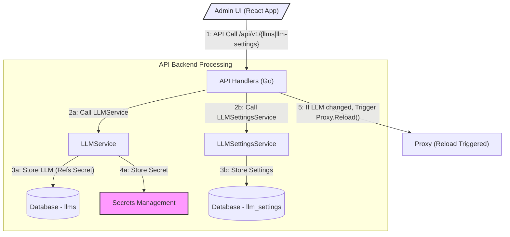
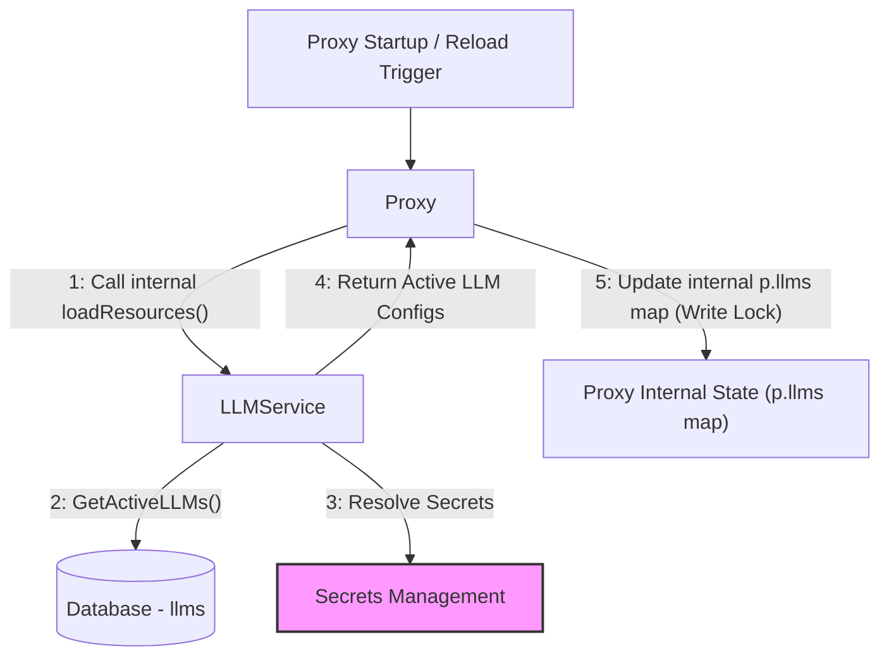
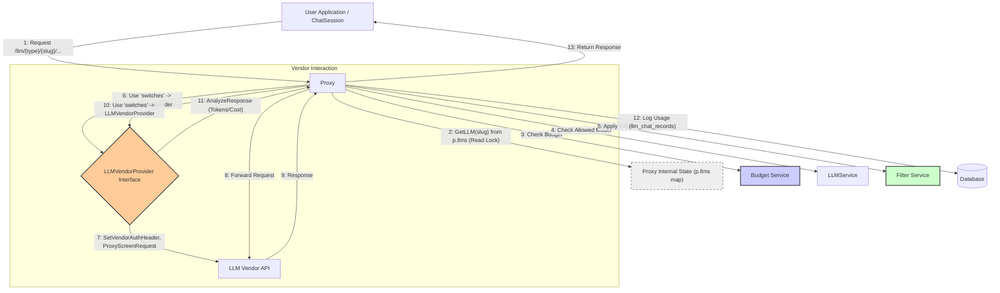

## LLM Management & Configuration

**1: Overview & Purpose**

The LLM Management & Configuration system allows administrators to define, manage, and configure the Large Language Models (LLMs) accessible through the Midsommar platform. This is primarily done via a dedicated **Admin UI** (a React application located in `ui/admin-frontend`) and its backing API. This system encompasses registering different LLM providers, securing their credentials, defining accessible sub-models, and configuring default generation parameters.

**Key Objectives:**

*   **Centralized Management:** Provide a single interface (**Admin UI** / API) to manage all integrated LLM providers and their configurations (`models.LLM`).
*   **Vendor Integration:** Support various LLM vendors (OpenAI, Anthropic, GoogleAI, Ollama, etc.) by storing necessary details (API endpoints, credentials via **Secrets Management**) and abstracting vendor-specific logic using the `models.LLMVendorProvider` interface.
*   **Model Control:** Allow administrators to specify which specific models within a provider are accessible (`llm.AllowedModels` using regex patterns) and set a default model (`llm.DefaultModel`).
*   **Parameter Tuning:** Enable the definition of default generation parameters (temperature, max tokens, system prompts, etc.) for specific model names using `models.LLMSettings`. These serve as base configurations that can potentially be overridden elsewhere. *(Note: Chat-specific prompt templates are managed separately via Chat configuration and components like `PromptTemplateManager.js`)*.
*   **Security & Compliance:** Manage API keys securely (**Secrets Management**), associate **Filters** with LLMs, and track privacy scores.
*   **Cost Awareness:** Integrate with **Budgeting** (setting `llm.MonthlyBudget`) and **Pricing** systems (linking model usage to costs via response analysis defined in `LLMVendorProvider.AnalyzeResponse`).
*   **Activation Control:** Enable/disable specific LLM providers (`llm.Active`), which triggers a configuration reload in the **Proxy**.

**User Roles & Interactions:**

*   **Administrator (via User Management):** Configures LLM providers (`models.LLM`) and default model settings (`models.LLMSettings`) via the **Admin UI** or API (`api/llm_handlers.go`, `api/llm_settings_handlers.go`). Manages API keys (**Secrets Management**). Associates **Filters**. Sets **Budgeting** limits. Defines **Pricing**. Monitors usage (**Analytics**).
*   **AI Developer/App Owner (via User Management):** Selects available LLMs for their applications (**App Management**). May override default `LLMSettings` within their application logic or `ChatSession`. Interacts via the Developer Portal UI or API.
*   **End User (Chat):** Interacts indirectly. Requests are routed by the **Proxy** to the appropriate LLM based on configuration. Chat behavior is influenced by the applied `LLMSettings` and potentially chat-specific prompt templates.

**2: Architecture & Data Flow**

**Core Components & Interactions:**

*   **Admin UI (`ui/admin-frontend`):** A React frontend application using Material UI components. Its static build (`index.html`, JS/CSS assets in `/static`, images in `/logos`) is served by the Go API server (`api/api.go`). It interacts with the `/api/v1/*` endpoints for management tasks.
*   **API Handlers (`api/llm_handlers.go`, `api/llm_settings_handlers.go`, `api/api.go`):** Expose REST endpoints (primarily under `/api/v1/`) for CRUD operations on LLMs and LLMSettings. Called by the **Admin UI** or directly via API. Trigger **Proxy** reloads (`proxy.Reload()`) on relevant changes to LLM configurations. Also responsible for serving the **Admin UI** static files.
*   **LLMService (`services/llm_service.go`):** Contains business logic for managing `models.LLM` entities. Handles CRUD, validation (`IsModelAllowed`), fetching active LLMs for the proxy (`GetActiveLLMs`), and interacts with the Database and **Secrets Management**.
*   **LLMSettingsService (`services/llm_settings_service.go`):** Contains business logic for managing `models.LLMSettings` entities (default model parameters). Interacts with the Database.
*   **Database (`models/llm.go`, `models/llm_settings.go`, `models/ivendor.go`):** Stores LLM provider configurations (`llms` table), default model parameter settings (`llm_settings` table), and defines the `LLMVendorProvider` interface. Also stores relationships like `llm_filters`. Usage data is stored in `llm_chat_records`.
*   **Proxy (`proxy/proxy.go`):**
    *   Loads active LLM configurations on startup and reload (`loadResources` called by `Reload`). Stores them in an internal map (`p.llms`) keyed by a URL-friendly slug (`slug.Make(llm.Name)`), protected by a RWMutex (`p.mu`).
    *   Handles incoming requests (`/llm/{rest|stream}/{llmSlug}/...`). Looks up LLM config using `GetLLM(llmSlug)` (read-locked access to `p.llms`).
    *   Uses the `switches` package to invoke vendor-specific logic based on `llm.Vendor` via the `models.LLMVendorProvider` interface (e.g., `SetVendorAuthHeader`, `ProxyScreenRequest`).
    *   Resolves credentials via **Secrets Management**.
    *   Validates requested sub-models against `llm.AllowedModels` (using `LLMService.IsModelAllowed`).
    *   Applies associated **Filters**.
    *   Interacts with **Budgeting** service (`BudgetService.CheckBudget`).
    *   Analyzes responses using vendor-specific logic (`LLMVendorProvider.AnalyzeResponse`/`AnalyzeStreamingResponse`) for logging usage data (tokens, cost) to `llm_chat_records`, which feeds **Pricing** and **Analytics**.
*   **Vendor Switching (`switches/switches.go`, `models/ivendor.go`):** Uses a map (`VendorMap`) to look up the correct `models.LLMVendorProvider` implementation based on `llm.Vendor`. This interface defines methods for vendor-specific actions like authentication, request screening, response analysis, and driver/embedder creation. Implementations reside in the `vendors/` directory.
*   **ChatSession (`chat_session/chat_session.go`):** Can load `LLMSettings` based on the model being used to apply default parameters. Uses `llmSettings.GenerateOptionsFromSettings` to prepare call options for the `langchaingo` library.
*   **Secrets Management (`secrets` package):** Securely stores and retrieves sensitive data like `llm.APIKey` and `llm.APIEndpoint`.
*   **Filters (`features/Filters.md`, `models/filter.go`):** LLMs can be associated with Filters.
*   **Budgeting (`features/Budgeting.md`, `services/budget_service.go`):** LLMs can have monthly spending limits.
*   **Pricing (`features/Pricing.md`, `models/model_price.go`):** Defines model costs, used by response analysis and **Budgeting**.

**Data Flows:**

The overall process involves several distinct flows: Admin Configuration, Proxy Initialization/Reload, Request Handling, and UI Serving.

**Flow 1: Admin Configuration**

This flow describes how an administrator defines or updates LLM providers and settings using the UI.

**Flow 2: Proxy Initialization / Reload**

This flow shows how the Proxy loads or reloads its internal configuration based on active LLMs in the database.

**Flow 3: Request Handling**

This flow details how an incoming user request for an LLM is processed by the proxy.

**3: Implementation Details**

*   **`models.LLM` Structure:**
    *   `Name`: User-friendly name (e.g., "OpenAI GPT"). Used to generate the slug key for the proxy map (`slug.Make(llm.Name)`).
    *   `APIKey`, `APIEndpoint`: References to secrets stored via **Secrets Management**.
    *   `Vendor`: Enum (`openai`, `anthropic`, etc.) used by `switches` to select the correct `LLMVendorProvider`.
    *   `DefaultModel`: Default sub-model if not specified in request.
    *   `AllowedModels`: List of *regex patterns*. Checked by `LLMService.IsModelAllowed`. Empty list allows all.
    *   `Active`: Boolean flag. Only active LLMs are loaded by the proxy during `loadResources`.
    *   `Filters`: Many-to-many relationship.
    *   `MonthlyBudget`, `BudgetStartDate`: Configuration for the **Budgeting** system.
    *   Metadata fields: `PrivacyScore`, descriptions, `LogoURL`.
*   **`models.LLMSettings` Structure:**
    *   `ModelName`: Specific model identifier (e.g., "gpt-4").
    *   Generation Parameters: `MaxLength`, `MaxTokens`, `Temperature`, etc. Mapped to `langchaingo/llms.CallOption` via `GenerateOptionsFromSettings`. Used by `ChatSession`.
    *   `SystemPrompt`: Default system prompt.
*   **`models.LLMVendorProvider` Interface (`models/ivendor.go`):** Defines the contract for vendor implementations:
    *   `GetTokenCounts`: Extracts token counts from a response choice.
    *   `GetDriver`: Creates a LangchainGo `llms.Model` instance.
    *   `GetEmbedder`: Creates a LangchainGo `embeddings.EmbedderImpl` instance (if supported).
    *   `AnalyzeResponse`/`AnalyzeStreamingResponse`: Processes HTTP responses to extract token usage, calculate cost (using **Pricing** data), and prepare data for logging.
    *   `ProxySetAuthHeader`: Modifies the outgoing HTTP request to add vendor-specific authentication headers.
    *   `ProxyScreenRequest`: Validates or modifies the incoming request before proxying.
    *   `ProvidesEmbedder`: Indicates if the vendor implementation supports embedding.
*   **Proxy Loading & Access:**
    *   `proxy.loadResources()` fetches active LLMs using `service.GetActiveLLMs()`.
    *   Configurations are stored in `proxy.llms` (a `map[string]*models.LLM`), keyed by slug.
    *   Access to `proxy.llms` is protected by `proxy.mu` (RWMutex). `GetLLM` uses `RLock`. `loadResources` (called by `Reload`) uses `Lock`.
*   **API Endpoints:** Standard RESTful endpoints under `/api/v1/` for `llms` and `llm-settings`, plus search and filtering options. Public endpoints exist for auth and potentially portal features. The root and other non-API routes serve the Admin UI.
*   **Admin UI (`ui/admin-frontend`):** React application built using `npm`. Served statically by the Go API server from the embedded filesystem (`ui/admin-frontend/build`). Communicates with `/api/v1/*` endpoints. Includes components for managing various platform aspects.
*   **Credential Handling:** Uses the `secrets` package. `LLMService` resolves secrets (`secrets.GetValue`) for internal use (proxy) but preserves references for API display.

**4: Use Cases & Behavior**

*   **Admin Registers OpenAI via UI:** Admin uses the **Admin UI**, fills a form for a new LLM. UI sends `POST /api/v1/llms`. Backend service stores LLM, resolves/stores secrets. Handler calls `proxy.Reload()`. Proxy fetches active LLMs including the new one, updates `p.llms` map. (Follows Flow 1 & 2).
*   **Admin Sets GPT-4 Defaults via UI:** Admin uses UI form for LLM Settings. UI sends `POST /api/v1/llm-settings`. Backend service stores settings. (Follows Flow 1).
*   **User Requests GPT-3.5:** Request hits `/llm/rest/openai-gpt/gpt-3.5-turbo`. Proxy finds `openai-gpt` in `p.llms`. Checks budget. Calls `LLMService.IsModelAllowed("gpt-3.5-turbo")`. Uses `switches` -> OpenAI provider -> `ProxySetAuthHeader`, `ProxyScreenRequest`. Forwards request. On response, OpenAI provider's `AnalyzeResponse` calculates tokens/cost. Proxy logs usage. Returns response. (Follows Flow 3).
*   **User Requests GPT-4 via ChatSession:** App uses `ChatSession`. `ChatSession` loads `LLMSettings` for "gpt-4". Applies defaults (Temperature, etc.) via `GenerateOptionsFromSettings`. Sends request via Proxy (Follows Flow 3).
*   **Admin Deactivates Anthropic via UI:** Admin toggles 'Active' switch in UI. UI sends `PATCH /api/v1/llms/{anthropic_id}` with `active: false`. Handler calls `proxy.Reload()`. Proxy reloads, Anthropic is no longer in `p.llms`. Subsequent requests to `/llm/rest/anthropic-claude/...` get 404 from proxy lookup. (Follows Flow 1 & 2).
*   **User Accesses Admin UI:** Browser requests `/`. Go API serves `index.html` from `ui/admin-frontend/build`. Browser loads JS/CSS from `/static/*`. React app initializes and makes API calls to `/api/v1/*` for data. (Follows Flow 4).

**5: Potential Considerations & Future Enhancements**

*   **Vendor Implementation:** Adding new vendors requires implementing the `LLMVendorProvider` interface and registering it in `switches/switches.go`.
*   **UI Completeness:** Ensure the Admin UI provides controls for all relevant `LLM` and `LLMSettings` fields and actions (like managing `AllowedModels` patterns).
*   **Configuration Complexity:** As features grow, managing settings inheritance or environment-specific overrides might become necessary.
*   **Error Handling:** Consistent and informative error handling across different vendor interactions and API responses is crucial.
*   **Performance:** Proxy map lookups (read-locked) should be fast. Potential bottlenecks include DB access during reload, secret resolution, budget checks, and vendor API latency. Response analysis (`AnalyzeResponse`) should be efficient.
*   **Scalability:** Consider the impact of a large number of configured LLMs on proxy reload time and memory usage. The current model loads all active LLMs into the proxy's memory.

This document provides a comprehensive overview of the LLM Management and Configuration system within Midsommar, detailing its architecture, components, distinct data flows, and key implementation aspects based on code analysis and user feedback.