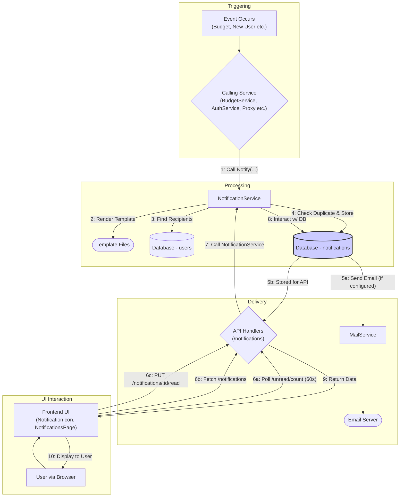

## Notification System

This document provides a detailed explanation of the Midsommar Notification System, designed for product managers, QAs, engineers, and administrators. It covers the feature's purpose, architecture, data flow, implementation details, API endpoints, UI integration, dependencies, and potential considerations, based on code analysis.

**1. Overview & Purpose**

The Midsommar Notification System provides a centralized mechanism for managing and delivering alerts and messages across the platform. Its primary goals are:

*   **Event Alerting:** Inform users (administrators or specific individuals) about significant occurrences like budget threshold breaches (**Budget Control System**), new user registrations (**User Management**), or other system events.
*   **Multi-Channel Delivery:** Deliver notifications via:
    *   **Email:** Using a configured SMTP server.
    *   **In-App UI:** Displaying notifications within the Midsommar web interface, with near real-time updates via polling.
*   **User Experience:** Offer users visibility into relevant events through persistent storage, retrieval via API, and a dedicated UI section.
*   **Deduplication & Tracking:** Prevent sending duplicate notifications for the same event context using a unique `NotificationID` and track read/unread status per user.
*   **Extensibility:** Allow new types of notifications and potentially new delivery channels to be added easily.

**User Roles & Interactions:**

*   **Administrator (via User Management):** Receives admin-targeted notifications (if `NotificationsEnabled=true`), manages the `NotificationsEnabled` setting for other admins, views notifications in the UI or via API.
*   **AI Developer/App Owner (via User Management):** Receives user-specific notifications (e.g., budget alerts for their apps), views notifications in the UI or via API.
*   **System Services (e.g., BudgetService, AuthService, Proxy):** Trigger notifications based on internal events.
*   **End User (via UI):** Interacts with the `NotificationIcon` and `NotificationsPage` to view and manage their notifications.

**2. Architecture & Data Flow**

**Core Components & Interactions:**

*   **NotificationService (`services/notification_service.go`):** Central orchestrator for creating, storing, deduplicating, and dispatching notifications.
    *   *Dependency:* Uses `models.User` data (DB) for recipient lookup and email addresses.
    *   *Dependency:* Uses `notifications.MailService` for email dispatch.
    *   *Dependency:* Interacts with `Database` (`notifications` table) for storage and deduplication.
*   **Database (`models/`):**
    *   `notifications` (`models/notifications.go`): Stores individual `Notification` records (recipient `UserID`, `NotificationID`, `Type`, `Title`, `Content`, `Read` status, `SentAt`).
    *   `users` (`models/user.go`): Stores user info, including `Email`, `IsAdmin`, and `NotificationsEnabled` flags.
*   **Calling Services:**
    *   `BudgetService` (`services/budget_service.go`): Triggers `"budget_alert"` notifications.
    *   `AuthService` (`auth/auth.go`): Triggers admin notifications for new user registration (`"user_signup"` implicitly).
    *   `Proxy` (`proxy/analyze_utils.go`): Triggers budget usage analysis which can lead to notifications via the `BudgetService`.
    *   Other services can potentially call `NotificationService.Notify` or `SendAdminAppNotification`.
*   **MailService (`notifications/email.go`):** Abstraction for sending emails via SMTP. Includes `TestMailer` for testing.
*   **API Handlers (`api/notification_handlers.go`):** Expose REST endpoints (`/common/api/v1/notifications/*`) for UI interaction (list, count, mark read). Authenticated via middleware.
*   **Frontend UI Components (`src/admin/components/notifications/`, `src/admin/pages/`):**
    *   `NotificationContext.js`: Manages state, fetches data, handles marking as read.
    *   `NotificationIcon.js`: Displays bell icon and unread count badge; polls `/unread/count`.
    *   `NotificationList.js`: Displays the list of notifications fetched from `/notifications`.
    *   `NotificationsPage.js`: Dedicated page hosting the `NotificationList`.
*   **Templates (`templates/`):** HTML templates (e.g., `budget_alert.tmpl`, `admin-notify.tmpl`) used for email content formatting.

**Data Flow:**

**Flow Explanation:**

1.  An event triggers a **Calling Service**.
2.  The service calls `NotificationService.Notify` with event details, template info, and recipient flags.
3.  **NotificationService** renders the specified email template, determines recipients (querying `users` DB), generates unique `NotificationID`s per recipient.
4.  For each recipient, it checks the `notifications` DB for duplicates using `NotificationID`. If not found, it stores the new `Notification` record.
5.  If **MailService** (SMTP) is configured, an email is sent. The notification is now available via the API.
6.  The **Frontend UI** (`NotificationIcon`) polls the `/unread/count` API endpoint every 60 seconds. When the user navigates to the `NotificationsPage` or interacts with the list, it fetches notifications via `/notifications` API and allows marking as read via `PUT /notifications/:id/read` API.
7.  The **API Handlers** receive requests from the UI.
8.  API Handlers call the **NotificationService** to retrieve data or update the `Read` status.
9.  **NotificationService** interacts with the `notifications` database table.
10. API returns data (count, list, status) to the Frontend UI.
11. UI displays the information to the user.

**3. Implementation Details**

*   **Notification Model (`models/Notification`):** Stores `NotificationID` (unique string for deduplication), `Type` (string like "budget\_alert"), `Title`, `Content`, recipient `UserID`, `Read` status (bool), `SentAt` (time).
*   **Recipient Targeting (`NotificationService.Notify`):** Uses `userFlags` (specific `UserID` or `models.NotifyAdmins`). Queries `users` table for admins where `is_admin = true` AND `notifications_enabled = true`. A specific `UserID` is extracted by clearing the admin flag (`userID := userFlags &^ models.NotifyAdmins`).
*   **Deduplication (`NotificationService.Send`):** Checks for existing `NotificationID` in `notifications` table using a `gorm.First` query before inserting. Skips if `result.Error == nil`.
*   **Email Sending (`notifications.MailService`):** Uses `go-mail/mail`, requires SMTP config (`fromEmail`, `smtpHost`, etc.). Errors are logged (`fmt.Printf`).
*   **Template Rendering (`NotificationService.renderTemplate`):** Uses Go's `html/template`, searches for templates first by exact path, then by walking up directories to find `templates/<templateName>`.
*   **User Preference (`models.User.NotificationsEnabled`):** Boolean flag, only applicable if `IsAdmin=true`. Controls receipt of admin-level notifications. Managed via User API/UI (`services/user_service.go` enforces the admin requirement).
*   **API Endpoints (`api/notification_handlers.go`):**
    *   `GET /common/api/v1/notifications`: List notifications for auth'd user (paginated via `limit`, `offset`).
    *   `GET /common/api/v1/notifications/unread/count`: Get unread count for auth'd user.
    *   `PUT /common/api/v1/notifications/:id/read`: Mark notification (by DB `ID`) as read for auth'd user.
*   **Admin Notifications (`NotificationService.SendAdminAppNotification`):** A specific helper function to send notifications to all enabled admins and optionally to a globally configured `config.Get().AdminEmail`.

**4. Notification Types**

Based on system behavior and code analysis:

1.  **`budget_alert`**: Triggered by `BudgetService` at 80%/100% usage. Sent to App Owner + Admins (for Apps) or Admins only (for LLMs). Uses `budget_alert.tmpl`.
2.  **`system_update`**: A potential type for announcements, though specific implementation details are not detailed here.
3.  **`admin_app_notification`**: Used for events like new app creation or approvals, likely sent via `SendAdminAppNotification`.
4.  **`user_signup`** (Implicit): Triggered by `AuthService.notifyAdmin` on new registration, notifies admins. Uses `admin-notify.tmpl`. The `NotificationID` format is `new_user_<userID>_<timestamp>`.

**5. Delivery Methods**

1.  **Email:** Sent via `MailService` if SMTP is configured. Uses HTML templates from `templates/`.
2.  **In-App UI:**
    *   Near real-time unread count via polling (`NotificationIcon.js` hitting `/unread/count` every 60s).
    *   Full list display on `NotificationsPage.js` (using `NotificationList.js` hitting `/notifications`).
    *   Managed state via `NotificationContext.js`.
    *   Allows marking as read, triggering API calls.

**6. UI Integration**

*   **Polling:** `NotificationIcon` polls `/common/api/v1/notifications/unread/count` every 60 seconds using `fetchUnreadCount` from `NotificationContext`.
*   **Display:**
    *   `NotificationIcon` (in header/sidebar): Shows a bell icon with a badge indicating the unread count. Clicking navigates to `/notifications`.
    *   `NotificationsPage` (route `/notifications`): Displays a list of notifications using `NotificationList`, showing title, content (markdown rendered), timestamp, and read status visually distinct for unread items.
*   **Interaction:** Clicking a notification (or an explicit "mark read" button) triggers `NotificationContext` to call the `PUT /common/api/v1/notifications/:id/read` endpoint via its `markNotificationAsRead` function.
*   **State Management:** `NotificationContext` fetches data (`fetchNotifications`, `fetchUnreadCount`), manages loading/error states, and provides notification data/functions (`notifications`, `unreadCount`, `markNotificationAsRead`) to consuming components.
*   **Settings:** Admins can toggle the `NotificationsEnabled` flag for users via `UserForm.js` (visible in `UserDetails.js`).

**7. Code References**

*   **Backend:**
    *   `models/notifications.go`, `models/user.go`
    *   `services/notification_service.go`, `services/budget_service.go`, `services/user_service.go`
    *   `notifications/email.go`, `notifications/test_mailer.go`
    *   `api/notification_handlers.go`, `api/api.go`, `api/user_handlers.go`
    *   `auth/auth.go`
    *   `proxy/analyze_utils.go`
    *   `templates/*.tmpl`
*   **Frontend:**
    *   `src/admin/components/notifications/NotificationIcon.js`
    *   `src/admin/components/notifications/NotificationList.js`
    *   `src/admin/components/notifications/NotificationContext.js`
    *   `src/admin/pages/NotificationsPage.js`
    *   `src/admin/components/users/UserForm.js`
    *   `src/admin/components/users/UserDetails.js`

**8. Testing Strategy**

*   **Unit Tests:** `notification_service_test.go` (using `TestMailer`), tests for handlers, models, and potentially frontend components using Jest/React Testing Library.
*   **Integration Tests:** Verify full flows like budget alerts (`proxy_budget_test.go`) or new user registration triggering notifications (`auth_test.go`).
*   **UI/E2E Tests (Cypress/Playwright):** Verify `NotificationIcon` polling/badge update, `NotificationList` rendering, navigation, and "mark as read" functionality from the user's perspective.

**9. Potential Considerations & Future Enhancements**

*   **Scalability:** `notifications` table growth; consider archiving or using a message queue for high volume.
*   **Real-time UI:** Replace polling with WebSockets or Server-Sent Events (SSE) for instant updates.
*   **Filtering/Categories:** Enhance UI and API with filtering by `Type` or introducing categories.
*   **"Mark All As Read":** Add API endpoint and UI button.
*   **Granular Preferences:** Allow users (especially admins) to toggle email/in-app per notification type.
*   **Delivery Channels:** Integrate with Slack, Teams, etc.
*   **Custom Rules:** Allow users to define custom notification triggers.
*   **Localization:** Support multi-language templates/content.
*   **Error Handling:** Improve visibility/alerting for email sending failures.