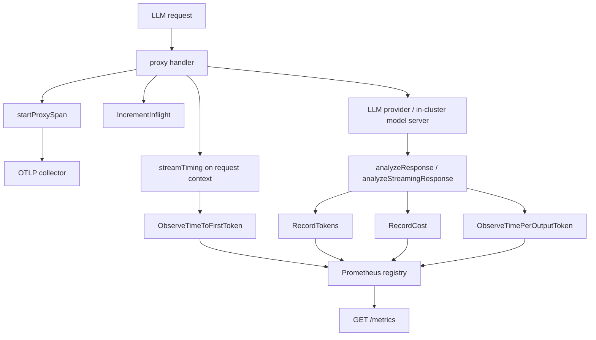

# Observability

## Introduction

The **Observability** subsystem exposes what the AI Gateway is doing to standard
cloud-native tooling: Prometheus metrics following the OpenTelemetry GenAI
semantic conventions, and OpenTelemetry distributed traces that join the
caller's trace rather than starting a new one.

It is deliberately scoped to the *gateway data path*. Product usage telemetry is
a separate system — see [Telemetry.md](Telemetry.md) — and the dashboard's
per-app cost and token reporting is the Analytics system, which reads from the
database rather than from these instruments.

---

## Table of Contents

1. [Overview](#overview)
2. [System Architecture](#system-architecture)
3. [Metrics](#metrics)
4. [Tracing](#tracing)
5. [Configuration](#configuration)
6. [Design Decisions](#design-decisions)
7. [Testing](#testing)

---

## Overview

One code path serves both runtimes. The Microgateway imports the root module's
proxy via `pkg/aigateway`, so `metrics.Init` is called from both
`main.go` (Studio, embedded gateway) and
`microgateway/internal/server/server.go` (Microgateway). Instrumentation added to
`proxy/` therefore appears in both without duplication.

| Concern | Package |
|---|---|
| Metric instruments and recording | `metrics/` |
| GenAI convention instruments and mapping | `metrics/genai.go` |
| Tracer provider, propagator, OTLP exporter | `pkg/tracing/` |
| Span creation on the request path | `proxy/tracing.go` |
| Streaming latency landmarks | `proxy/stream_timing.go` |
| Metrics endpoint registration and auth | `pkg/middleware` |

## System Architecture

The two streaming latency metrics are recorded in different places because their
inputs become available at different times. Time-to-first-token is known in the
SSE read loop; time-per-output-token additionally needs the completion token
count, which only exists once the analytics path has parsed the response. A
`streamTiming` struct carried on the request context bridges the two. It stores
the first-chunk timestamp in an atomic, because the analytics goroutine may read
it while the stream is still draining.

## Metrics

### GenAI semantic convention metrics

Attributes: `gen_ai_provider_name`, `gen_ai_request_model`,
`gen_ai_operation_name`, `gen_ai_token_type`, and `error_type` on failures only.

| Metric | Type | Notes |
|---|---|---|
| `gen_ai_server_request_duration_seconds` | histogram | Every proxied request |
| `gen_ai_server_time_to_first_token_seconds` | histogram | Streaming only |
| `gen_ai_server_time_per_output_token_seconds` | histogram | Streaming only; dropped when the stream produced no output tokens |
| `gen_ai_client_token_usage` | histogram | Split by `gen_ai_token_type` |
| `gen_ai_client_operation_duration_seconds` | histogram | Tool execution, `gen_ai_operation_name=execute_tool` |

Vendor identifiers are mapped to the registered convention values rather than
emitted raw:

| AI Studio vendor | `gen_ai_provider_name` |
|---|---|
| `bedrock` | `aws.bedrock` |
| `vertex` | `gcp.vertex_ai` |
| `google_ai` | `gcp.gemini` |
| everything else | passed through unchanged |

Token categories map `prompt` → `input` and `completion` → `output`. The
`cache_read` and `cache_write` categories have no registered convention value and
pass through unchanged, so the data is preserved rather than discarded.

### AI Studio metrics

These describe governance rather than inference and have no counterpart in the
conventions, so they keep their own names:

| Metric | Type | Labels |
|---|---|---|
| `aistudio_llm_requests_total` | counter | `app_id`, `vendor`, `model`, `status_code` |
| `aistudio_llm_cost_total` | counter | `vendor`, `model`, `app_id` |
| `aistudio_llm_inflight_requests` | gauge | `vendor` |
| `aistudio_policy_blocks_total` | counter | `rule_name`, `block_type` |
| `aistudio_compliance_events_total` | counter | `event_type`, `severity`, `filter_name` |
| `aistudio_tool_calls_total` | counter | `tool_name`, `app_id` |

### Legacy metrics

Three instruments predate the conventions and now have replacements. They are
emitted alongside the new ones while `METRICS_LEGACY_NAMES=true` (the default),
so existing dashboards keep working:

| Legacy | Replacement |
|---|---|
| `aistudio_llm_request_duration_seconds` | `gen_ai_server_request_duration_seconds` |
| `aistudio_llm_tokens_total` | `gen_ai_client_token_usage` |
| `aistudio_tool_execution_duration_seconds` | `gen_ai_client_operation_duration_seconds` |

### Endpoint

`/metrics` is **secure by default**: the route is not registered at all unless
`METRICS_AUTH_TOKEN` is set or `METRICS_ALLOW_UNAUTHENTICATED=true`. This catches
operators by surprise when a Prometheus target silently 404s, so the Helm chart
refuses to render a ServiceMonitor unless one of the two is configured.

## Tracing

`ENABLE_TRACING` and `TRACING_ENDPOINT` had been parsed into the gateway config
for some time with nothing behind them. They now drive an OTLP/gRPC exporter.

One span covers each proxy hop, carrying the same `gen_ai.*` attributes as the
metrics, named `{operation} {model}` per the conventions, with `codes.Error` and
`http.response.status_code` set on failures.

Two properties matter more than the spans themselves:

- **The gateway joins the caller's trace.** The inbound `traceparent` is
  extracted before the span is started, so a request stays on one trace from the
  Gateway API listener through Tyk to the model server.
- **The propagator is installed even when export is disabled.** OpenTelemetry's
  no-op tracer preserves an incoming span context, so an inbound `traceparent`
  still reaches the upstream provider with tracing switched off. Turning tracing
  on is therefore about *recording*, not about *propagation*.

Span export is off by default. With it off the global provider stays the no-op
implementation, so span creation on the request path costs a couple of
allocations and nothing leaves the process.

## Configuration

| Variable | Default | Purpose |
|---|---|---|
| `ENABLE_METRICS` | `true` | Serve Prometheus metrics |
| `METRICS_PATH` | `/metrics` | Endpoint path |
| `METRICS_AUTH_TOKEN` | — | Requires `Authorization: Bearer <token>` |
| `METRICS_ALLOW_UNAUTHENTICATED` | `false` | Opt-out for in-cluster scraping |
| `METRICS_LEGACY_NAMES` | `true` | Also emit the pre-conventions `aistudio_*` series |
| `ENABLE_TRACING` | `false` | Export spans over OTLP |
| `TRACING_ENDPOINT` | — | Collector address; `host:port` is dialled insecurely, an `https://` URL uses TLS |

Both runtimes read the same variable names, so one set of settings configures
either side of the hub-spoke pair. Studio equivalents live on
`config.AppConf` (`TracingEnabled`, `TracingEndpoint`); the Microgateway's are on
`ObservabilityConfig`.

## Design Decisions

**Only metrics with a genuine counterpart were renamed.** Cost, policy blocks,
compliance events and in-flight requests have no equivalent in the GenAI
conventions. Inventing `gen_ai.*` names for them would have produced series that
look standard but are not.

**The conventions are not stable.** Every `gen_ai.*` attribute and metric in the
OpenTelemetry registry is still marked *Development*, not Stable. The convention
version is pinned in a package comment in `metrics/genai.go`, and
`METRICS_LEGACY_NAMES` exists precisely because these names may shift.

**Token usage is a histogram, not a counter.** The conventions define
`gen_ai.client.token.usage` as a histogram of tokens per request. The `_sum`
still gives the running total that a counter would have, so nothing is lost.

**`gen_ai.client.token.usage` is emitted from a server.** It is nominally a
client-side metric, but a gateway is both. This follows the precedent set by
Envoy AI Gateway and other inference gateways.

## Testing

| Area | Location |
|---|---|
| Instrument names, attributes, mappings, legacy toggle | `metrics/genai_test.go` |
| Streaming timing semantics, including under `-race` | `proxy/stream_timing_test.go` |
| Span attributes, error status, trace joining, model fallback | `proxy/tracing_test.go` |
| Exporter setup, endpoint parsing, propagation | `pkg/tracing/tracing_test.go` |
| End-to-end streaming metrics through an assembled gateway | `microgateway/tests/integration/streaming_metrics_test.go` |
| Helm chart invariants | `tests/helm_chart_test.go` |

Two assertions are worth preserving deliberately, because both were arrived at
after a weaker version failed to catch a seeded regression:

- Time-to-first-token is asserted by observation **count** (exactly one per
  stream), not by comparing sums. A sum comparison is timing-dependent, because
  SSE chunks can coalesce into a single read, and it let a "record on every
  chunk" bug through.
- Trace propagation is asserted from the **upstream side**, with a known trace ID
  sent by the client. Asserting only that a header exists proves nothing when
  nothing initiated a trace.

## Related

- [Telemetry.md](Telemetry.md) — anonymised product usage statistics, a separate system
- [Proxy.md](Proxy.md) — the request path these instruments measure
- `docs/site/docs/observability.md` — operator-facing guide
- `docs/site/docs/deployment-kubernetes-inference-gateway.md` — running alongside the Kubernetes Inference Gateway
