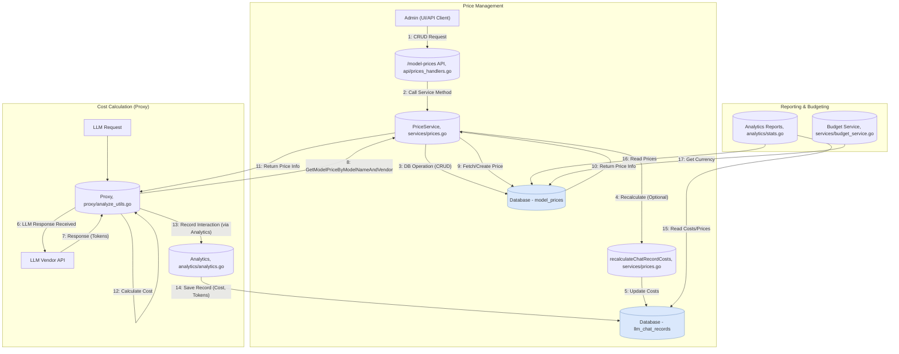

## Model Pricing System

**1. Overview & Purpose**

The Model Pricing system provides the mechanism to define and manage the costs associated with using different Large Language Models (LLMs) within the Midsommar platform. Its primary purpose is to enable accurate cost calculation for LLM interactions, which is crucial for budgeting, analytics, and potential billing.

**Key Objectives:**

*   **Cost Definition:** Allow administrators to define specific costs for various LLM models based on vendor, input tokens, output tokens, and cache usage.
*   **Accurate Tracking:** Ensure that every LLM interaction processed by the **Proxy** has an associated cost calculated based on defined prices.
*   **Data Source for Other Systems:** Provide the foundational cost data used by the **Budget Control System** for spending limits and the **Analytics** module for reporting.
*   **Flexibility:** Handle cases where prices might not be explicitly defined by providing a fallback mechanism.

**User Roles & Interactions:**

*   **Administrator (via User Management):** Manages model prices (CRUD operations) via API endpoints or a potential UI. Can trigger recalculation of historical costs.
*   **Proxy (`proxy/proxy.go`):** Consumes pricing data to calculate the cost of each LLM request/response cycle.
*   **Analytics (`analytics` package):** Uses pricing data when recording LLM interactions (`llm_chat_records`) and generating cost-related reports.
*   **Budget Service (`services/budget_service.go`):** Indirectly uses pricing data (specifically the currency) when formatting budget notifications.

**2. Architecture & Data Flow**

**Core Components & Interactions:**

*   **API Handlers (`api/prices_handlers.go`):** Expose REST endpoints for managing `ModelPrice` entities.
    *   Handles requests for creating, reading, updating, and deleting prices.
    *   Provides endpoints for specific operations like fetching by vendor (`/by-vendor`), getting or creating by name (`/by-name`), and updating with recalculation (`/{id}/recalculate`).
    *   *Dependency:* Calls `PriceService` methods.
*   **Price Service (`services/prices.go`):** Contains the business logic for price management.
    *   Implements CRUD operations interacting with the database.
    *   Includes `GetModelPriceByModelNameAndVendor`: Fetches a price, creating a default 0-cost entry if not found (ensures cost calculation doesn't fail).
    *   Includes `UpdateModelPriceAndRecalculate`: Updates a price and triggers a recalculation of costs in `llm_chat_records`.
    *   *Dependency:* Interacts with the **Database** (`models.ModelPrice`).
*   **Database Model (`models/prices.go`):** Defines the `ModelPrice` struct and database interaction methods (using GORM).
    *   `ModelPrice` struct: `ID`, `ModelName`, `Vendor`, `CPT` (Cost Per output Token), `CPIT` (Cost Per Input Token), `CacheWritePT` (Cost Per Token for cache writes), `CacheReadPT` (Cost Per Token for cache reads), `Currency`.
    *   `idx_model_vendor`: Unique index ensuring only one price entry per model/vendor combination.
    *   Includes `GetOrCreateByModelName` and `GetByModelNameAndVendor` methods for retrieving or creating default entries.
*   **Proxy (`proxy/analyze_utils.go`):** Calculates the cost of LLM interactions.
    *   *Dependency:* Calls `PriceService.GetModelPriceByModelNameAndVendor` after an LLM response is received.
    *   Uses the fetched `CPT`, `CPIT`, `CacheWritePT`, `CacheReadPT` and token counts from the response to calculate the cost.
    *   Stores the calculated cost (scaled by 10000) and currency in the `llm_chat_records` table via the **Analytics** module.
*   **Analytics (`analytics/analytics.go`, `analytics/stats.go`):** Records and reports on costs.
    *   `RecordContentMessage`: Calls `PriceService.GetModelPriceByModelNameAndVendor` to get price details before saving `LLMChatRecord`.
    *   Reporting functions (e.g., `GetTotalCostPerVendorAndModel`): Join `llm_chat_records` with `model_prices` to provide detailed cost breakdowns.
*   **Budget Service (`services/budget_service.go`):**
    *   *Dependency:* Calls `ModelPrice.GetByModelNameAndVendor` to retrieve the currency associated with an LLM for notification formatting.

**Data Flow (Management & Usage):**

**Flow Explanation:**

1.  **Management:** An Admin uses the API (or a UI) to manage prices. API handlers call the `PriceService`. The service interacts with the `model_prices` table in the database. Updating a price can optionally trigger a recalculation of historical costs in `llm_chat_records`.
2.  **Usage (Proxy):** The Proxy handles an LLM request. After receiving the response (with token counts) from the vendor, it calls the `PriceService` to get the relevant `ModelPrice` (fetching or creating a default if needed). It then calculates the cost using the price info and token counts. Finally, it records the interaction details, including the calculated cost, into the `llm_chat_records` table via the Analytics module.
3.  **Consumption:** Analytics reporting functions read from `llm_chat_records` and `model_prices` to generate reports. The Budget Service reads `model_prices` to get currency information for notifications.

**3. Implementation Details**

*   **Price Structure:** Costs are defined per token: `CPIT` (input/prompt), `CPT` (output/completion), `CacheWritePT` (writing to semantic cache), `CacheReadPT` (reading from semantic cache). A `Currency` (e.g., "USD") is also stored.
*   **Cost Calculation Formula (in Proxy):**
    `cost = (CPT * response_tokens) + (CPIT * prompt_tokens) + (CacheWritePT * cache_write_tokens) + (CacheReadPT * cache_read_tokens)`
*   **Cost Storage:** The calculated cost is multiplied by 10000 and stored as an integer in `llm_chat_records.cost` to maintain precision. It's divided by 10000.0 when used in calculations or displayed.
*   **Fallback Mechanism:** If `GetModelPriceByModelNameAndVendor` doesn't find an exact match for the model name and vendor, it creates a new `ModelPrice` entry in the database with 0.0 for all costs and "USD" as the currency. This prevents cost calculation failures but logs a message indicating the price was missing. The `GetOrCreateByModelName` model method provides similar fallback logic based only on model name.
*   **Recalculation:** The `UpdateModelPriceAndRecalculate` service method and corresponding API endpoint (`PATCH /model-prices/{id}/recalculate`) allow updating a price and retrospectively applying it to all existing `llm_chat_records` for that model/vendor. This is done within a database transaction.
*   **Uniqueness:** The database enforces uniqueness on the combination of `model_name` and `vendor`.
*   **API Endpoints:**
    *   `POST /model-prices`: Create a new price.
    *   `GET /model-prices`: Get all prices (paginated).
    *   `GET /model-prices/{id}`: Get a specific price by ID.
    *   `PATCH /model-prices/{id}`: Update a price (no recalculation).
    *   `DELETE /model-prices/{id}`: Delete a price.
    *   `GET /model-prices/by-vendor?vendor=X`: Get prices for a specific vendor.
    *   `GET /model-prices/by-name?model_name=Y`: Get or create a price by model name.
    *   `PATCH /model-prices/{id}/recalculate`: Update a price and recalculate historical costs.

**4. Use Cases & Behavior**

*   **Admin Defines Price:** An administrator uses the API (e.g., `POST /model-prices`) to add a new price for "gpt-4" from "openai" with specific CPT, CPIT, etc.
*   **Proxy Calculates Cost:** A user interacts with an application. The request goes through the Proxy. The Proxy calls the LLM vendor, receives a response with token counts, calls `GetModelPriceByModelNameAndVendor` to get the "gpt-4" price, calculates the cost using the formula, and records it in `llm_chat_records`.
*   **Missing Price Encountered:** The Proxy processes a request for a new model "llama-3" from "meta" for which no price exists. `GetModelPriceByModelNameAndVendor` creates a default 0-cost entry for "llama-3"/"meta". The cost is calculated as 0, and a log message is generated.
*   **Admin Corrects Price & Recalculates:** The administrator notices the missing price, adds the correct price for "llama-3" using `POST /model-prices`. They then realize historical costs are wrong and use `PATCH /model-prices/{id}/recalculate` to update the price and fix the costs in `llm_chat_records`.
*   **Analytics Report:** A user views an analytics dashboard which calls an API endpoint (e.g., `/analytics/costs-by-model`). This endpoint uses functions like `analytics.GetTotalCostPerVendorAndModel` which query `llm_chat_records` and join with `model_prices` to show aggregated costs.

**5. Potential Considerations & Future Enhancements**

*   **Currency Handling:** The system currently stores a currency string but assumes calculations and budgets operate consistently. Supporting multi-currency budgets or conversions would require significant changes in **Pricing**, **Budget Control**, and **Analytics**.
*   **Time-Varying Prices:** Prices might change over time. The current recalculation applies the *new* price to *all* historical data. A more sophisticated system might store price validity periods (`valid_from`, `valid_to`) and calculate historical costs based on the price active at the time of the interaction.
*   **User Interface:** While APIs exist, a dedicated UI for managing model prices would improve usability for administrators.
*   **Default Price Management:** The automatic creation of 0-cost defaults is convenient but might hide missing configurations. A stricter mode or better reporting on missing prices could be beneficial.
*   **Bulk Operations:** APIs for bulk creation/update/deletion of prices could be useful for managing large numbers of models. (Note: Basic bulk methods exist in `models/prices.go` but aren't fully exposed via dedicated API handlers in the provided snippets).