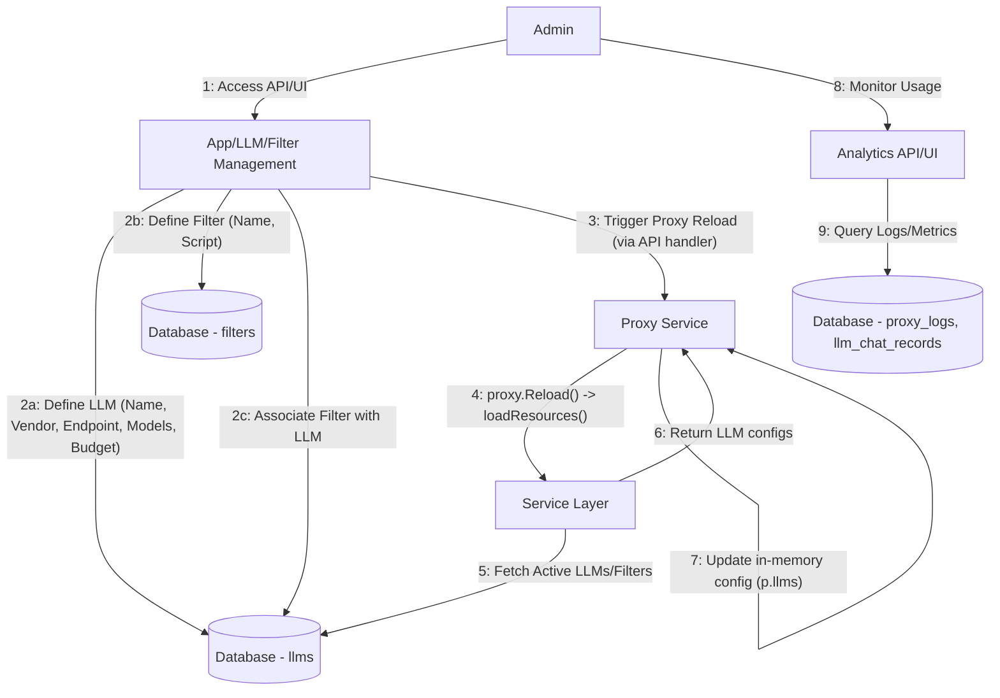
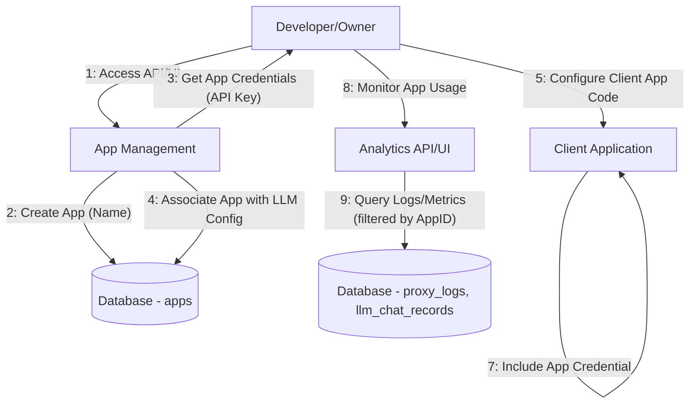
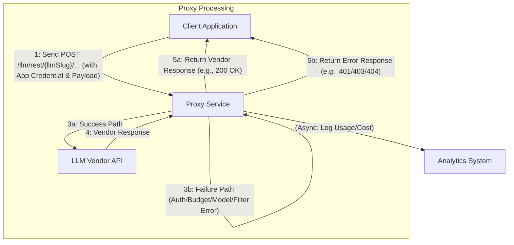

## LLM Proxy System

**1. Overview & Purpose**

The LLM Proxy System acts as a centralized, secure, and observable gateway for all interactions between internal applications (Apps) and external Large Language Model (LLM) providers. It intercepts requests directed at specific LLM configurations, enforces various policies (authentication, model restrictions, budget limits, custom filters), and forwards valid requests to the appropriate vendor API endpoint, while logging usage for analytics and cost tracking.

**Key Objectives:**

*   **Centralized Access:** Provide a single point of entry (`/llm/rest/{llmSlug}/...`, `/llm/stream/{llmSlug}/...`) for applications to consume different LLMs without needing direct vendor credentials or endpoints.
*   **Authentication & Authorization:** Verify application credentials (`App` token) before allowing access to any LLM resource using the **Credential Validator**.
*   **Model Control:** Enforce which specific models within a vendor's offering an application is allowed to use, based on the LLM configuration (`llm.AllowedModels`) using the **Model Validator**.
*   **Policy Enforcement (Filters):** Apply custom request filtering rules defined per LLM configuration (`llm.Filters`) to modify or reject requests based on content or other criteria before they reach the vendor. Uses the **Scripting** engine.
*   **Budget Enforcement:** Integrate with the **Budget Control System** (`BudgetService`) to check App and LLM budgets before forwarding requests and trigger usage updates after completion.
*   **Vendor Abstraction:** Hide vendor-specific API details (authentication, request/response formats, endpoints) from consuming applications using the **Switches** and **Vendor** packages.
*   **Analytics & Observability:** Log detailed records of each proxied request (`ProxyLog`) and the corresponding LLM interaction, including token counts and calculated costs (`LLMChatRecord`), feeding data into the **Analytics** system.
*   **Streaming Support:** Handle real-time streaming responses from LLMs that support it.
*   **Dynamic Configuration:** Allow runtime reloading of LLM configurations (`proxy.Reload()`) triggered by API updates without restarting the service.

**User Roles & Interactions:**

*   **Administrator (Admin):**
    *   **Configuration:** Uses the Midsommar API/UI (**App/LLM/Filter Management**) to:
        *   Define LLM providers (`llms` table), including vendor type, API endpoint, credentials (if applicable, though often App-specific), allowed models, budget settings, and associated Filters.
        *   Create and manage Filters (`filters` table) containing JavaScript logic.
        *   Manage Applications (`apps` table) and potentially their credentials/associations.
        *   Manage Model Pricing (`model_prices` table) via **Pricing** features.
    *   **Monitoring:** Uses the Midsommar API/UI (**Analytics**) to view aggregated usage, costs, budget status, and proxy logs. Receives budget/system notifications via **Notification Service**.
*   **AI Developer/App Owner (Dev):**
    *   **Configuration:** Uses the Midsommar API/UI (**App Management**) to:
        *   Create and manage their Applications (`apps` table).
        *   Obtain credentials (e.g., API keys) for their Apps.
        *   Associate their Apps with specific LLM configurations.
    *   **Integration:** Configures their client application code to send requests to the appropriate Midsommar Proxy endpoint (`/llm/.../{llmSlug}/...`), including the App's credential for authentication.
    *   **Monitoring:** Uses the Midsommar API/UI (**Analytics**) to monitor their specific App's usage, costs, and budget status. Receives App-specific budget notifications via **Notification Service**.
*   **Application (Client):**
    *   **Interaction:** An automated system (code written by the Dev) that sends HTTP requests (POST) to the Midsommar Proxy endpoints (`/llm/rest/...` or `/llm/stream/...`).
    *   **Authentication:** Includes its unique credential (e.g., API key) in the request headers as required by the target vendor's format (e.g., `Authorization: Bearer <app_key>`).
    *   **Request:** Specifies the target LLM via the `{llmSlug}` in the URL and includes the vendor-specific payload (including the desired model) in the request body.
    *   **Response:** Receives either the proxied response from the upstream LLM vendor or an HTTP error from the Midsommar Proxy (e.g., 401 Unauthorized, 403 Forbidden for budget/model/filter violations, 404 Not Found, 5xx for internal/upstream errors).

*(Note: This system primarily focuses on pass-through proxying. A separate OpenAI Translation Layer exists at `/v1/chat/completions` which adapts OpenAI-formatted requests to various backend vendors.)*

**2. Architecture & Data Flow**

**Core Components & Interactions:** (Components remain the same as previous spec)

*   **Proxy (`proxy/proxy.go`)**
*   **CredentialValidator (`proxy/credential_validator.go`)**
*   **ModelValidator (`proxy/model_validator.go`)**
*   **Service (`services/service.go`)**
*   **BudgetService (`services/budget_service.go`)**
*   **Switches (`switches/switches.go`)**
*   **Vendor Implementations (`vendors/{vendor}/{vendor}.go`)**
*   **Analytics (`analytics/analytics.go`)**
*   **Scripting (`scripting/scripting.go`)**
*   **Database (`models/`)**

**Data Flow (Simplified REST Request):**

```mermaid
flowchart LR
    A["Client Request (/llm/rest/{llmSlug}/...)"] --> B{"Proxy Router"};
    subgraph "Middleware Chain"
        B --> C["CredentialValidator"];
        C -- "1: Validate Creds (via Service)" --> D[("Database - apps")];
        C -- "Context: App" --> E["ModelValidator"];
        E -- "2: Extract/Validate Model (vs llm.AllowedModels)" --> F[("Database - llms")];
        E -- "Context: Model Name" --> G["handleLLMRequest"];
    end
    subgraph "Request Handling"
        G -- "3: CheckBudget(app, llm)" --> H["BudgetService"];
        H -- "4a: Budget OK" --> I{"Screen Request"};
        H -- "4b: Budget Exceeded" --> J["Return HTTP 403"];
        I -- "5: Apply llm.Filters (Scripting)" --> K{"Vendor Screen"};
        K -- "6: Call vendor.ProxyScreenRequest" --> L{"Set Auth"};
        L -- "7: Call vendor.ProxySetAuthHeader" --> M["Forward Request (ReverseProxy)"];
    end
    M --> N["LLM Vendor API"];
    N -- "8: Vendor Response" --> M;
    M -- "9: Capture Response" --> G;
    G -- "10: Analyze Async" --> P(("analyzeResponse Goroutine"));
    subgraph "Async Analysis"
        P -- "11: Log ProxyLog" --> Q["Analytics"];
        P -- "12: switches.AnalyzeResponse" --> R{"Vendor Analyze"};
        R -- "13: vendor.AnalyzeResponse" --> S["Parse Tokens"];
        S -- "ITokenResponse" --> T["AnalyzeCompletionResponse"];
        T -- "14: Get Pricing" --> U[("Database - model_prices")];
        T -- "15: Calculate Cost" --> T;
        T -- "16: Log LLMChatRecord" --> Q;
        T -- "17: Trigger Budget Update" --> H;
    end
    G -- "18: Return Response to Client" --> A;

    style J fill:#f9f,stroke:#333,stroke-width:2px
```

**User Role Flows:**

**Administrator Flow (Configuration Example):**

**Developer/Owner Flow (Integration Example):**

**Application (Client) Flow (Request Example):**

**3. Implementation Details**

*   **Endpoints:**
    *   `POST /llm/rest/{llmSlug}/{rest:.*}`: For standard REST LLM API calls.
    *   `POST /llm/stream/{llmSlug}/{rest:.*}`: For streaming LLM API calls.
    *   `{llmSlug}`: URL slug generated from the `llm.Name` configured in the database.
    *   `{rest:.*}`: Captures the remaining path to be forwarded to the vendor API.
*   **Configuration:** LLM endpoints, credentials (API keys, often App-specific), allowed models, filters, and vendor types are stored in the `llms` table, managed via **LLM Management** API/UI. Active LLMs are loaded into the proxy's memory map (`p.llms`) by `loadResources`. Filters are stored in the `filters` table. Pricing in `model_prices`.
*   **Authentication:** Relies on `CredentialValidator` middleware. Expects credentials in the format required by the *target vendor* (e.g., `Authorization: Bearer <app_key>` for OpenAI-like vendors, `x-api-key: <app_key>` for Anthropic). The validator checks this `<app_key>` against the `apps` table via the `service`.
*   **Model Validation:** `ModelValidator` checks the `model` field within the request *body* against the `llm.AllowedModels` string array. Vendor-specific extractors handle different request body structures.
*   **Filtering:** LLM-specific filters (`llm.Filters`, linked via `llm` table) are executed by `scripting.RunFilter` within `screenProxyRequestByVendor` *before* the request is forwarded. Filters are JavaScript snippets stored in the `filters` table.
*   **Cost Calculation:** Performed *after* the response is received in `AnalyzeCompletionResponse`. Uses token counts from vendor-specific analysis (`ITokenResponse`) and pricing data (`model_prices` table fetched via `service.GetModelPriceByModelNameAndVendor`). Cost stored as integer (actual * 10000) in `llm_chat_records`.
*   **Logging:**
    *   `ProxyLog`: Records basic request/response metadata (AppID, UserID, Timestamp, Vendor, truncated bodies, status code). Recorded by `analyzeResponse`/`analyzeStreamingResponse`.
    *   `LLMChatRecord`: Records detailed LLM usage (LLMID, Model, Vendor, Tokens (Prompt/Response/Cache), Cost, Timestamp, AppID, UserID, InteractionType=Proxy). Recorded by `AnalyzeCompletionResponse`.
*   **Vendor Abstraction:** The `switches` package uses the `VendorMap` and `models.LLMVendorProvider` interface to decouple the core proxy logic from vendor specifics.
*   **Streaming Implementation:** Uses `http.Client` for forwarding, copies headers, streams chunks back while aggregating the full response in memory for final analysis. Includes timeouts and keep-alive settings.
*   **Concurrency:** Response analysis and logging happen in goroutines. Uses `sync.RWMutex` (`p.mu`) to protect access to shared resources like `p.llms` during reloads or lookups.

**4. Use Cases & Behavior**

*   **Admin Configures New LLM:**
    1.  Admin uses API/UI to define a new LLM (e.g., "Claude3-Opus"), sets vendor=Anthropic, endpoint, allowed models=["claude-3-opus-20240229"], budget=100.
    2.  Admin defines a Filter (e.g., "PII Check") and associates it with "Claude3-Opus".
    3.  API handler saves to DB and calls `proxy.Reload()`.
    4.  Proxy loads the new config.
*   **Dev Integrates App:**
    1.  Dev uses API/UI to create "MyApp", gets API key `<myapp_key>`.
    2.  Dev associates "MyApp" with "Claude3-Opus".
    3.  Dev updates their application code to send requests to `POST /llm/rest/claude3-opus/v1/messages` with `x-api-key: <myapp_key>` header and payload `{ "model": "claude-3-opus-20240229", ... }`.
*   **Client Makes Valid Request:**
    1.  "MyApp" sends the request configured above.
    2.  Proxy `CredentialValidator` checks `<myapp_key>` -> OK, finds "MyApp".
    3.  Proxy `ModelValidator` checks `"claude-3-opus-20240229"` against allowed models -> OK.
    4.  Proxy `handleLLMRequest` checks budget for "MyApp" & "Claude3-Opus" -> OK.
    5.  Proxy `screenProxyRequestByVendor` runs "PII Check" filter -> OK. Runs Anthropic `ProxyScreenRequest` -> OK.
    6.  Proxy adds Anthropic auth header (`x-api-key` from LLM config, *Note: Auth needs clarification - likely uses App key or LLM key depending on setup*). Forwards `/v1/messages` to Anthropic.
    7.  Receives 200 OK from Anthropic.
    8.  Returns 200 OK to "MyApp".
    9.  Logs `ProxyLog` and `LLMChatRecord` (with cost) asynchronously. Updates budget asynchronously.
*   **Client Exceeds Budget:** Request reaches step 4, `BudgetService.CheckBudget` fails. Proxy logs failure analytics, returns HTTP 403 to "MyApp".
*   **Client Uses Disallowed Model:** Request reaches step 3, `ModelValidator` fails (e.g., client sent `"claude-3-sonnet..."`). Proxy returns HTTP 403 to "MyApp".
*   **Client Violates Filter:** Request reaches step 5, "PII Check" filter script rejects the request body. Proxy returns HTTP 403 to "MyApp".
*   **Client Uses Invalid Key:** Request reaches step 2, `CredentialValidator` fails. Proxy returns HTTP 401 to "MyApp".

**5. Potential Considerations & Future Enhancements**

*   **Filter Execution Point:** Filters currently run *before* vendor-specific screening (`ProxyScreenRequest`). The order might need adjustment depending on desired behavior. Global filters are not implemented.
*   **Authentication Model:** The exact mechanism for vendor authentication (App key vs. LLM config key) needs clarification based on `setVendorAuthHeader` implementation details and security requirements. The current code seems to use the key from the `llm` model (`llm.APIKey`).
*   **Vendor Complexity:** Adding new vendors remains a significant effort requiring careful implementation of the provider interface.
*   **Streaming Analysis Memory:** Aggregating full streaming responses in memory could be problematic for very large outputs.
*   **OpenAI Translation Layer:** Consider clarifying the distinction or potential unification with the direct proxy endpoints.
*   **Datasource Proxying:** This spec focuses on LLM proxying, but the `/datasource/...` endpoint provides similar proxying for internal search, which could be documented separately.
*   **Error Handling:** Improve mapping of vendor errors to client-facing HTTP errors.