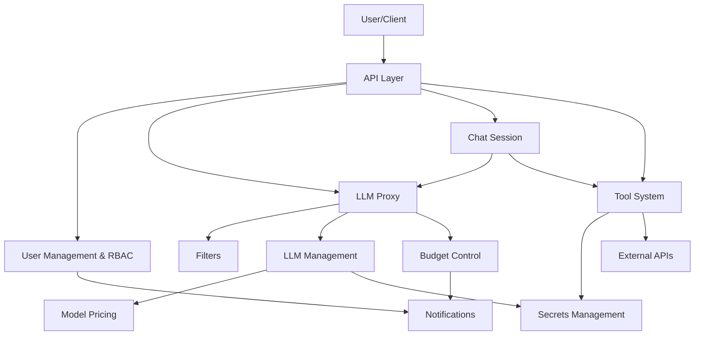

# Midsommar Feature Specifications

This directory contains detailed specifications for Midsommar's core features. Each specification provides comprehensive documentation about the feature's architecture, implementation, and functionality.

## System Architecture Overview

Midsommar is designed as a modular, service-oriented platform that provides secure, controlled access to Large Language Models (LLMs) and external tools. The system architecture integrates multiple components that work together to deliver a comprehensive AI interaction platform.

### Core Components and Relationships

### Key Integration Points

1. **Central Authentication & Authorization**: The User Management & RBAC system serves as the foundation for all access control, determining which users can access which features, tools, and LLMs.

2. **LLM Request Flow**: Client requests flow through the API layer to the Proxy, which applies Filters for policy enforcement, checks Budget constraints, and routes to the appropriate LLM provider configured in the LLM Management system.

3. **Tool Execution Pipeline**: The Tool System integrates with Chat Sessions to enable LLMs to interact with external services, using Secrets Management for secure authentication and applying privacy controls consistent with LLM configurations.

4. **Cost Management Chain**: The Model Pricing system tracks usage costs, which feed into the Budget Control system to enforce spending limits, which in turn triggers Notifications when thresholds are reached.

5. **Security Layers**: Multiple security mechanisms work together, including RBAC for access control, Secrets Management for credential security, Filters for content policy enforcement, and privacy scoring to ensure appropriate data handling.

### Cross-Cutting Concerns

- **Analytics**: Usage data is collected across LLM interactions, tool calls, and user activities to provide insights and reporting.
- **Admin UI**: A comprehensive administration interface allows configuration of all system components.
- **API Layer**: RESTful endpoints provide programmatic access to all platform capabilities.
- **Database**: Persistent storage for all configuration, user data, and usage records.

Each feature specification below provides detailed documentation on the individual components that make up this integrated architecture.

## Available Specifications

### [User Management & RBAC](UserManagement.md)
- Authentication and authorization system
- Role-based access control (RBAC)
- User registration and email verification
- Group-based membership model
- Admin capabilities and permissions
- API key authentication
- Security features and best practices

### [Notifications](Notifications.md)
- Centralized notification management system
- Multi-channel delivery (in-app and email)
- Notification types and delivery methods
- Integration with other services (Budget, Auth)
- Deduplication and tracking
- UI components and frontend architecture
- Testing strategy and future enhancements

### [Budget Control](Budgeting.md)
- Monthly spending caps for apps and LLMs
- Real-time usage tracking and blocking
- Proactive alerts at usage thresholds
- Caching mechanism for performance
- Integration with notification system
- Analytics and reporting
- UI components for budget management

### [Secrets Management](Secrets.md)
- Secure storage of sensitive data (passwords, tokens, API keys)
- AES encryption for data at rest
- Environment variable and secret references ($ENV/VAR_NAME, $SECRET/SECRET_NAME)
- CRUD API endpoints with role-based access control
- Integration with multiple services (credentials, tools, LLMs)
- Admin UI for secret management
- Secure deployment configuration

### [Filters](Filters.md)
- Custom logic to intercept and modify LLM requests
- Policy enforcement for content moderation and data loss prevention
- Request blocking for non-compliant content
- Flexible scripting using Tengo language
- Granular application to LLMs or Chats
- Custom functions for HTTP requests and LLM calls
- Integration with proxy system

### [LLM Management & Configuration](LLM.md)
- Centralized management of LLM providers and models
- Vendor integration (OpenAI, Anthropic, GoogleAI, etc.)
- Model access control with regex patterns
- Parameter tuning with default generation settings
- Security and compliance with privacy scores
- Cost awareness with budget integration
- Activation control for LLM providers
- Admin UI for configuration

### [Model Pricing System](Pricing.md)
- Cost definition for various LLM models
- Accurate tracking of token usage and costs
- Integration with Budget Control and Analytics
- Flexible pricing based on input/output tokens
- Fallback mechanism for undefined prices
- Historical cost recalculation
- Currency management

### [Tool System](Tools.md)
- External service integration via OpenAPI specifications
- Privacy control with compatibility scoring
- Access management through User and Group systems
- Security with Secrets Management integration
- Extensibility with dependency management
- Organization through tool catalogues
- Documentation integration with file stores
- Filter integration for request validation
