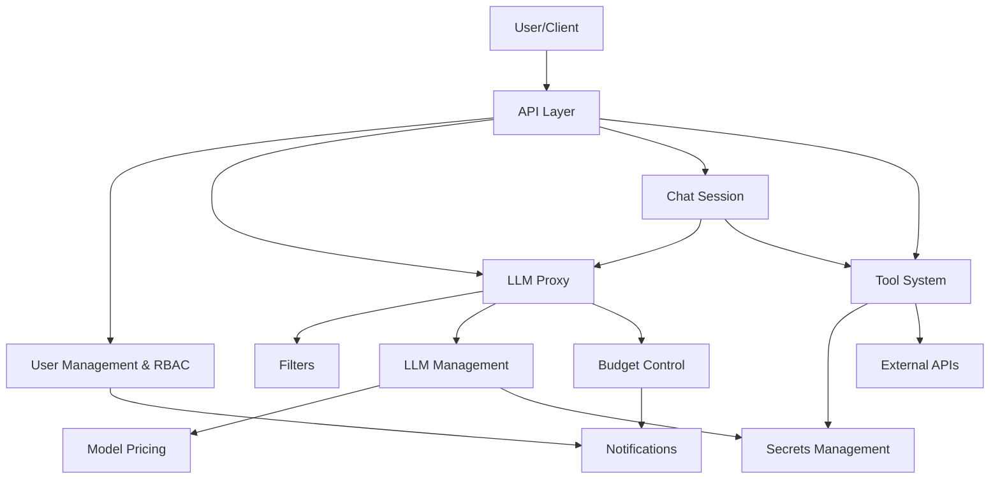

# Midsommar Feature Specifications

This directory contains detailed specifications for Midsommar's core features. Each specification provides comprehensive documentation about the feature's architecture, implementation, and functionality.

## System Architecture Overview

Midsommar is designed as a modular, service-oriented platform that provides secure, controlled access to Large Language Models (LLMs) and external tools. The system architecture integrates multiple components that work together to deliver a comprehensive AI interaction platform.

### Core Components and Relationships

```mermaid
graph TD
    User[User/Client] --> API[API Layer]
    API --> Auth[User Management & RBAC]
    API --> Proxy[LLM Proxy]
    API --> ChatSession[Chat Session]
    API --> ToolSystem[Tool System]
    
    Proxy --> Filters[Filters]
    Proxy --> LLMManagement[LLM Management]
    Proxy --> Budget[Budget Control]
    
    LLMManagement --> Pricing[Model Pricing]
    LLMManagement --> Secrets[Secrets Management]
    
    ChatSession --> Proxy
    ChatSession --> ToolSystem
    
    ToolSystem --> Secrets
    ToolSystem --> ExternalAPIs[External APIs]
    
    Budget --> Notifications[Notifications]
    Auth --> Notifications
```

### Key Integration Points

1. **Central Authentication & Authorization**: The User Management & RBAC system serves as the foundation for all access control, determining which users can access which features, tools, and LLMs.

2. **LLM Request Flow**: Client requests flow through the API layer to the Proxy, which applies Filters for policy enforcement, checks Budget constraints, and routes to the appropriate LLM provider configured in the LLM Management system.

3. **Tool Execution Pipeline**: The Tool System integrates with Chat Sessions to enable LLMs to interact with external services, using Secrets Management for secure authentication and applying privacy controls consistent with LLM configurations.

4. **Cost Management Chain**: The Model Pricing system tracks usage costs, which feed into the Budget Control system to enforce spending limits, which in turn triggers Notifications when thresholds are reached.

5. **Security Layers**: Multiple security mechanisms work together, including RBAC for access control, Secrets Management for credential security, Filters for content policy enforcement, and privacy scoring to ensure appropriate data handling.

### Cross-Cutting Concerns

- **Analytics**: Usage data is collected across LLM interactions, tool calls, and user activities to provide insights and reporting.
- **Admin UI**: A comprehensive administration interface allows configuration of all system components.
- **API Layer**: RESTful endpoints provide programmatic access to all platform capabilities.
- **Database**: Persistent storage for all configuration, user data, and usage records.

Each feature specification below provides detailed documentation on the individual components that make up this integrated architecture.

## Available Specifications

### [AI Portal](AIPortal.md)
- End-user portal for discovering resources and building apps
- App gallery, resource browser and chat interface
- App endpoint documentation (Main Ingress and per-LLM endpoints)

### [Asset Catalog (Enterprise plugin)](AssetCatalog.md)
- Runtime-defined asset types for agents, prompts, skills, guardrails and other non-gateway assets
- Ownership roles, versioning with lineage, relationships and lifecycle tags
- Community submissions via the platform Submission form
- Access-request workflow with in-Studio notifications and event publishing
- Platform extensions: plugin submissions, `CreateNotification` and `RegisterResourceTypes` RPCs, admin RPC caller identity

### [Community Submissions (UGC)](UGC.md)
- Portal users submit Data Sources, Tools and plugin resource instances for review
- Draft → submitted → in review → approved / rejected / changes requested
- Attestations, privacy suggestions, catalogue assignment and versioned updates

### [Analytics System](Analytics.md)
- Comprehensive usage tracking and cost calculation
- Data aggregation for LLM interactions and tool calls
- Budget monitoring and consumption tracking
- Proxy logging for debugging and auditing
- API exposure for analytics data retrieval
- Asynchronous processing for performance
- Dashboard visualization for administrators and developers

### [Audit Trail](AuditTrail.md) (Enterprise)
- Append-only record of every management API action: actor, IP, action, resource, status
- Field-level diffs for updates, full final state for deletes, secret redaction
- Login, logout, SSO and failed authentication events
- Database and/or file storage with configurable retention
- Filtered query, summary, per-object history and CSV/JSON export API
- Admin UI page under Governance

### [Budget Control](Budgeting.md)
- Monthly spending caps for apps and LLMs
- Real-time usage tracking and blocking
- Proactive alerts at usage thresholds
- Caching mechanism for performance
- Integration with notification system
- Analytics and reporting
- UI components for budget management

### [Chat Session System](Chat.md)
- Stateful conversation management with LLMs
- Real-time streaming responses via Server-Sent Events
- Dynamic tool and datasource integration
- Persistence of chat history and metadata
- Integration with user management and access control
- Customizable chat behavior through configurations
- Responsive and interactive chat UI

### [Datasource & RAG System](Datastore.md)
- Vector store abstraction for multiple providers
- File management for source documents
- Embedding generation for document chunks
- Data ingestion pipeline for vector databases
- Retrieval Augmented Generation (RAG) capabilities
- Integration with chat sessions for context enhancement
- Admin UI for datasource configuration and management

### [Filters](Filters.md)
- Custom logic to intercept and modify LLM requests
- Policy enforcement for content moderation and data loss prevention
- Request blocking for non-compliant content
- Flexible scripting using Tengo language
- Granular application to LLMs or Chats
- Custom functions for HTTP requests and LLM calls
- Integration with proxy system

### [LLM Management & Configuration](LLM.md)
- Centralized management of LLM providers and models
- Vendor integration (OpenAI, Anthropic, GoogleAI, etc.)
- Model access control with regex patterns
- Parameter tuning with default generation settings
- Security and compliance with privacy scores
- Cost awareness with budget integration
- Activation control for LLM providers
- Admin UI for configuration

### [Governed Metadata (Enterprise)](GovernedMetadata.md)
- Admin-defined metadata schemas, required fields and controlled vocabularies for LLMs, tools and data sources
- Standard validation envelope with advisory or enforced modes, compliance report and audit trail
- Portal- and gateway-visible fields, plugin hooks, management gRPC API and manifest contributions

### [LLM Proxy System](Proxy.md)
- Centralized gateway for LLM provider interactions
- Authentication and authorization enforcement
- Model access control based on configurations
- Policy enforcement through filters
- Budget limit enforcement
- Vendor abstraction for multiple LLM providers
- Analytics and observability for all LLM interactions
- Streaming support for real-time responses

### [Model Pricing System](Pricing.md)
- Cost definition for various LLM models
- Accurate tracking of token usage and costs
- Integration with Budget Control and Analytics
- Flexible pricing based on input/output tokens
- Fallback mechanism for undefined prices
- Historical cost recalculation
- Currency management

### [Notifications](Notifications.md)
- Centralized notification management system
- Multi-channel delivery (in-app and email)
- Notification types and delivery methods
- Integration with other services (Budget, Auth)
- Deduplication and tracking
- UI components and frontend architecture
- Testing strategy and future enhancements

### [Secrets Management](Secrets.md)
- Secure storage of sensitive data (passwords, tokens, API keys)
- AES encryption for data at rest
- Environment variable and secret references ($ENV/VAR_NAME, $SECRET/SECRET_NAME)
- CRUD API endpoints with role-based access control
- Integration with multiple services (credentials, tools, LLMs)
- Admin UI for secret management
- Secure deployment configuration

### [Single Sign-On (SSO) Support](SSOSupport.md)
- Multiple identity provider integration (OpenID Connect, SAML, LDAP)
- Profile management with Monaco editor-based UI
- Group mapping between external and internal systems
- Embedded Tyk Identity Broker integration
- Secure authentication flows
- Default login profile configuration
- Admin controls for SSO configuration

### [Tool System](Tools.md)
- External service integration via OpenAPI specifications
- Privacy control with compatibility scoring
- Access management through User and Group systems
- Security with Secrets Management integration
- Extensibility with dependency management
- Organization through tool catalogues
- Documentation integration with file stores
- Filter integration for request validation

### [Universal LLM Client System](UniversalLLMClient.md)
- OpenAI API compatibility layer for non-OpenAI models
- Request translation between different vendor formats
- Response translation to standardized format
- Centralized configuration using LLM management
- Policy enforcement consistent with direct proxy
- Analytics integration for usage tracking
- Vendor abstraction through common interfaces

### [Role-Based Access Control](RBAC.md) (Enterprise)
- Permission catalogue (`resource:action`) shared by the API, navigation and role editor
- Built-in Owner / Administrator / Editor / Viewer / Auditor roles plus custom roles
- Roles bound to users and teams; effective permissions are the union

### [User Management & RBAC](UserManagement.md)
- Authentication and authorization system
- Role-based access control (RBAC)
- User registration and email verification
- Group-based membership model
- Admin capabilities and permissions
- API key authentication
- Security features and best practices
