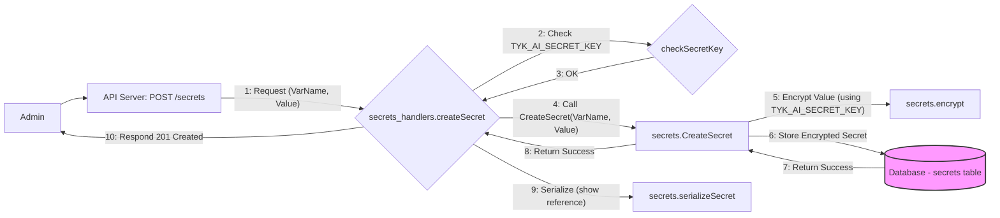
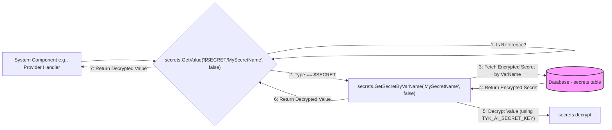

## Secrets Management System

**1. Overview & Purpose**

The Secrets Management system provides a secure way to store and manage sensitive information, such as API keys, tokens, or other credentials, within the Midsommar application. It prevents hardcoding sensitive data directly into configurations or code. Secrets can be referenced indirectly using a special format (`$SECRET/VarName`) and are resolved at runtime when needed.

**Key Objectives:**

*   **Secure Storage:** Encrypt sensitive values at rest in the database using AES-GCM.
*   **Centralized Management:** Provide API endpoints and a corresponding UI section for administrators to perform CRUD operations on secrets.
*   **Reference Mechanism:** Allow referencing secrets indirectly using `$SECRET/VarName` format in configurations. Also supports resolving environment variables using `$ENV/VarName`.
*   **Runtime Resolution:** Provide a mechanism (`secrets.GetValue`) for different parts of the application to resolve these references into actual values when required.
*   **Controlled Access:** Leverage existing API authentication and authorization for managing secrets.
*   **Enable/Disable:** The entire feature is contingent on the presence of the `TYK_AI_SECRET_KEY` environment variable.

**User Roles & Interactions:**

*   **Administrator:** Manages secrets (CRUD operations) via the API (`/secrets` endpoints) or the administrative UI. Uses secret references (`$SECRET/VarName`) when configuring other parts of the system (e.g., Providers, Tools, LLMs, Datasources).
*   **System Components:** Resolve secret references at runtime using `secrets.GetValue` to fetch the actual sensitive data needed for their operation.

**2. Architecture & Data Flow**

**Core Components & Interactions:**

*   **API Handlers (`api/secrets_handlers.go`):** Expose RESTful endpoints for managing secrets. Responsible for CRUD operations, calling the Secrets Service, and checking for `TYK_AI_SECRET_KEY`.
*   **Secrets Service (`secrets` package):** Contains the core logic.
    *   `secrets.Secret` (`secrets/models.go`): Data model (ID, VarName, encrypted Value).
    *   `encrypt`/`decrypt` (`secrets/models.go`): AES-GCM encryption/decryption using `TYK_AI_SECRET_KEY`.
    *   CRUD Functions (`secrets/models.go`): Database interactions (`CreateSecret`, `GetSecretByID`, etc.).
    *   `GetValue` (`secrets/secrets.go`): Resolves `$SECRET/VarName` and `$ENV/VarName` references. Requires DB access for `$SECRET`.
    *   `SetDBRef` (`secrets/secrets.go`): Injects the database connection, necessary for `GetValue` to resolve `$SECRET` references.
*   **Database (`models`):** Stores the `secrets` table.
*   **Consumers (Various Services/Handlers):** Components that use sensitive data.
    *   **LLM Service (`services/llm_service.go`):** Uses `secrets.GetValue` to resolve API keys and endpoints for LLM providers.
        * `GetLLMByID` - Preserves references for API responses
        * `GetLLMByName` - Resolves actual values for internal use
        * `GetActiveLLMs` - Resolves actual values for all active LLMs
    *   **Tool Service (`services/tool_service.go`):** Uses `secrets.GetValue` to resolve authentication keys for tools.
        * `GetToolByID` - Preserves references for API responses
        * `GetToolByName` - Preserves references for API responses
    *   **Datasource Service (`services/datasource_service.go`):** Uses `secrets.GetValue` to resolve connection credentials and API keys.
        * `GetDatasourceByID` - Preserves references for API responses
        * `SearchDatasources` - Preserves references for API responses
    *   **Chat Service (`services/chat_service.go`):** Uses `secrets.GetValue` to resolve credentials for LLMs, tools, and datasources used in chats.
        * `GetChatByID` - Resolves actual values for LLM API keys, tool auth keys, and datasource API keys
    *   **Provider Handlers (`api/provider_handlers.go`):** Uses `secrets.GetValue` to resolve tokens for providers like Tyk Dashboard.
        * `configureProvider` - Resolves actual values for provider tokens

**Data Flow:**

**A) Creating a Secret:**

**B) Resolving a Secret Reference:**

**3. Implementation Details**

*   **Enabling the Feature:** The `TYK_AI_SECRET_KEY` environment variable **must** be set.
*   **Database Initialization:** `secrets.SetDBRef` must be called at startup to enable `$SECRET` resolution via `secrets.GetValue`.
    * This is done in `api/provider_handlers.go` in the `NewProviderAPI` function.
*   **Data Model (`secrets.Secret`):** Stores ID, VarName, encrypted Value, and standard GORM timestamps.
*   **Encryption:** AES-GCM using `TYK_AI_SECRET_KEY`. Encryption occurs on create/update, decryption on retrieval via `GetValue` (when `preserveRef` is false).
*   **Reference Format & Resolution:**
    *   `$SECRET/VarName`: Resolved by looking up `VarName` in the `secrets` table, decrypting the value.
    *   `$ENV/VarName`: Resolved using `os.Getenv(VarName)`.
    *   `secrets.GetValue(reference, preserveRef)`: Central function for resolution. `preserveRef=true` returns the reference string itself, `preserveRef=false` returns the actual resolved value.
    *   API responses for secrets generally use `preserveRef=true` (showing `$SECRET/VarName`).
    *   Internal consumers (like providers) use `preserveRef=false` to get the actual secret.
*   **API Endpoints:** Standard RESTful CRUD endpoints under `/secrets`. Supports pagination for listing. Uses standard HTTP status codes for responses and errors.
*   **Logging:** Debug and Error logs exist in handlers and the service package.
*   **Redaction Utility:** `secrets.FilterSensitiveFields` exists to redact sensitive fields in objects by using struct tags.

**4. Use Cases & Behavior**

*   **Storing an API Key:** Admin uses UI/API to create a secret (e.g., `VarName="MyServiceKey"`, `Value="actual_key"`). System stores encrypted key. UI/API shows reference `$SECRET/MyServiceKey"`.
*   **Configuring a Provider:** Admin sets provider token field to `$SECRET/MyTykToken`. At runtime, the provider handler calls `secrets.GetValue("$SECRET/MyTykToken", false)` to get the actual token.
*   **Configuring an LLM:** Admin sets LLM API key field to `$SECRET/OpenAIKey`. The `llm_service` calls `secrets.GetValue(llm.APIKey, false)` when the LLM is used.
*   **Configuring a Tool:** Admin configures a tool requiring an API key, setting the key field to `$SECRET/MyToolKey`. The `tool_service` calls `secrets.GetValue(tool.AuthKey, false)` when the tool is invoked.
*   **Configuring a Datasource:** Admin sets datasource connection credentials to `$SECRET/DBPassword`. The `datasource_service` calls `secrets.GetValue(datasource.DBConnAPIKey, false)` when connecting to the datasource.
*   **Using in Chat Sessions:** When a chat uses LLMs, tools, or datasources with secret references, the `chat_service` resolves these references to actual values before use.
*   **Viewing/Editing Secrets:** Admin uses UI/API. Secrets are always displayed/returned in their reference format (`$SECRET/VarName`), never the actual decrypted value. Editing requires providing the new plaintext value, which is then encrypted.
*   **Deleting a Secret:** Admin deletes via UI/API. The database record is removed. Subsequent attempts to resolve its reference will fail.
*   **Feature Disabled:** If `TYK_AI_SECRET_KEY` is unset, `/secrets` API calls fail (503), and `$SECRET` resolution via `GetValue` fails (likely returning the reference string and logging errors).

**5. Potential Considerations & Future Enhancements**

*   **`TYK_AI_SECRET_KEY` Management:** Security, rotation, and deployment are critical.
*   **Key Rotation:** No built-in support. Manual process required.
*   **Access Control:** Relies on general API auth; no per-secret granularity.
*   **Error Handling for Unresolved References:** Consumers need robust handling if `GetValue` fails (deleted secret, missing key, DB ref not set).
*   **External Secret Managers:** Integration could offer enhanced features (Vault, AWS/GCP Secrets Manager).
*   **Secret Versioning:** Not supported; updates overwrite previous values.
*   **Automatic Secret Detection:** Implement scanning for potential secrets in configurations and suggest using the secret reference mechanism.
*   **Secret Usage Tracking:** Add functionality to track which components are using which secrets for better management and security auditing.