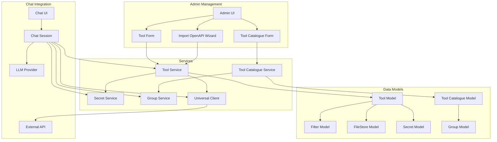
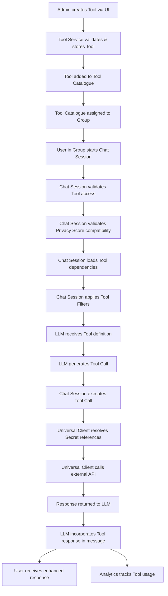
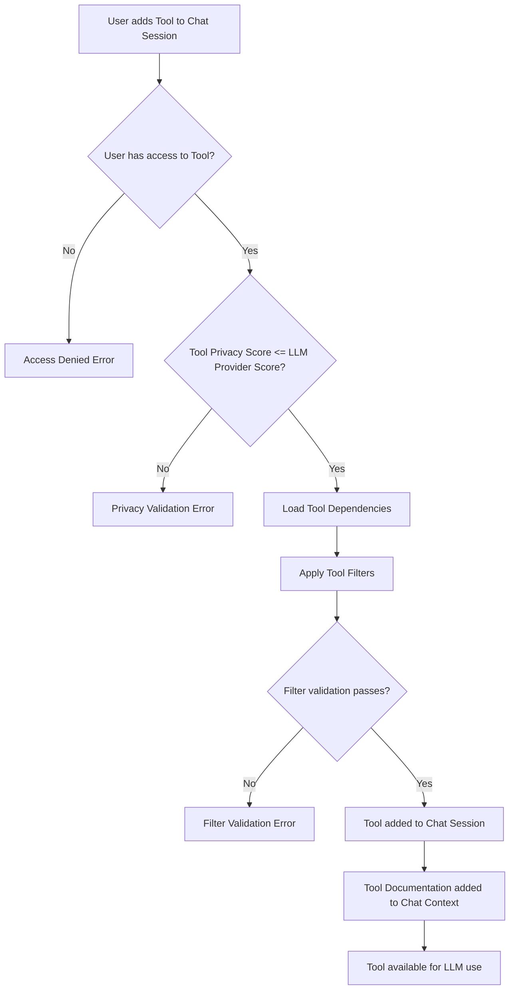
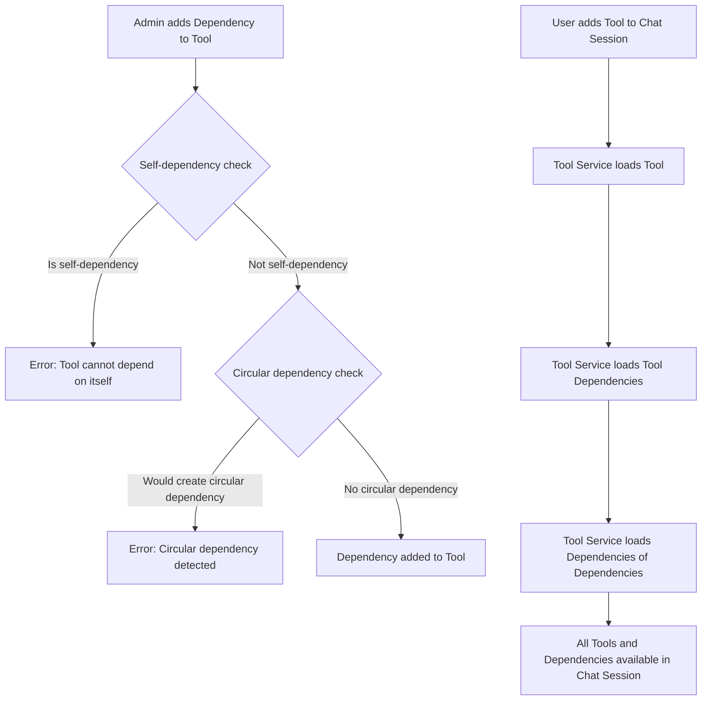

## Tool System

**1. Overview & Purpose**

The Midsommar Tool System provides a framework for integrating external services and APIs with LLM interactions, enabling LLMs to interact with external data sources while maintaining security, privacy, and access controls.

**Core Objectives:**

* **External Service Integration:** Enable LLMs to interact with external services via OpenAPI specifications.
* **Privacy Control:** Enforce privacy scores to ensure tools are only used with compatible **LLM Provider** settings.
* **Access Management:** Control tool access through **User Management** and **Group Management** systems.
* **Security:** Manage authentication and authorization via the **Secrets Management** system.
* **Extensibility:** Support easy addition of new tools and tool types.
* **Organization:** Group related tools into catalogues for easier discovery and management.
* **Documentation Integration:** Associate file stores with tools to provide usage documentation to LLMs.

**User Roles & Interactions:**

* **Administrator:** Creates and manages tools and tool catalogues, assigns tools to groups, configures privacy settings.
* **Group Manager:** Assigns tool catalogues to groups, controlling which users have access to specific tools.
* **Chat Room Owner:** Configures default tools for chat rooms and manages tool usage within conversations.
* **End User:** Uses tools within chat sessions to accomplish tasks, receives tool-enhanced responses from LLMs.

**2. Architecture & Data Flow**

**Complete System Architecture:**



**Tool Creation and Usage Flow:**



**Privacy Score and Filter Validation Flow:**



**Tool Dependency Management:**



**3. Implementation Details**

* **Tool Model Structure:**
  ```go
  type Tool struct {
      ID                 uint   `json:"id" gorm:"primary_key"`
      Name               string `json:"name"`
      Description        string `json:"description"`
      ToolType           string `json:"tool_type"`
      OASSpec            string `json:"oas_spec"`             // Base64 encoded OpenAPI specification
      AvailableOperations string `json:"available_operations"` // Comma-separated list of operations
      PrivacyScore       int    `json:"privacy_score"`
      AuthKey            string `json:"auth_key"`             // Secret reference ($SECRET/name)
      AuthSchemaName     string `json:"auth_schema_name"`     // Auth scheme (e.g., "apiKey")
      FileStores         []FileStore `gorm:"many2many:tool_filestores;" json:"file_stores"`
      Filters            []Filter    `gorm:"many2many:tool_filters;" json:"filters"`
      Dependencies       []*Tool     `gorm:"many2many:tool_dependencies" json:"dependencies"`
      Apps               []App       `gorm:"many2many:app_tools;" json:"apps"`  // New relationship with Apps
  }
  ```

* **Privacy Scoring System:**
  * Integer value representing privacy requirements (higher values = more stringent).
  * Tools can only be used with **LLM Providers** having equal or higher privacy scores.
  * Validation occurs during chat session initialization and when adding tools.
  * Prevents sensitive tools from being used with less trustworthy **LLM Providers**.

* **Operation Management:**
  * Operations stored as comma-separated strings in `AvailableOperations`.
  * `AddOperation`, `RemoveOperation`, and `GetOperations` methods for management.
  * `ListToolOperationsFromSpec` extracts available operations from OpenAPI specs.
  * Operations can be selectively enabled from the full set available in the spec.

* **Dependency Management:**
  * Tools can depend on other tools, creating a dependency graph.
  * Circular dependency detection prevents infinite loops via `WouldCreateCircularDependency`.
  * Self-dependency prevention stops tools from depending on themselves.
  * Dependencies are automatically loaded when a tool is added to a chat session.

* **Authentication & Security:**
  * `AuthKey` stores API keys or other authentication credentials as **Secret** references.
  * `AuthSchemaName` defines the authentication scheme (e.g., "apiKey", "bearer").
  * Keys are securely managed through the **Secrets Management** system.
  * Universal Client applies authentication when executing operations.

* **File Store Integration:**
  * Tools can have associated documentation files stored in `FileStores`.
  * Files are automatically added to chat context when a tool is used.
  * Supports multiple file formats (text, markdown, etc.).
  * Files help LLMs understand how to use the tools effectively.

* **Filter Integration:**
  * Tools can have associated **Filters** that control their behavior.
  * Filters are applied before tool operations are executed.
  * Filters can validate inputs, transform data, or block operations.
  * Filter hierarchy: Tool filters → LLM Provider filters → Chat Room filters.

* **App Integration:**
  * Tools can now be subscribed to by applications, similar to how applications can subscribe to LLMs and Data Sources.
  * Many-to-many relationship between Apps and Tools via the `app_tools` join table.
  * Apps can subscribe to multiple Tools, and Tools can be used by multiple Apps.
  * Tool access controlled by permissions and privacy settings.
  * New API endpoints for managing app-tool relationships:
    * `GET /apps/{app_id}/tools`: Get all tools associated with an app.
    * `POST /apps/{app_id}/tools/{tool_id}`: Associate a tool with an app.
    * `DELETE /apps/{app_id}/tools/{tool_id}`: Disassociate a tool from an app.
  * UI components for selecting and managing tool subscriptions in the App Form and App Details views.

**4. UI Components & Interactions**

* **Tool List Page:**
  * Displays all tools with search, filtering, and pagination.
  * Shows tool name, description, type, and privacy score.
  * Provides actions for editing, viewing details, and deleting tools.
  * Includes "Import OpenAPI" button to launch the Import Wizard.

* **Tool Form:**
  * Creates and edits tools with comprehensive configuration options.
  * Includes fields for name, description, privacy score, and OpenAPI specification.
  * Provides authentication configuration with **Secrets Management** integration.
  * Allows selection of operations from the OpenAPI specification.
  * Manages tool dependencies with add/remove functionality.

* **Import OpenAPI Wizard:**
  * Multi-step wizard for importing tools from OpenAPI specifications.
  * Steps include: Select Provider, Configure Provider, Select API, Direct Import, Configure Tool.
  * Supports importing from popular API providers or direct specification upload.
  * Automatically extracts operations from specifications.

* **Chat Interface Tool Integration:**
  * Sidebar displays available and currently used tools.
  * Allows adding/removing tools during active chat sessions.
  * Shows tool documentation when tools are added.
  * Displays tool calls and responses in the chat thread.

**5. API Endpoints**

* **Tool Management:**
  * `POST /tools`: Create a new tool.
  * `GET /tools/{id}`: Get a tool by ID.
  * `PATCH /tools/{id}`: Update a tool.
  * `DELETE /tools/{id}`: Delete a tool.
  * `GET /tools`: List all tools.
  * `GET /tools/search`: Search tools by name or description.

* **Tool Operations:**
  * `POST /tools/{id}/operations`: Add an operation to a tool.
  * `GET /tools/{id}/operations`: Get all operations for a tool.
  * `GET /tools/{id}/spec-operations`: List operations from the OpenAPI spec.
  * `POST /tools/{id}/call-operation`: Call a tool operation.

* **Tool Relationships:**
  * `POST /tools/{id}/filestores/{filestore_id}`: Add a file store to a tool.
  * `POST /tools/{id}/filters/{filter_id}`: Add a filter to a tool.
  * `POST /tools/{id}/dependencies/{dependency_id}`: Add a dependency to a tool.

* **Tool Catalogue Management:**
  * `POST /tool-catalogues`: Create a new tool catalogue.
  * `GET /tool-catalogues/{id}`: Get a tool catalogue by ID.
  * `POST /tool-catalogues/{id}/tools`: Add a tool to a catalogue.

* **Chat Session Integration:**
  * `POST /chat-sessions/{session_id}/tools`: Add a tool to a chat session.
  * `DELETE /chat-sessions/{session_id}/tools/{tool_id}`: Remove a tool from a chat session.

**6. Potential Considerations & Future Enhancements**

* **Additional Tool Types:** Support for non-REST tool types (e.g., database queries, custom functions).
* **Enhanced Privacy Controls:** More granular privacy scoring system and per-operation privacy scores.
* **Performance Optimization:** Caching of tool execution results and parallel execution of multiple tool calls.
* **Advanced Dependency Management:** Versioning of tools and dependencies and conditional dependencies based on context.
* **Improved Documentation:** Structured documentation format for better LLM understanding and automatic example generation.
* **Analytics Integration:** Tracking of tool usage patterns and performance metrics for tool operations.
* **Enhanced Security:** More authentication methods, request signing and verification, and rate limiting.
