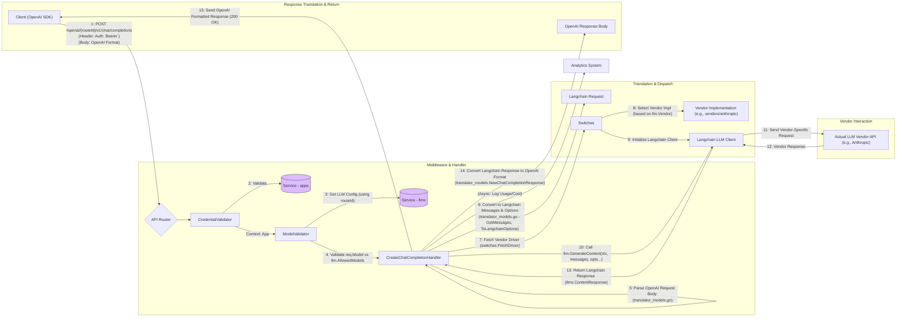

## Universal LLM Client System (Backend)

**1. Overview & Purpose**

The Universal LLM Client System is the backend component responsible for providing a unified interface for interacting with various Large Language Model (LLM) providers. It serves two primary functions:

1.  **Direct Proxy (`/llm/...`):** Acts as a secure, observable gateway for internal applications, forwarding requests nearly directly to configured LLM vendors while enforcing policies (auth, budget, model limits, filters). (This is covered in detail in `features/Proxy.md`).
2.  **OpenAI Translation Layer (`/v1/chat/completions` or similar):** Provides OpenAI API compatibility, accepting standard OpenAI-formatted requests and translating them to the appropriate backend vendor's format, enabling the use of OpenAI SDKs and tools with non-OpenAI models configured in Midsommar.

This specification focuses primarily on the **OpenAI Translation Layer** and the underlying **Vendor Abstraction** mechanism that supports both the proxy and the translation layer.

**Key Objectives:**

*   **Vendor Abstraction:** Hide vendor-specific API details (authentication, request/response formats, endpoints) from consuming applications using the **Switches** (`switches/`) and **Vendor** (`vendors/`) packages.
*   **OpenAI Compatibility:** Offer endpoints (e.g., `/v1/chat/completions`) that mimic the OpenAI API, allowing clients built for OpenAI to interact with any supported backend LLM configured in Midsommar.
*   **Request Translation:** Convert incoming OpenAI-formatted requests into a standardized internal format (leveraging `langchaingo`) suitable for dispatching to various vendor implementations.
*   **Response Translation:** Convert responses received from diverse backend vendors back into the standard OpenAI format for the client.
*   **Centralized Configuration:** Utilize the LLM configurations (`llms` table) managed via the API/UI to determine the target vendor, model, credentials, and policies for each request.
*   **Policy Enforcement:** Apply relevant policies (Authentication, Model Validation, Budget Control, Filters) consistently across both direct proxy and translated requests. *(Note: Policy enforcement details are largely covered in `features/Proxy.md` but apply conceptually here too)*.
*   **Analytics Integration:** Log usage and cost information for translated requests similar to proxied requests, feeding data into the **Analytics** system. *(Note: Specific implementation details for analytics on translated requests might differ slightly from the direct proxy)*.

**User Roles & Interactions:**

*   **AI Developer/App Owner (Dev):**
    *   **Configuration:** Uses Midsommar API/UI to define LLM configurations, specifying the *actual* backend vendor (e.g., Anthropic, Vertex) but potentially intending to use it via the OpenAI-compatible endpoint. Obtains App credentials.
    *   **Integration:** Configures their client application (potentially using standard OpenAI SDKs) to target the Midsommar OpenAI-compatible endpoint (e.g., `https://midsommar.example.com/openai/{routeId}/v1/chat/completions`), providing their App credential as the Bearer token. The `{routeId}` corresponds to the specific LLM configuration they want to use.
*   **Application (Client using OpenAI SDK):**
    *   **Interaction:** An automated system using an OpenAI library.
    *   **Configuration:** Sets the `baseURL` of the OpenAI client to the Midsommar endpoint (e.g., `https://midsommar.example.com/openai/{routeId}/v1/chat/completions`) and the `apiKey` to the Midsommar App credential.
    *   **Request:** Makes standard OpenAI API calls (e.g., `createChatCompletion`).
    *   **Response:** Receives standard OpenAI-formatted responses or OpenAI-formatted error messages generated by the Midsommar translation layer.

**2. Architecture & Data Flow**

**Core Components & Interactions:**

*   **API Router (e.g., `main.go`, `api/router.go`):** Defines the OpenAI-compatible endpoints (e.g., `/ai/{routeId}/v1/chat/completions`) and routes them to the appropriate handlers.
*   **Translator Handlers (`proxy/translator.go`):**
    *   `CreateChatCompletionHandler`: Handles requests to the chat completions endpoint.
    *   `CreateCompletionHandler`: Handles requests to the legacy completions endpoint (marked as deprecated).
*   **Translator Models (`proxy/translator_models.go`):** Defines Go structs mirroring OpenAI request/response schemas (e.g., `ChatCompletionRequest`, `ChatCompletionResponse`) and includes methods for translation (`ToLangchainOptions`, `GetMessages`, `NewChatCompletionResponse`).
*   **Credential Validator (`proxy/credential_validator.go`):** Middleware to authenticate the App credential provided in the `Authorization: Bearer <app_key>` header.
*   **Model Validator (`proxy/model_validator.go`):** Middleware/logic to validate the `model` specified in the OpenAI request against the `AllowedModels` in the LLM configuration identified by `{routeId}`.
*   **Switches (`switches/switches.go`):** Core vendor abstraction layer. Uses `VendorMap` to find the correct vendor implementation based on `llm.Vendor`. `FetchDriver` initializes the vendor-specific client (using `langchaingo` interfaces).
*   **Vendor Implementations (`vendors/{vendor}/{vendor}.go`):** Specific implementations for each supported LLM provider (e.g., `openai`, `anthropic`, `vertex`). Implement the `models.LLMVendorProvider` interface. Handle vendor-specific logic, including potential request/response nuances not fully covered by `langchaingo`.
*   **LangchainGo Library:** Used internally as a common interface for interacting with different LLMs (`llms.Model`, `llms.MessageContent`, `llms.CallOption`).
*   **Service (`services/service.go`):** Provides access to database resources (LLM configurations, Apps, etc.).
*   **Analytics (`analytics/analytics.go`):** Logs usage details. *(Note: Logging for translated requests needs specific verification)*.
*   **Database (`models/`):** Stores LLM configurations, App details, etc.

**Data Flow (OpenAI Chat Completion Request):**

**3. Implementation Details**

*   **Endpoints:**
    *   `POST /ai/{routeId}/v1/chat/completions`: Handles OpenAI chat completion requests. Mapped to `proxy.CreateChatCompletionHandler`.
    *   `POST /ai/{routeId}/v1/completions`: Handles legacy OpenAI completion requests. Mapped to `proxy.CreateCompletionHandler` (deprecated).
    *   `{routeId}`: A path parameter identifying the specific `llm` configuration in the database to use for this request. This determines the *actual* backend vendor, allowed models, etc.
*   **Authentication:** Expects a Midsommar App credential passed as a Bearer token (`Authorization: Bearer <app_key>`). Validated by `CredentialValidator` against the `apps` table.
*   **Request Parsing:** Uses structs in `proxy/translator_models.go` (e.g., `ChatCompletionRequest`) that mirror the OpenAI JSON structure.
*   **Translation to Langchain:**
    *   `ChatCompletionRequest.GetMessages()` converts OpenAI messages (including roles and multi-part content) to `[]llms.MessageContent`.
    *   `ChatCompletionRequest.ToLangchainOptions()` converts OpenAI parameters (temperature, max_tokens, tools, JSON mode, etc.) to `[]llms.CallOption`. It crucially uses the `llm` config identified by `routeId` to potentially override the `model` specified in the request if the target vendor is *not* OpenAI.
*   **Vendor Dispatch:** `switches.FetchDriver` uses the `llm.Vendor` field from the configuration to instantiate the correct vendor client implementing the `langchaingo/llms.Model` interface.
*   **Vendor Interaction:** The `GenerateContent` method of the `langchaingo/llms.Model` interface is called, which triggers the vendor-specific implementation to make the actual API call.
*   **Response Translation:** `proxy.NewChatCompletionResponse` takes the `*llms.ContentResponse` returned by `GenerateContent` and converts it back into the `proxy.ChatCompletionResponse` struct (OpenAI format), including mapping finish reasons and structuring tool calls correctly.
*   **Error Handling:** Errors during processing (auth failure, model validation, vendor API error, translation error) are wrapped into an OpenAI-compatible error format using `proxy.respondWithOAIError`.
*   **Streaming:** Currently marked as **not supported** in the `CreateChatCompletionHandler` and `CreateCompletionHandler` implementations found.

**4. Use Cases & Behavior**

*   **Client Uses OpenAI SDK with Anthropic Backend:**
    1.  Admin configures an LLM in Midsommar: Name="Claude Opus", Vendor="anthropic", RouteID="claude-opus", AllowedModels=["claude-3-opus-20240229"], DefaultModel="claude-3-opus-20240229".
    2.  Dev configures their OpenAI client: `baseURL="https://midsommar.example.com/ai/claude-opus/v1/chat/completions"`, `apiKey="<my_app_key>"`.
    3.  Client calls `openai.createChatCompletion` with `model="claude-3-opus-20240229"` (or potentially even a different model name, which might get overridden depending on `ToLangchainOptions` logic) and messages.
    4.  Midsommar receives the request. `CredentialValidator` checks `<my_app_key>` -> OK.
    5.  `CreateChatCompletionHandler` looks up `llm` config using `routeId="claude-opus"`.
    6.  `ModelValidator` checks requested model against `llm.AllowedModels` -> OK.
    7.  Handler translates the OpenAI request to `langchaingo` format (messages, options). `ToLangchainOptions` ensures the model passed to the driver is "claude-3-opus-20240229".
    8.  `switches.FetchDriver` gets the "anthropic" vendor implementation.
    9.  `GenerateContent` is called, sending a request to the actual Anthropic API.
    10. Anthropic responds.
    11. Handler receives the `llms.ContentResponse`.
    12. `NewChatCompletionResponse` translates the Anthropic response (via `langchaingo` format) back into OpenAI format.
    13. Midsommar returns a standard OpenAI JSON response to the client.
*   **Client Requests Disallowed Model:** Request reaches step 6, `ModelValidator` fails. Handler calls `respondWithOAIError`, returning an OpenAI-formatted error (e.g., 403 Forbidden) to the client.
*   **Client Uses Invalid App Key:** Request reaches step 4, `CredentialValidator` fails. Middleware returns a 401 Unauthorized error (likely in OpenAI format).
*   **Client Requests Streaming:** Request reaches handler, `req.Stream` is true. Handler calls `respondWithOAIError`, returning an OpenAI-formatted error (e.g., 400 Bad Request) stating streaming is not supported.

**5. Potential Considerations & Future Enhancements**

*   **Streaming Support:** Implementing streaming for the translation endpoints would significantly increase compatibility and user experience for chat applications. This requires handling SSE or chunked responses within the handlers and ensuring vendor responses can be streamed and translated chunk-by-chunk.
*   **Analytics Granularity:** Ensure `LLMChatRecord` and `ProxyLog` capture sufficient detail for translated requests, including both the requested OpenAI model and the actual backend model used, and potentially the `routeId`.
*   **Error Mapping:** Refine the mapping of vendor-specific errors (received via `langchaingo`) into meaningful OpenAI error codes and messages.
*   **Tool Use Translation:** Ensure robust translation of tool definitions (`tools` parameter) and tool calls/results between the OpenAI format and the format expected by various backend vendors via `langchaingo`. The current implementation seems to handle basic tool structure.
*   **Endpoint Configuration:** Make the base path for OpenAI-compatible endpoints (e.g., `/ai/`) configurable.
*   **Embeddings Endpoint:** The code mentions `OpenAIEmbeddingsEndpoint`. A similar translation handler (`CreateEmbeddingsHandler`) would be needed to provide universal embedding capabilities via an OpenAI-compatible `/v1/embeddings` endpoint.
*   **Vendor Feature Parity:** Not all vendors support all OpenAI features (e.g., logprobs, specific tool choice modes). The translation layer needs to handle these discrepancies gracefully, potentially by ignoring unsupported parameters or returning informative errors.
*   **LangchainGo Limitations:** The translation quality is dependent on `langchaingo`'s ability to abstract vendor differences. Updates or limitations in the library might affect the system.
