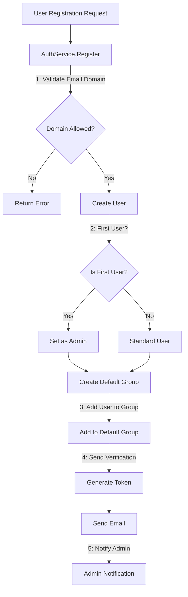
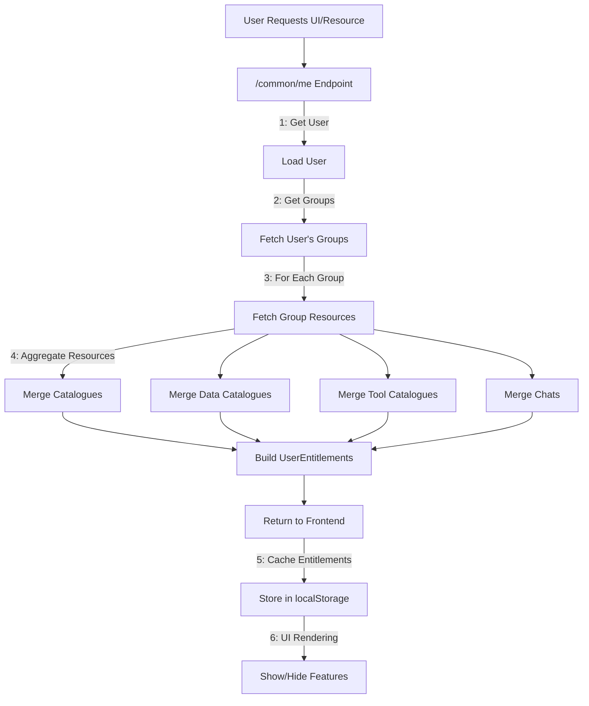

# User Management, Groups, and Role-Based Access Control

## 1. Overview & Purpose

The User Management, Groups, and Role-Based Access Control (RBAC) system in Midsommar provides a comprehensive framework for managing users, controlling access to resources, and enforcing security policies. The system is designed to support:

* **User Lifecycle Management:** Registration, authentication, verification, and profile management.
* **Group-Based Access Control:** Resource access through group membership rather than individual permissions.
* **Role Differentiation:** Distinct capabilities for administrators versus standard users.
* **Resource Segregation:** Controlled access to catalogues, data sources, tools, and other system resources.
* **Entitlements System:** Aggregation of all accessible resources for a user based on their group memberships.

**Key Objectives:**

* **Security & Authentication:** Provide secure authentication mechanisms including session-based (cookie) authentication for browser clients and API key authentication for programmatic access.
* **Access Control:** Implement a group-based membership model where users belong to one or more groups, each providing access to specific resources.
* **Administrative Oversight:** Enable administrators to manage users, groups, and resource assignments through dedicated APIs and UI components.
* **Self-Service Capabilities:** Allow users to manage their own profiles, reset passwords, and verify email addresses.
* **Domain Restrictions:** Support optional domain-based registration restrictions to limit who can register.
* **Email Communication:** Facilitate system-to-user communication for verification, password resets, and notifications.
* **UI Personalization:** Control feature visibility based on user entitlements and role.

**User Roles & Interactions:**

* **Administrator:** The first registered user automatically becomes a system administrator. Administrators can manage all users, groups, and resources, and receive special notifications about system events.
* **Standard User:** Regular users with limited privileges who can access only resources shared with them via group membership.
* **Group Membership:** All users belong to at least one group (default group created automatically), which determines their access to resources.

## 2. Architecture & Data Flow

**Core Components & Interactions:**

* **AuthService (`auth/auth.go`):** Central component for authentication and user management.
  * Handles login, logout, registration, password management, and email verification.
  * Provides middleware for authentication and admin-only access control.
  * Manages session tokens and API keys.
  * *Dependency:* Uses `MailService` for sending emails.
  * *Dependency:* Uses `NotificationService` for admin notifications.

* **User Model (`models/user.go`):** Represents user data and provides methods for user operations.
  * Stores user credentials, profile information, and authentication tokens.
  * Provides methods for accessing resources based on group membership.
  * *Relationship:* Many-to-many relationship with `Group` through `user_groups` table.

* **Group Model (`models/group.go`):** Represents groups and their resource associations.
  * Manages group membership and resource access.
  * *Relationship:* Many-to-many relationships with `User`, `Catalogue`, `DataCatalogue`, and `ToolCatalogue`.

* **UserEntitlements (`services/user_service.go`):** Aggregates all resources a user can access.
  * Merges resources from all groups a user belongs to.
  * Provides methods to check access to specific resources (`HasDataSourceAccess`, `HasToolAccess`).
  * Used by both backend services and frontend components to enforce access control.
  * *Dependency:* Relies on group membership and resource associations.

**Data Flow (User Registration & Authentication):**



**Entitlements Flow:**



## 3. User Model & Permissions

The `User` model (`models/user.go`) is the central entity in the RBAC system:

```go
type User struct {
    gorm.Model
    ID                   uint   `json:"id" gorm:"primaryKey"`
    Email                string `json:"email"`
    Name                 string
    Password             string `json:"password"`
    SessionToken         string
    ResetToken           string
    ResetTokenExpiry     time.Time
    EmailVerified        bool
    VerificationToken    string
    IsAdmin              bool
    ShowPortal           bool
    ShowChat             bool
    APIKey               string
    NotificationsEnabled bool `json:"notifications_enabled"`
}
```

**User Fields & Permissions Explained:**

1. **ID**: Primary key and unique identifier for the user.

2. **Email**: Unique email address used for login and notifications. Must be verified for standard users.

3. **Name**: Display name of the user.

4. **Password**: Bcrypt-hashed password. Never stored in plaintext.

5. **SessionToken**: Token used for session-based authentication. Set during login and cleared on logout.

6. **ResetToken & ResetTokenExpiry**: Used for password reset flow. Time-limited token sent via email.

7. **EmailVerified**: Boolean flag indicating if the user's email has been verified.
   - If `true`: User can log in and access the system.
   - If `false`: Standard users cannot log in until they verify their email.
   - First user (admin) has this automatically set to `true`.

8. **VerificationToken**: Token used for email verification. Sent via email during registration.

9. **IsAdmin**: Boolean flag indicating administrator status.
   - If `true`: User has full administrative privileges.
   - If `false`: User has standard permissions limited by group membership.
   - First registered user automatically has this set to `true`.

10. **ShowPortal**: Boolean flag controlling UI visibility.
    - If `true`: User can access the portal interface.
    - If `false`: Portal interface is hidden from the user.
    - Returned as part of UI options in entitlements.

11. **ShowChat**: Boolean flag controlling UI visibility.
    - If `true`: User can access the chat interface.
    - If `false`: Chat interface is hidden from the user.
    - Returned as part of UI options in entitlements.

12. **APIKey**: Unique key for API authentication.
    - Generated automatically on user creation.
    - Can be rotated via dedicated endpoint.
    - Used for programmatic access to the API.

13. **NotificationsEnabled**: Boolean flag for admin notifications.
    - If `true` and user is admin: Receives system notifications (new user registrations, etc.).
    - If `false`: Does not receive system notifications.
    - First user (admin) has this automatically set to `true`.

## 4. User Roles & Permissions

1. **Admin Role** (`User.IsAdmin = true`):
   - Manage users (create, update, delete)
   - Manage groups (create, update, delete)
   - Add/remove users from groups
   - Associate/disassociate resources with groups
   - Access all system resources regardless of group membership
   - Receive system notifications (if `NotificationsEnabled = true`)
   - Access admin UI screens (`/admin/*` routes)
   - Perform API key rotation for any user
   - Force email verification for users
   - Toggle UI visibility flags for users

2. **Standard User Role** (`User.IsAdmin = false`):
   - Access only resources shared via group membership
   - Update own profile information
   - Reset own password
   - Rotate own API key
   - View own accessible resources
   - Cannot access admin UI screens
   - Cannot modify groups or other users
   - Cannot see resources not shared with their groups

## 5. Group-Based Access Control

* **Group Model:**
```go
type Group struct {
    gorm.Model
    ID             uint
    Name           string
    Users          []User          // Many-to-many
    Catalogues     []Catalogue     // Many-to-many
    DataCatalogues []DataCatalogue // Many-to-many
    ToolCatalogues []ToolCatalogue // Many-to-many
}
```

* **Group Membership:**
  - Many-to-many relationship between users and groups via `user_groups` table.
  - All users belong to at least one group (default group created automatically).
  - Administrators can add/remove users from groups.

* **Resource Association:**
  - Groups can be associated with multiple resource types:
    - `Catalogues` (LLM catalogues)
    - `DataCatalogues` (collections of data sources)
    - `ToolCatalogues` (collections of tools)
    - `Chats` (chat configurations)
  - Many-to-many relationships via junction tables (e.g., `group_catalogues`).

* **Access Inheritance:**
  - Users inherit access to all resources associated with their groups.
  - Access is determined by querying the appropriate junction tables.
  - Methods like `User.GetAccessibleCatalogues()` aggregate resources from all user's groups.

## 6. Entitlements System

* **UserEntitlements Struct:**
```go
type UserEntitlements struct {
    User           *models.User
    Catalogues     []models.Catalogue
    DataCatalogues []models.DataCatalogue
    ToolCatalogues []models.ToolCatalogue
    Chats          []models.Chat
}
```

* **Access Check Methods:**
```go
func (ue *UserEntitlements) HasDataSourceAccess(dataSourceID uint) bool {
    // Admins have access to everything
    if ue.User.IsAdmin {
        return true
    }

    // For regular users, check each data catalogue
    for _, dc := range ue.DataCatalogues {
        for _, dataSource := range dc.Datasources {
            if dataSource.ID == dataSourceID {
                return true
            }
        }
    }
    return false
}

func (ue *UserEntitlements) HasToolAccess(toolID uint) bool {
    // Similar implementation for tool access
}
```

* **Entitlements Resolution:**
  - `GetUserEntitlements(userID)` fetches all groups a user belongs to.
  - For each group, retrieves associated resources.
  - Uses maps to ensure uniqueness when merging resources from different groups.
  - Converts maps to slices for the final response.

* **Frontend Integration:**
  - The `/common/me` endpoint returns user information and entitlements.
  - React hook `useUserEntitlements` fetches and caches this data.
  - UI components use entitlements to conditionally render features and resources.
  - Entitlements are cached in localStorage for ~10 seconds to improve performance.

## 7. API Endpoints

* **Authentication:**
  - `/auth/login` - User login
  - `/auth/logout` - User logout
  - `/auth/register` - User registration
  - `/auth/verify-email` - Email verification
  - `/auth/forgot-password` - Password reset request
  - `/auth/reset-password` - Password reset completion
  - `/auth/resend-verification` - Resend verification email
  - `/common/me` - Get current user with entitlements

* **User Management:**
  - `/users` - List/create users
  - `/users/{id}` - Get/update/delete specific user
  - `/users/{id}/roll-api-key` - Regenerate API key
  - `/users/{id}/catalogues` - List accessible catalogues
  - `/users/{id}/groups` - List user's groups

* **Group Management:**
  - `/groups` - List/create groups
  - `/groups/{id}` - Get/update/delete specific group
  - `/groups/{id}/users` - List/add/remove users in group
  - `/groups/{id}/catalogues` - List/add/remove catalogues in group
  - `/groups/{id}/data-catalogues` - List/add/remove data catalogues in group
  - `/groups/{id}/tool-catalogues` - List/add/remove tool catalogues in group

## 8. UI Components & Functionality

1. **User Management UI:**
   - **Paths:**
     - `/admin/users` - Lists all users (paginated)
     - `/admin/users/new` - Create new user form
     - `/admin/users/edit/:id` - Edit existing user
     - `/admin/users/:id` - View user details
   - **Implementation:**
     - `UserForm.js` - Form for creating/editing users
     - `UserDetails.js` - Detailed user information view
   - **Key Capabilities:**
     - Create/edit user details (email, name, admin status, etc.)
     - Manage group membership
     - API key rotation
     - Toggle UI visibility flags (ShowPortal, ShowChat)
     - Toggle email verification status (admin only)
     - Toggle notifications enabled (admin only)

2. **Group Management UI:**
   - **Paths:**
     - `/admin/groups` - Lists all groups
     - `/admin/groups/new` - Create new group form
     - `/admin/groups/edit/:id` - Edit existing group
     - `/admin/groups/:id` - View group details
   - **Implementation:**
     - `GroupForm.js` - Form for creating/editing groups
     - `GroupDetail.js` - Detailed group information view
   - **Key Capabilities:**
     - Create/rename/delete groups
     - Add/remove users from groups
     - Associate/disassociate resources with groups

3. **Frontend Permission Checking:**
   - Admin check: UI reads `user.attributes.is_admin`
   - Resource access: UI checks user's entitlements lists
   - UI elements conditionally render based on permissions
   - React hook `useUserEntitlements` fetches and caches entitlement data

## 9. Use Cases & Behavior

**User Registration & Onboarding:**
- Standard registration with email verification
- First user automatically becomes admin
- Default group assignment

**Authentication Flows:**
- Browser authentication with secure cookies
- API authentication with API keys

**Resource Access Control:**
- Adding resources to groups grants access to all group members
- Removing resources from groups revokes access
- Users inherit access from all their groups

**Administrative Functions:**
- User management (create, read, update, delete)
- Group management (create, read, update, delete)
- Resource association with groups

## 10. Potential Considerations & Future Enhancements

- Fine-grained permissions within groups (read, write, admin)
- Multi-factor authentication for sensitive operations
- OAuth integration for third-party authentication
- User activity auditing for security and compliance
- Group hierarchies for nested permissions
- Resource ownership models
- Temporary access grants
- Self-service group management

The User Management, Groups, and Role-Based Access Control system provides a solid foundation for secure, scalable access control within Midsommar. Its group-based approach simplifies administration while maintaining strong security boundaries between different user constituencies.