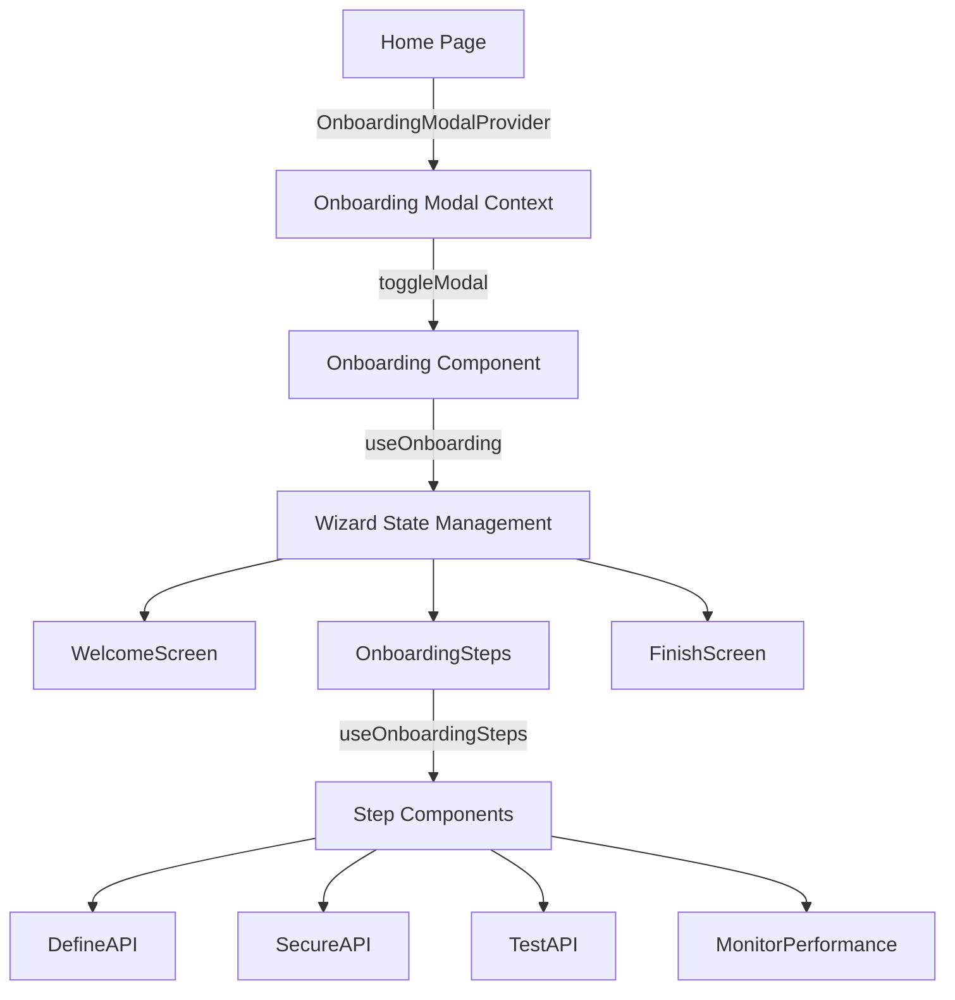
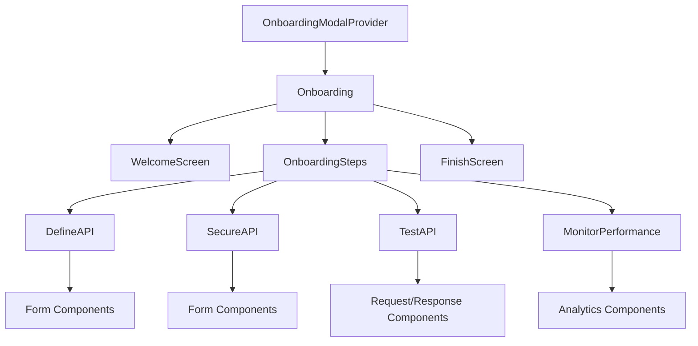

# Tyk Dashboard Onboarding Wizard

The onboarding wizard in Tyk Dashboard is a guided, step-by-step process designed to help new users quickly set up their first API. It's implemented as a modal dialog with multiple steps that guide users through the entire API lifecycle.

## Architecture and Components

The onboarding wizard is built using React and leverages components from the `@tyk-technologies/tyk-ui` library. Here's a breakdown of its architecture:



### Core Components

1. **Modal Context System**
   - `OnboardingModalProvider`: React context provider that manages the modal's visibility state
   - `useOnboardingModal`: Custom hook to access the modal context

2. **Main Onboarding Component**
   - `Onboarding`: The main component that renders the modal and manages the flow between screens
   - Uses the `useOnboarding` hook to manage state transitions between welcome, steps, and finish screens

3. **Wizard Steps**
   - `OnboardingSteps`: Uses the Stepper component from tyk-ui to render the wizard steps
   - `useOnboardingSteps`: Hook that defines the steps and their validation logic

4. **Individual Step Components**
   - `DefineAPI`: First step - Configure basic API settings (name, listen path, upstream URL)
   - `SecureAPI`: Second step - Create security policy and generate API keys
   - `TestAPI`: Third step - Test the API with requests and view responses
   - `MonitorPerformance`: Fourth step - View analytics and performance metrics

## Workflow

1. **Initialization**: The onboarding wizard is integrated into the home page via the `OnboardingModalProvider` and can be triggered by clicking the "Quick start" button in the home header.

2. **Welcome Screen**: Shows a welcome message and gives users the option to start the wizard or explore on their own.

3. **Step-by-Step Process**:
   - **Define API**: Users enter basic API information (name, listen path, upstream URL)
   - **Secure API**: Users create a security policy with rate limits, quotas, and generate an API key
   - **Test API**: Users can test their API with different methods, headers, and view responses
   - **Monitor Performance**: Users can view analytics and performance metrics for their API

4. **Completion**: After completing all steps, users see a congratulatory message and suggestions for next steps.

## Integration Points

The onboarding wizard is integrated into the application in several ways:

1. **Home Page**: The primary entry point is the "Quick start" button on the home page.

2. **Help Buttons**: Various pages (Keys, Policies, APIs) have "Help" buttons that trigger contextual onboarding experiences using the `toggleOnboarding` function.

3. **First-time Experience**: The wizard is designed to be the first experience for new users to help them quickly get started with Tyk.

## Technical Implementation

- Uses React context for state management
- Leverages the Stepper component from tyk-ui for the wizard flow
- Each step has its own validation logic to ensure data integrity
- Uses Formik for form handling and validation
- Integrates with the Tyk API for creating APIs, policies, and keys

The onboarding wizard provides a comprehensive introduction to Tyk's core functionality, guiding users through the complete API lifecycle from definition to monitoring, all within a streamlined, step-by-step interface.

# Deep Analysis of Tyk Dashboard Onboarding Wizard Code

## Architecture and Data Flow

The onboarding wizard is built using a modern React architecture with a clear separation of concerns:

### 1. State Management

The wizard uses a combination of React Context and local component state:

- **Modal Visibility**: Managed by `OnboardingModalContext` which provides a `toggleModal` function to open/close the wizard
- **Wizard Flow State**: Managed by `useOnboarding` hook which tracks three states:
  - Initial welcome screen
  - Active wizard steps
  - Completion screen
- **Step Data**: Each step has its own state management hook (e.g., `useDefineAPIStep`, `useSecureAPIStep`)

Data flows unidirectionally from parent components to children, with each step maintaining its own state but passing data to subsequent steps.

### 2. Component Structure

The wizard follows a hierarchical component structure:



### 3. API Integration

The wizard integrates with several Tyk API endpoints:

- **Define API Step**: 
  - `importOASApi` - Creates a new API
  - `getOASApi` - Retrieves API details
  - `patchOASApi` - Updates an existing API
  - `updateOASApi` - Updates API with additional configurations

- **Secure API Step**:
  - `createPolicy` - Creates a security policy
  - `getPolicy` - Retrieves policy details
  - `updatePolicy` - Updates an existing policy
  - `createKey` - Generates an API key

- **Test API Step**:
  - Uses a proxy endpoint to test API requests

- **Monitor Performance Step**:
  - Uses analytics endpoints to fetch performance data

## Step-by-Step Implementation Details

### 1. Define API Step

**Key Components:**
- `DefineAPI`: Form component for API configuration
- `useDefineAPIStep`: Hook for managing API definition state
- `validateDefineAPI`: Validation logic for API creation

**Data Flow:**
1. User enters API details (name, listen path, upstream URL)
2. Form validation occurs using Formik
3. On validation success, the API is created via `importOASApi`
4. The API is then enhanced with edge segment tags via `updateOASApi`
5. The API data is stored in state and passed to subsequent steps

**Technical Implementation:**
```javascript
// API creation process
const { isSuccess, errorMsg: importError, data: importData } = 
  await apiCallWrapper(importOASApi, data, params);

// Get API details
const { isSuccess: getSuccess, errorMsg: getApiError, data: apiData } = 
  await apiCallWrapper(getOASApi, apiId);

// Add edge segment tag
const updatedApiData = addEdgeSegmentTag(apiData);

// Update API with edge segment
const { isSuccess: updateSuccess, errorMsg: updateError } = 
  await apiCallWrapper(updateOASApi, apiId, updatedApiData);
```

### 2. Secure API Step

**Key Components:**
- `SecureAPI`: Form component for security policy configuration
- `useSecureAPIStep`: Hook for managing policy and key state
- `validateSecureAPI`: Validation logic for policy and key creation

**Data Flow:**
1. User configures security policy (rate limits, quotas, expiry)
2. User generates an API key
3. On key generation, a policy is created via `createPolicy`
4. The policy is retrieved via `getPolicy`
5. An API key is generated via `createKey`
6. The policy and key data are stored in state

**Technical Implementation:**
```javascript
// Create policy
const policyPayload = preparePolicyPayload(values, api);
const { isSuccess: policyCreated, data: policyCreateData } =
  await apiCallWrapper(createPolicy, policyPayload);

// Get policy details
const { isSuccess: getPolicySuccess, data: finalPolicyData } = 
  await apiCallWrapper(getPolicy, policyId);

// Create key
const keyPayload = prepareKeyPayload(finalPolicyData._id, api);
const { isSuccess: keyCreated, data: keyData } = 
  await apiCallWrapper(createKey, keyPayload);
```

### 3. Test API Step

**Key Components:**
- `TestAPI`: Component for testing API requests
- `URLInput`: Component for configuring request URL
- `DataViewer`: Component for viewing request/response data

**Data Flow:**
1. User configures request details (method, endpoint, headers, body)
2. User sends test request to the API
3. Response is displayed in the response viewer

**Technical Implementation:**
```javascript
// Send test request
const handleSubmit = async (values) => {
  try {
    testApi({
      method: values.method.id,
      headers: editableListToObject(values?.requestHeaders),
      url: gatewayURL + listenPath + values.endpoint,
      body: values.requestBody
    });
  } catch (error) {
    console.error('API test failed:', error);
  }
};
```

### 4. Monitor Performance Step

**Key Components:**
- `MonitorPerformance`: Component for displaying API analytics
- `AnalyticsSummaryContent`: Component for displaying analytics data
- `useTodayHourlyAnalytics`: Hook for fetching analytics data

**Data Flow:**
1. Analytics data is fetched for the API
2. Performance metrics (average latency, error rate) are calculated
3. Analytics data is displayed in charts and summary cards

**Technical Implementation:**
```javascript
// Calculate performance metrics
function getPerformanceMetrics(data, totals) {
  const validLatencies = (data || [])
    .map(item => item.latency)
    .filter(latency => latency > 0);

  const totalLatency = validLatencies.reduce((sum, latency) => sum + latency, 0);
  const averageLatency = validLatencies.length > 0
    ? (totalLatency / validLatencies.length).toFixed(2)
    : 0;

  const errorRate = totals && totals.hits > 0
    ? ((totals.error / totals.hits) * 100).toFixed(2)
    : '0.00';

  return { averageLatency, errorRate };
}
```

## Validation and Error Handling

Each step implements robust validation:

1. **Form Validation**: Using Formik for client-side validation
   ```javascript
   // Define API validation
   export const validateAPIForm = (values = {}) => {
     const errors = {
       ...(!values?.oas?.info?.title && {
         oas: { info: { title: ERROR_MESSAGES.apiNameRequired } }
       }),
       ...(!values.listenPath && { listenPath: ERROR_MESSAGES.required }),
       // Additional validations...
     };
     return errors;
   };
   ```

2. **API Call Wrapper**: Common utility for handling API errors
   ```javascript
   export const apiCallWrapper = async (apiCall, ...args) => {
     try {
       const response = await apiCall(...args);
       return { isSuccess: true, data: response.data };
     } catch (error) {
       const errorMsg = requestErrorFormatter(error);
       return { isSuccess: false, errorMsg };
     }
   };
   ```

3. **Step Validation**: Each step has a validator function that returns `isValid` and `errorMsg`
   ```javascript
   const stepValidator = useCallback(
     async (activeStep) => {
       const validate = validators[activeStep];
       if (!validate) {return true;}

       const { isValid, errorMsg } = await validate();
       if (!isValid && errorMsg) {
         console.error(errorMsg);
       }
       return isValid;
     },
     [validators]
   );
   ```

## Integration with Tyk UI Components

The wizard leverages several components from the `@tyk-technologies/tyk-ui` library:

1. **Stepper**: For the multi-step wizard navigation
   ```javascript
   <Stepper
     onFinish={onFinish}
     stepValidator={stepValidator}
     stepErrMessage="This step cannot be completed. Please check your inputs."
     orientation="horizontal"
   >
     {steps.map(({ id, title, description, component }) => (
       <Stepper.Step key={id} id={id} title={title} description={description}>
         {component}
       </Stepper.Step>
     ))}
   </Stepper>
   ```

2. **Form Components**: For input fields and validation
   ```javascript
   <Field
     component={FormikInput2}
     name="oas.info.title"
     label="API Name"
     placeholder="My First API"
   />
   ```

3. **Modal**: For the wizard container
   ```javascript
   <Modal
     className='onboarding-modal'
     opened={opened}
     disableCloseCommands
     size="lg"
   >
     <Modal.Body>
       {/* Wizard content */}
     </Modal.Body>
   </Modal>
   ```

4. **Toast Notifications**: For success/error messages
   ```javascript
   if (!result.isValid && result.errorMsg) {
     toast.danger(result.errorMsg);
   }
   ```

## Entry Points and Integration

The onboarding wizard can be triggered from multiple places:

1. **Home Page**: Via the "Quick start" button
   ```javascript
   function HomeHeader({ t }) {
     const { toggleModal } = useOnboardingModal();
     return (
       <Button theme="primary" onClick={toggleModal}>
         {t('Quick start')}
       </Button>
     );
   }
   ```

2. **Help Buttons**: Various pages have help buttons that trigger contextual onboarding
   ```javascript
   toggleOnboarding() {
     this.intro.show([{
       intro: "This page allows you to set up and manage your keys. Each API requires a Key."
     }, 
     // Additional steps...
     ]);
   }
   ```

## Advanced Features

1. **Data Persistence**: API data is passed between steps to ensure continuity
2. **Validation Chains**: Each step has validation that must pass before proceeding
3. **Error Recovery**: Users can fix errors and retry steps
4. **Responsive Design**: The modal adapts to different screen sizes
5. **Internationalization**: Text is passed through translation functions

## Conclusion

The Tyk Dashboard onboarding wizard is a sophisticated implementation that guides users through the complete API lifecycle. It demonstrates modern React patterns including:

- Hooks for state management
- Context for global state
- Component composition
- Form validation
- API integration
- Error handling

The code is well-structured with clear separation of concerns, making it maintainable and extensible. Each step in the wizard has its own set of components, hooks, and validation logic, while sharing common utilities and patterns.

# Stepper Component Analysis

The Stepper component is a multi-step form or wizard interface that guides users through a sequence of steps. Here's how it works:

## Core Structure

The Stepper is built using a context-based architecture with several key components:

1. **Main Stepper Component (`index.js`)**: 
   - Acts as the container and context provider
   - Manages state for active step, errors, and validation
   - Supports two orientations: vertical (default) and horizontal
   - Filters children to identify steps and buttons

2. **StepperContext**: 
   - Shares state and functions between all Stepper components
   - Provides access to active step, errors, navigation functions, and validation

3. **Step Component**: 
   - Simple wrapper for step content
   - Has props for title, description, and ID
   - Identified by `displayName: "StepperStep"`

4. **StepList & StepItem**: 
   - StepList renders all steps in a vertical or horizontal layout
   - StepItem renders individual steps with proper styling based on state
   - Shows visual indicators for active, completed, and error states

5. **Navigation Components**:
   - `Buttons`: Provides core navigation logic (next, previous, skip)
   - `DefaultButtons`: Default UI implementation with customizable text
   - Handles validation before proceeding to next step

## Key Features

1. **Step Validation**:
   - Custom validation through `stepValidator` prop
   - Error display when validation fails
   - Prevents navigation to next step if validation fails

2. **Visual Indicators**:
   - Step numbers change appearance based on state (active, completed, error)
   - Progress indicators between steps
   - Error messages display when validation fails

3. **Navigation**:
   - Next/Continue button to advance
   - Back button to return to previous step
   - Optional skip functionality
   - Finish button on the last step

4. **Orientation Options**:
   - Vertical layout (default): Steps stacked vertically with content beside each step
   - Horizontal layout: Steps arranged horizontally at the top with content below

5. **Customization**:
   - Custom button text
   - Custom step validation
   - Custom error messages
   - Custom button components

## Usage Example

```jsx
<Stepper 
  onFinish={() => console.log('Completed!')}
  stepValidator={(stepId) => true} // Validate each step
  orientation="vertical"
>
  <Stepper.Step id="step1" title="Step 1" description="First step">
    <div>Step 1 content</div>
  </Stepper.Step>
  
  <Stepper.Step id="step2" title="Step 2" description="Second step">
    <div>Step 2 content</div>
  </Stepper.Step>
  
  {/* Optional custom buttons */}
  <Stepper.Buttons>
    {({ goToNextStep, goToPreviousStep, isLastStep }) => (
      <>
        <button onClick={goToPreviousStep}>Back</button>
        <button onClick={goToNextStep}>
          {isLastStep ? 'Finish' : 'Next'}
        </button>
      </>
    )}
  </Stepper.Buttons>
</Stepper>
```

The Stepper component uses React's Context API for state management and React's component composition pattern to create a flexible, customizable multi-step interface.