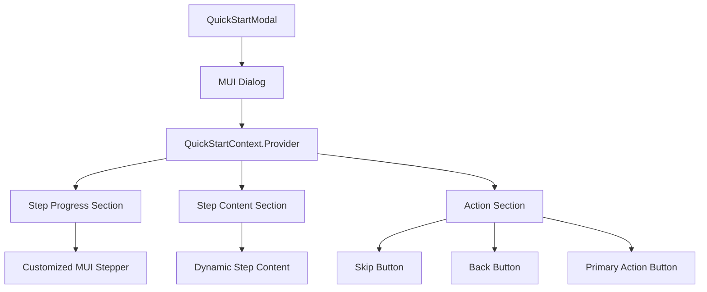
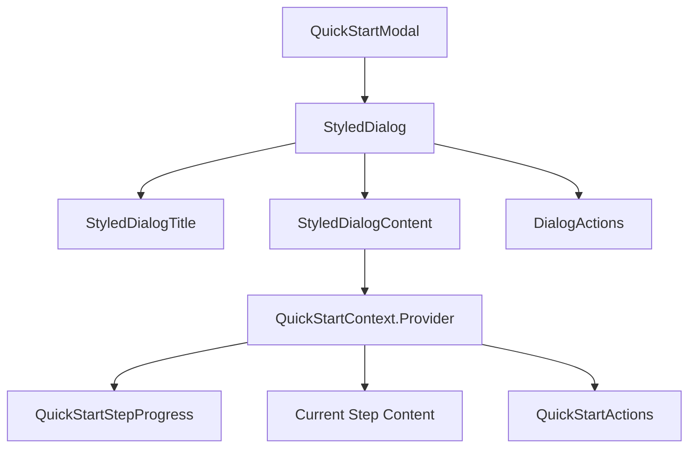
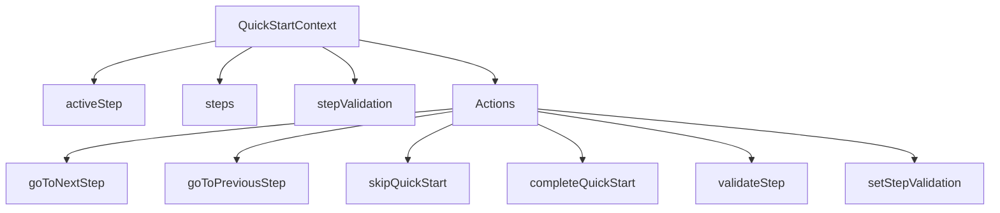

# Detailed Plan for Implementing a Generic and Reusable Quick Start Component

Based on our analysis of the project structure, existing components, and the requirements, I've created a comprehensive plan for implementing a generic and reusable quick start component.

## 1. Component Overview

The Quick Start component will be a reusable, step-based wizard implemented as a modal dialog that guides users through a series of steps to complete a task. It will leverage the existing MUI Stepper component with customized styling to meet the specific requirements.



## 2. Component Structure

### 2.1 File Structure

```
ui/admin-frontend/src/admin/components/wizards/quick-start/
├── QuickStartModal.js         # Main component
├── QuickStartContext.js       # Context for managing state
├── QuickStartStepProgress.js  # Customized MUI Stepper
├── QuickStartActions.js       # Action buttons component
├── index.js                   # Export all components
└── styles.js                  # Styled components
```

### 2.2 Component Hierarchy



## 3. Component API

The QuickStartModal component will have the following API:

```jsx
<QuickStartModal
  open={boolean}                // Controls visibility of the modal
  onClose={function}            // Called when the modal is closed
  title={string}                // Title of the modal
  steps={[                      // Array of step objects
    {
      id: string,               // Unique identifier for the step
      title: string,            // Title displayed in the step progress
      content: ReactNode,       // Content to display for this step
      validate: function,       // Optional validation function that returns boolean
    },
    // More steps...
  ]}
  onComplete={function}         // Called when all steps are completed
  onSkip={function}             // Called when the user skips the quick start
  initialStep={number}          // Optional initial step index (default: 0)
  primaryActionLabels={{        // Optional custom labels for primary action button
    next: string,               // Label for "Next" button (default: "Next")
    complete: string,           // Label for "Complete" button on final step (default: "Complete")
  }}
  backLabel={string}            // Optional custom label for back button (default: "Back")
  skipLabel={string}            // Optional custom label for skip button (default: "Skip quick start")
/>
```

## 4. State Management

We'll use React Context to manage the state of the quick start component:



## 5. Styling Implementation

Based on the requirements, we'll implement the following styling:

### 5.1 Modal Dialog Styling
- Border: 1px solid theme.palette.border.neutralPressed
- Box-shadow: 0px 16px 32px 0px rgba(9, 9, 35, 0.25)
- Border-radius: 16px
- Padding: 40px

### 5.2 Step Progress Section
- Step Number (Inactive):
  - Typography: bodyLargeMedium
  - Color: text.defaultSubdued
  - Circular border: width and height 24px, 1px solid border.neutralDefault
- Step Title (Inactive):
  - Typography: bodyLargeDefault
  - Color: text.neutralDisabled
- Step Tab (Inactive):
  - Border bottom: 1.6px solid border.neutralDefaultSubdued
- Step Number (Active):
  - Color: text.defaultSubdued
  - Circular border: 1.5px solid background.iconSuccessDefault
- Step Title (Active):
  - Typography: bodyLargeBold
  - Color: text.primary
- Step Tab (Active):
  - Border bottom: 1.6px solid background.iconSuccessDefault

### 5.3 Action Section
- Primary Action Button: Aligned to the right
- Go Back Button: Aligned to the right
- Skip Quick Start Button: Aligned to the left
- Primary Action Button: Disabled until all step requirements are met
- Welcome and First Step: No Go Back button

## 6. Implementation Details

### 6.1 QuickStartContext.js

This file will define the context and provider for managing the state of the quick start component:

```jsx
import React, { createContext, useContext, useState, useCallback } from 'react';

const QuickStartContext = createContext();

export const QuickStartProvider = ({ 
  children, 
  steps, 
  initialStep = 0, 
  onComplete, 
  onSkip 
}) => {
  const [activeStep, setActiveStep] = useState(initialStep);
  const [stepValidation, setStepValidation] = useState({});

  const validateStep = useCallback((stepId) => {
    const step = steps.find(s => s.id === stepId);
    if (!step || !step.validate) return true;
    return step.validate();
  }, [steps]);

  const goToNextStep = useCallback(() => {
    const currentStepId = steps[activeStep].id;
    if (!validateStep(currentStepId)) return;

    if (activeStep < steps.length - 1) {
      setActiveStep(prev => prev + 1);
    } else {
      onComplete && onComplete();
    }
  }, [activeStep, steps, validateStep, onComplete]);

  const goToPreviousStep = useCallback(() => {
    if (activeStep > 0) {
      setActiveStep(prev => prev - 1);
    }
  }, [activeStep]);

  const skipQuickStart = useCallback(() => {
    onSkip && onSkip();
  }, [onSkip]);

  const setStepValid = useCallback((stepId, isValid) => {
    setStepValidation(prev => ({
      ...prev,
      [stepId]: isValid
    }));
  }, []);

  const value = {
    activeStep,
    steps,
    stepValidation,
    goToNextStep,
    goToPreviousStep,
    skipQuickStart,
    validateStep,
    setStepValid,
    isFirstStep: activeStep === 0,
    isLastStep: activeStep === steps.length - 1,
    currentStep: steps[activeStep]
  };

  return (
    <QuickStartContext.Provider value={value}>
      {children}
    </QuickStartContext.Provider>
  );
};

export const useQuickStart = () => {
  const context = useContext(QuickStartContext);
  if (!context) {
    throw new Error('useQuickStart must be used within a QuickStartProvider');
  }
  return context;
};
```

### 6.2 styles.js

This file will define the styled components used in the quick start component:

```jsx
import { styled } from '@mui/material/styles';
import { 
  Dialog, 
  DialogTitle, 
  DialogContent, 
  Box, 
  Step, 
  StepLabel, 
  Stepper 
} from '@mui/material';

export const StyledDialog = styled(Dialog)(({ theme }) => ({
  '& .MuiDialog-paper': {
    borderRadius: 16,
    border: `1px solid ${theme.palette.border.neutralPressed}`,
    boxShadow: '0px 16px 32px 0px rgba(9, 9, 35, 0.25)',
    maxWidth: 800,
    width: '100%',
  },
}));

export const StyledDialogTitle = styled(DialogTitle)(({ theme }) => ({
  padding: theme.spacing(3),
  backgroundColor: theme.palette.background.default,
  color: theme.palette.text.default,
}));

export const StyledDialogContent = styled(DialogContent)(({ theme }) => ({
  padding: 40,
}));

export const StyledStepper = styled(Stepper)(({ theme }) => ({
  marginBottom: theme.spacing(4),
}));

export const StyledStep = styled(Step)(({ theme, active }) => ({
  '& .MuiStepLabel-root': {
    padding: theme.spacing(2, 0),
    borderBottom: `1.6px solid ${active 
      ? theme.palette.background.iconSuccessDefault 
      : theme.palette.border.neutralDefaultSubdued}`,
  },
}));

export const StyledStepLabel = styled(StepLabel)(({ theme, active }) => ({
  '& .MuiStepLabel-iconContainer': {
    width: 24,
    height: 24,
    borderRadius: '50%',
    border: `1.5px solid ${active 
      ? theme.palette.background.iconSuccessDefault 
      : theme.palette.border.neutralDefault}`,
    display: 'flex',
    alignItems: 'center',
    justifyContent: 'center',
    padding: 0,
    '& .MuiStepIcon-root': {
      display: 'none',
    },
    '&::before': {
      content: '"' + (active ? '+1' : '+1') + '"',
      ...theme.typography.bodyLargeMedium,
      color: theme.palette.text.defaultSubdued,
    },
  },
  '& .MuiStepLabel-label': {
    ...(active 
      ? theme.typography.bodyLargeBold 
      : theme.typography.bodyLargeDefault),
    color: active 
      ? theme.palette.text.primary 
      : theme.palette.text.neutralDisabled,
  },
}));

export const ActionsContainer = styled(Box)(({ theme }) => ({
  display: 'flex',
  justifyContent: 'space-between',
  marginTop: theme.spacing(4),
}));

export const LeftActions = styled(Box)({
  display: 'flex',
});

export const RightActions = styled(Box)({
  display: 'flex',
  gap: 8,
});
```

### 6.3 QuickStartStepProgress.js

This file will define the customized MUI Stepper component:

```jsx
import React from 'react';
import { Stepper, Step, StepLabel } from '@mui/material';
import { useQuickStart } from './QuickStartContext';
import { StyledStepper, StyledStep, StyledStepLabel } from './styles';

const QuickStartStepProgress = () => {
  const { steps, activeStep, isLastStep } = useQuickStart();

  // Don't show step progress on the final step
  if (isLastStep) return null;

  return (
    <StyledStepper activeStep={activeStep} alternativeLabel>
      {steps.map((step, index) => (
        <StyledStep key={step.id} active={index === activeStep}>
          <StyledStepLabel active={index === activeStep}>
            {step.title}
          </StyledStepLabel>
        </StyledStep>
      ))}
    </StyledStepper>
  );
};

export default QuickStartStepProgress;
```

### 6.4 QuickStartActions.js

This file will define the action buttons component:

```jsx
import React from 'react';
import { useQuickStart } from './QuickStartContext';
import { 
  ActionsContainer, 
  LeftActions, 
  RightActions 
} from './styles';
import { 
  PrimaryButton, 
  SecondaryLinkButton, 
  SecondaryOutlineButton 
} from '../../styles/sharedStyles';

const QuickStartActions = ({ 
  primaryActionLabels = { next: 'Next', complete: 'Complete' }, 
  backLabel = 'Back', 
  skipLabel = 'Skip quick start' 
}) => {
  const { 
    goToNextStep, 
    goToPreviousStep, 
    skipQuickStart, 
    isFirstStep, 
    isLastStep,
    currentStep,
    stepValidation
  } = useQuickStart();

  // Don't show actions on the final step
  if (isLastStep) return null;

  const isPrimaryActionDisabled = currentStep && 
    currentStep.validate && 
    stepValidation[currentStep.id] === false;

  return (
    <ActionsContainer>
      <LeftActions>
        <SecondaryLinkButton onClick={skipQuickStart}>
          {skipLabel}
        </SecondaryLinkButton>
      </LeftActions>
      <RightActions>
        {!isFirstStep && (
          <SecondaryOutlineButton onClick={goToPreviousStep}>
            {backLabel}
          </SecondaryOutlineButton>
        )}
        <PrimaryButton 
          onClick={goToNextStep}
          disabled={isPrimaryActionDisabled}
        >
          {isLastStep ? primaryActionLabels.complete : primaryActionLabels.next}
        </PrimaryButton>
      </RightActions>
    </ActionsContainer>
  );
};

export default QuickStartActions;
```

### 6.5 QuickStartModal.js

This file will define the main component:

```jsx
import React from 'react';
import { DialogActions } from '@mui/material';
import { 
  StyledDialog, 
  StyledDialogTitle, 
  StyledDialogContent 
} from './styles';
import { QuickStartProvider } from './QuickStartContext';
import QuickStartStepProgress from './QuickStartStepProgress';
import QuickStartActions from './QuickStartActions';

const QuickStartModal = ({ 
  open, 
  onClose, 
  title, 
  steps, 
  onComplete, 
  onSkip, 
  initialStep = 0,
  primaryActionLabels,
  backLabel,
  skipLabel
}) => {
  const handleComplete = () => {
    onComplete && onComplete();
    onClose && onClose();
  };

  const handleSkip = () => {
    onSkip && onSkip();
    onClose && onClose();
  };

  return (
    <StyledDialog open={open} onClose={onClose} maxWidth="md" fullWidth>
      <StyledDialogTitle>{title}</StyledDialogTitle>
      <StyledDialogContent>
        <QuickStartProvider 
          steps={steps} 
          initialStep={initialStep} 
          onComplete={handleComplete} 
          onSkip={handleSkip}
        >
          <QuickStartStepProgress />
          {steps[initialStep]?.content}
          <QuickStartActions 
            primaryActionLabels={primaryActionLabels}
            backLabel={backLabel}
            skipLabel={skipLabel}
          />
        </QuickStartProvider>
      </StyledDialogContent>
      <DialogActions>
        {/* Final step actions can be placed here if needed */}
      </DialogActions>
    </StyledDialog>
  );
};

export default QuickStartModal;
```

### 6.6 index.js

This file will export all the components:

```jsx
export { default as QuickStartModal } from './QuickStartModal';
export { QuickStartProvider, useQuickStart } from './QuickStartContext';
```

## 7. Usage Example

Here's an example of how to use the QuickStartModal component:

```jsx
import React, { useState } from 'react';
import { Button, TextField, Box, Typography } from '@mui/material';
import { QuickStartModal } from '../components/wizards/quick-start';

const Step1Content = ({ onValidChange }) => {
  const [name, setName] = useState('');
  
  const handleNameChange = (e) => {
    const value = e.target.value;
    setName(value);
    onValidChange(value.length > 0);
  };
  
  return (
    <Box sx={{ my: 2 }}>
      <Typography variant="h6" gutterBottom>
        Configure AI
      </Typography>
      <Typography variant="body1" paragraph>
        Enter a name for your AI assistant.
      </Typography>
      <TextField 
        fullWidth
        label="AI Name"
        value={name} 
        onChange={handleNameChange} 
        margin="normal"
      />
    </Box>
  );
};

const Step2Content = ({ onValidChange }) => {
  const [owner, setOwner] = useState('');
  
  const handleOwnerChange = (e) => {
    const value = e.target.value;
    setOwner(value);
    onValidChange(value.length > 0);
  };
  
  return (
    <Box sx={{ my: 2 }}>
      <Typography variant="h6" gutterBottom>
        Assign Owner
      </Typography>
      <Typography variant="body1" paragraph>
        Assign an owner to this AI assistant.
      </Typography>
      <TextField 
        fullWidth
        label="Owner"
        value={owner} 
        onChange={handleOwnerChange} 
        margin="normal"
      />
    </Box>
  );
};

const Step3Content = ({ onValidChange }) => {
  const [details, setDetails] = useState('');
  
  const handleDetailsChange = (e) => {
    const value = e.target.value;
    setDetails(value);
    onValidChange(value.length > 0);
  };
  
  return (
    <Box sx={{ my: 2 }}>
      <Typography variant="h6" gutterBottom>
        App Details
      </Typography>
      <Typography variant="body1" paragraph>
        Provide details about your application.
      </Typography>
      <TextField 
        fullWidth
        label="Details"
        value={details} 
        onChange={handleDetailsChange} 
        margin="normal"
        multiline
        rows={4}
      />
    </Box>
  );
};

const FinalStep = () => {
  return (
    <Box sx={{ my: 2, textAlign: 'center' }}>
      <Typography variant="h6" gutterBottom>
        All Done!
      </Typography>
      <Typography variant="body1" paragraph>
        Your AI assistant has been configured successfully.
      </Typography>
      <Button variant="contained" color="primary">
        Go to Dashboard
      </Button>
    </Box>
  );
};

const MyPage = () => {
  const [open, setOpen] = useState(false);
  const [stepValidation, setStepValidation] = useState({
    step1: false,
    step2: false,
    step3: false
  });
  
  const handleStepValidChange = (stepId, isValid) => {
    setStepValidation(prev => ({
      ...prev,
      [stepId]: isValid
    }));
  };
  
  const steps = [
    {
      id: 'step1',
      title: 'Configure AI',
      content: <Step1Content onValidChange={(isValid) => handleStepValidChange('step1', isValid)} />,
      validate: () => stepValidation.step1
    },
    {
      id: 'step2',
      title: 'Assign Owner',
      content: <Step2Content onValidChange={(isValid) => handleStepValidChange('step2', isValid)} />,
      validate: () => stepValidation.step2
    },
    {
      id: 'step3',
      title: 'App Details',
      content: <Step3Content onValidChange={(isValid) => handleStepValidChange('step3', isValid)} />,
      validate: () => stepValidation.step3
    },
    {
      id: 'final',
      title: 'Summary & Credentials',
      content: <FinalStep />
    }
  ];
  
  const handleComplete = () => {
    console.log('Quick start completed!');
  };
  
  const handleSkip = () => {
    console.log('Quick start skipped!');
  };
  
  return (
    <div>
      <Button variant="contained" onClick={() => setOpen(true)}>
        Open Quick Start
      </Button>
      
      <QuickStartModal 
        open={open}
        onClose={() => setOpen(false)}
        title="Create New AI Assistant"
        steps={steps}
        onComplete={handleComplete}
        onSkip={handleSkip}
        primaryActionLabels={{
          next: 'Next',
          complete: 'Create App'
        }}
        backLabel="Back"
        skipLabel="Skip quick start"
      />
    </div>
  );
};

export default MyPage;
```

## 8. Testing Strategy

We'll implement tests for each component to ensure they work as expected:

1. **QuickStartContext Tests**:
   - Test that the context provides the correct values
   - Test that the actions (goToNextStep, goToPreviousStep, etc.) work correctly
   - Test that step validation works correctly

2. **QuickStartStepProgress Tests**:
   - Test that it renders the correct number of steps
   - Test that the active step is highlighted correctly
   - Test that it doesn't render on the final step

3. **QuickStartActions Tests**:
   - Test that the primary action button is disabled when validation fails
   - Test that the back button is not shown on the first step
   - Test that the actions trigger the correct functions
   - Test that it doesn't render on the final step

4. **QuickStartModal Integration Tests**:
   - Test that the component renders correctly with different props
   - Test that the steps transition correctly
   - Test that the completion and skip callbacks are called correctly

## 9. Accessibility Considerations

To ensure the component is accessible, we'll implement the following:

1. Proper ARIA attributes for the step progress section
2. Keyboard navigation for the step tabs
3. Focus management when transitioning between steps
4. High contrast colors for the active and inactive states
5. Proper text alternatives for any icons or visual indicators

## 10. Performance Considerations

To ensure the component performs well, we'll implement the following:

1. Memoization of expensive calculations
2. Lazy loading of step content
3. Efficient state management to prevent unnecessary re-renders
4. Optimized styling to prevent layout thrashing

## Conclusion

This plan outlines a comprehensive approach to implementing a generic and reusable quick start component as a modal dialog that meets the specified requirements. The component will leverage the existing MUI Stepper component with customized styling to achieve the desired look and feel.

The implementation follows the existing patterns and styles used in the project, making it easy to integrate with the rest of the application. The component is also designed to be accessible and performant, ensuring a good user experience.